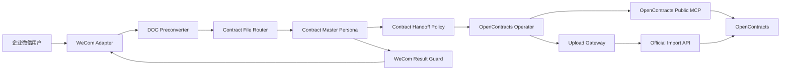

# ContractBotConfig

面向企业合同工作的 AstrBot 配置与扩展工程。系统通过企业微信接收合同文件，由主人格协调上传、问答、风险分析和文书生成，并以 OpenContracts 作为合同存储、解析和检索系统。

## 当前能力

1. 接收并暂存企业微信合同文件；
2. 将旧版 Word `.doc` 通过 Gotenberg/LibreOffice 转换为 PDF；
3. 提取合同日期和正式标题，生成稳定远端身份；
4. 使用 OpenContracts 公开 MCP 执行查重、正文读取和语义检索；
5. 使用 WorkerKey 调用官方导入 API 写入合同；
6. 对重复、阻断、处理中、完成、人工核查和失败状态执行确定性会话控制；
7. 基于合同库、批准模板和用户信息生成 DOCX 文书。

## 系统架构



## OpenContracts 集成

AstrBot 配置公开 MCP：

```text
http://opencontracts-api:8000/mcp/
```

上传链路使用：

```text
list_documents
get_document_text
search_corpus
```

目标 Corpus slug 由 Router 配置：

```text
opencontracts_target = contracts
```

Router 将其放入：

```text
targets.opencontracts
branch_tasks.opencontracts_operator.corpus_slug
```

上传流程不使用 `list_public_corpuses` 猜测目标，也不调用不存在的 `get_corpus_info` 或旧的 `opencontracts_check_duplicate`。

写入使用官方端点：

```text
POST /api/imports/documents/
Authorization: WorkerKey <token>
```

写入目标由 WorkerKey 绑定。Gateway 不配置 Corpus ID，也不保存 MCP 读取凭证。

## 合同身份

远端身份格式：

```text
document_title = YYYY-MM-DD 合同标题
normalized_filename = YYYY-MM-DD_合同标题.原扩展名
```

标题使用合同正文中的正式名称。日期按以下优先级取得：

1. 正文明确合同日期；
2. 明确签署日期；
3. 明确生效日期；
4. 正文日期字段为空时，使用 Router 从原始文件名确定性提取的唯一日期。

文件名日期支持：

```text
YYYY-M-D
YYYY.M.D
YYYY_M_D
YYYY年M月D日
YYYYMMDD
```

例如 `新田光伏发电项目_2025.1.7.pdf` 会提供：

```json
{
  "identity_hints": {
    "contract_date": "2025-01-07",
    "source": "original_filename"
  }
}
```

正文没有日期且该提示存在时，Master 直接使用，不向客户提问。文件名存在多个不同日期时不生成提示。

## 上传状态和文件生命周期

```text
[CONTRACT_UPLOAD:DUPLICATE_CONFIRMATION_REQUIRED]
[CONTRACT_UPLOAD:BLOCKED]
[CONTRACT_UPLOAD:PROCESSING]
[CONTRACT_UPLOAD:COMPLETE]
[CONTRACT_UPLOAD:MANUAL_REVIEW]
[CONTRACT_UPLOAD:FAILED]
```

| 状态 | 写入含义 | 暂存处理 |
|---|---|---|
| `DUPLICATE_CONFIRMATION_REQUIRED` | 发现已有合同，等待客户决定 | 保留 |
| `BLOCKED` | 尚未写入，身份、配置、MCP、文件或权限条件不足 | 保留 |
| `PROCESSING` | 写入已接收，正文或检索未完成 | 流程结束 |
| `COMPLETE` | 正文可读且已进入检索 | 流程结束 |
| `MANUAL_REVIEW` | 可能已经写入，最终状态未知 | 流程结束，禁止重复上传 |
| `FAILED` | 已确认没有发生提交的正式失败 | 流程结束 |

### BLOCKED 恢复

Router 0.5.2 在 `BLOCKED` 后进入：

```text
awaiting_blocked_resolution
```

此时：

- pending 和暂存文件继续保留；
- 缺日期时客户直接回复日期；
- 缺标题时客户直接回复正式标题；
- 系统条件修复后客户回复“继续”；
- Router 复用原 `staged_path` 和 SHA-256 再次执行；
- 客户回复“结束”或“取消”时清理文件；
- 无需重新发送合同文件。

Result Guard 0.3.4 即使遇到模型漏写显式 BLOCKED 标记，也会根据明确的“日期/标题缺失”语义保留任务。

## 组件版本

以 [VERSIONS.md](VERSIONS.md) 为准。当前关键组件：

```text
astrbot_plugin_contract_doc_preconverter 0.1.3
astrbot_plugin_contract_file_router 0.5.2
astrbot_plugin_contract_handoff_policy 0.4.5
astrbot_plugin_opencontracts_gateway 0.6.1
astrbot_plugin_wecom_final_result_guard 0.3.4
contract-orchestrator 1.15.3
contract-result-verification 1.16.3
contract_master_orchestrator 1.17
```

## 安装与配置

### Plugins

在 AstrBot WebUI 中安装 `dist/plugins/` 下各插件 ZIP。DOC Preconverter 默认访问：

```text
http://gotenberg:3000/forms/libreoffice/convert
```

### Skills

导入 `dist/skills/` 下 Skill ZIP，并为对应 Persona 绑定。

### Personas

导入 `personas/` 中最新版本 JSON。Tools 和 Skills 在 AstrBot WebUI 中单独绑定。

### Gateway

```text
auth_token = <OpenContracts WorkerKey>
import_path = /api/imports/documents/
```

## 工具边界

上传期间：

- Master 只读取当前合同并调用 `transfer_to_opencontracts_operator`；
- Operator 只使用公开 MCP Tools、`opencontracts_gateway_status` 和 `opencontracts_upload_document`；
- Master 和 Operator 不使用 Shell、Python、通用 HTTP、配置文件读取或直接 MCP JSON-RPC 绕过标准流程；
- 任一 `[CONTRACT_UPLOAD:*]` 状态出现后，Master 停止当前轮次工具调用。

## 构建发布包

```bash
python3 -m compileall -q plugins scripts
python3 scripts/build_release.py --clean
```

输出：

```text
dist/
├── plugins/
├── skills/
├── personas/
└── MANIFEST.json
```

## 工程结构

```text
config/       示例配置
docs/         架构、审计和部署说明
personas/     Persona JSON
plugins/      AstrBot 插件
scripts/      发布工具
skills/       AstrBot Skills
```
