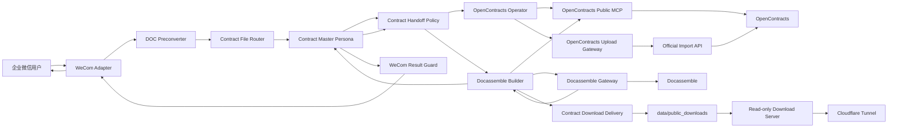

# ContractBotConfig

面向企业合同工作的 AstrBot 配置与扩展工程。系统通过企业微信接收合同文件，由主人格协调上传、问答、风险分析和文书生成；OpenContracts 负责合同存储、解析和检索，Docassemble 负责文书生成，独立 Download Delivery 负责把生成的 DOCX 以短时 HTTPS 链接交付给用户。

## 当前能力

1. 接收并暂存企业微信合同文件；
2. 将旧版 Word `.doc` 通过 Gotenberg/LibreOffice 转换为 PDF；
3. 提取合同日期和正式标题，生成稳定远端身份；
4. 使用 OpenContracts 公开 MCP 执行查重、正文读取和语义检索；
5. 使用 WorkerKey 调用官方导入 API 写入合同；
6. 对重复、阻断、处理中、完成、人工核查和失败状态执行确定性会话控制；
7. 基于合同库、批准模板和用户信息，通过 Docassemble allowlist interview 生成真实 DOCX；
8. 将 Docassemble Gateway 输出的 DOCX 发布为带高熵 token 和 TTL 的临时 HTTPS 下载链接，供企业微信用户在浏览器下载。

## 系统架构



## OpenContracts 集成

AstrBot 配置公开 MCP：

```text
http://opencontracts-api:8000/mcp/
```

读取链路使用：

```text
list_documents
get_document_text
search_corpus
```

目标 Corpus slug 由 Router 放入：

```text
targets.opencontracts
branch_tasks.opencontracts_operator.corpus_slug
```

上传流程不使用 `list_public_corpuses` 猜测目标，也不调用不存在的 `get_corpus_info` 或旧的 `opencontracts_check_duplicate`。

写入使用官方端点：

```text
POST /api/imports/documents/
Authorization: WorkerKey <token>
```

写入目标由 WorkerKey 绑定。Gateway 不配置 Corpus ID，也不保存 MCP 读取凭证。

## Docassemble 与临时下载交付

AstrBot 与 Docassemble 共用 Docker `legal-network` 时，Docassemble Gateway 默认访问：

```text
http://docassemble
```

生成和交付涉及四个受控 LLM Tool：

```text
docassemble_gateway_status
docassemble_generate_document
contract_download_delivery_status
publish_contract_download
```

其中前两个由 Docassemble Gateway 提供，后两个由 Contract Download Delivery 提供。

完整链路：

```text
Docassemble Builder
→ docassemble_gateway_status
→ contract_download_delivery_status
→ 选择 allowlist interview
→ docassemble_generate_document
→ GET /api/session/new
→ POST /api/session
→ interview json_response(contractbot_document)
→ GET /api/file/<file_number>?extension=docx
→ Gateway 校验并保存 DOCX
→ publish_contract_download(output_path, output_filename)
→ data/public_downloads/<48-hex-token>/<filename>.docx
→ https://download.ri0n72y.top/contracts/<token>/<filename>
→ Master 将链接发送给企业微信用户
```

`api_key` 只保存在 Docassemble Gateway 插件配置中，不进入 Persona、Skill、LLM 上下文、日志或用户回复。MVP 暂允许使用管理员 API Key；独立服务账户由安全 Issue #7 跟踪。

### Interview 返回契约

ContractBot 使用的 API-first interview 完成时必须返回：

```json
{
  "contractbot_document": {
    "status": "complete",
    "file_number": 123,
    "filename": "contract.docx",
    "extension": "docx"
  }
}
```

`file_number` 必须来自 Docassemble 生成文件的 `DAFile.number`。Gateway 不接受模型自行生成的本地文件冒充 Docassemble 输出。

仓库提供 `docs/docassemble/contractbot_api_smoke.yml` 作为 API → DOCX → `/api/file` 链路 smoke，不是生产合同模板。生产环境应使用真实 Docassemble package/interview，优先采用 `docx template file` 装配批准模板。

### 临时下载安全边界

Delivery Plugin 默认只允许发布：

```text
data/plugins_data/astrbot_plugin_docassemble_gateway/output
```

发布目录固定为：

```text
data/public_downloads
```

主要约束：

- 来源必须位于 `allowed_source_dirs`；
- 拒绝符号链接和非 DOCX；
- 校验 DOCX ZIP 必需结构和最大文件大小；
- 发布后重新计算 SHA-256，必须与源文件一致；
- token 使用 `secrets.token_hex(24)`，形成 48 位随机十六进制目录名；
- 默认 TTL 1800 秒；
- 长期审计不保存 token 和下载 URL；
- 清理器不使用递归删除，只处理 `public_root` 直属且名称严格匹配 token 规则的目录；遇到异常子目录时拒绝删除。

### Builder WebUI 绑定

`contract_docassemble_builder` 应绑定：

```text
Skill:
- contract-docassemble

Tools:
- list_documents
- get_document_text
- search_corpus
- docassemble_gateway_status
- docassemble_generate_document
- contract_download_delivery_status
- publish_contract_download
```

不得向 Builder 绑定用于生成或交付替代路径的能力：

```text
astrbot_execute_shell
astrbot_execute_python
python-docx
通用 HTTP
通用文件写入/编辑工具
```

只有 `docassemble_generate_document` 成功取得真实 DOCX，并且 `publish_contract_download` 成功返回 HTTPS `download_url`，Builder 才能输出 `[CONTRACT_DOCASSEMBLE:READY]`。Master 只向客户展示下载链接、文件名和有效期，不展示本地 `output_path`。

## 下载基础设施

已验证部署拓扑：

```text
bot.ri0n72y.top
→ Cloudflare Tunnel
→ http://localhost:6185
→ AstrBot / Hypercorn

download.ri0n72y.top + ^/contracts/.*
→ Cloudflare Tunnel
→ http://localhost:6198
→ 独立只读下载服务
```

AstrBot `/AstrBot/data` 使用宿主机 bind mount，因此 `data/public_downloads` 可由 AstrBot 写入、下载服务只读挂载。生产环境不要使用 smoke 阶段的 `python -m http.server`；使用仓库提供的：

```text
docs/deployment/contract-download-nginx.conf
docs/deployment/contract-download-delivery.md
```

下载服务端口只绑定 `127.0.0.1:6198`，公网入口只通过 Cloudflare Tunnel。

## 合同身份

远端身份格式：

```text
document_title = YYYY-MM-DD 合同标题
normalized_filename = YYYY-MM-DD_合同标题.原扩展名
```

日期优先使用正文明确合同日期、签署日期或生效日期；正文日期字段为空时，可使用 Router 从原始文件名确定性提取的唯一日期。无法可靠取得身份字段时停止上传，不猜测。

## 上传状态和文件生命周期

```text
[CONTRACT_UPLOAD:DUPLICATE_CONFIRMATION_REQUIRED]
[CONTRACT_UPLOAD:BLOCKED]
[CONTRACT_UPLOAD:PROCESSING]
[CONTRACT_UPLOAD:COMPLETE]
[CONTRACT_UPLOAD:MANUAL_REVIEW]
[CONTRACT_UPLOAD:FAILED]
```

| 状态 | 写入含义 | 暂存处理 |
|---|---|---|
| `DUPLICATE_CONFIRMATION_REQUIRED` | 发现已有合同，等待客户决定 | 保留 |
| `BLOCKED` | 尚未写入，身份、配置、MCP、文件或权限条件不足 | 保留 |
| `PROCESSING` | 写入已接收，正文或检索未完成 | 流程结束 |
| `COMPLETE` | 正文可读且已进入检索 | 流程结束 |
| `MANUAL_REVIEW` | 可能已经写入，最终状态未知 | 流程结束，禁止重复上传 |
| `FAILED` | 已确认没有发生提交的正式失败 | 流程结束 |

Router 在 `BLOCKED` 后保留暂存文件和 pending 状态；客户补充缺失信息或系统修复后回复“继续”时复用原文件，回复“结束”或“取消”时才清理。

## 当前版本

以 [VERSIONS.md](VERSIONS.md) 为唯一版本基线。当前关键组件：

```text
astrbot_plugin_contract_doc_preconverter 0.1.3
astrbot_plugin_contract_download_delivery 0.1.0
astrbot_plugin_contract_file_router 0.5.4
astrbot_plugin_contract_handoff_policy 0.4.6
astrbot_plugin_docassemble_gateway 0.1.1
astrbot_plugin_opencontracts_gateway 0.6.1
astrbot_plugin_wecom_final_result_guard 0.3.5
contract-docassemble 1.16
contract-orchestrator 1.15.4
contract-result-verification 1.16.4
contract_docassemble_builder 1.16
contract_master_orchestrator 1.19
contract_opencontracts_operator 1.17
```

## 安装与配置

### Plugins

在 AstrBot WebUI 中安装构建后的插件 ZIP。DOC Preconverter 默认访问：

```text
http://gotenberg:3000/forms/libreoffice/convert
```

### Skills / Personas

导入最新 Skill 和 Persona，并在 AstrBot WebUI 中单独绑定 Tools 和 Skills。Persona JSON 本身不自动携带 Tool/Skill 绑定。

### OpenContracts Gateway

```text
auth_token = <OpenContracts WorkerKey>
import_path = /api/imports/documents/
```

### Docassemble Gateway

```text
base_url = http://docassemble
api_key = <Docassemble API Key>
allowed_interviews = [<完整 interview filename>]
default_interview = <完整 interview filename>
result_descriptor_key = contractbot_document
```

示例：`config/config_docassemble_gateway.example.json`

### Contract Download Delivery

```text
public_root = data/public_downloads
public_base_url = https://download.ri0n72y.top/contracts
allowed_source_dirs = [data/plugins_data/astrbot_plugin_docassemble_gateway/output]
ttl_seconds = 1800
cleanup_interval_seconds = 60
max_file_bytes = 31457280
```

示例：`config/config_contract_download_delivery.example.json`

## 工具边界

上传期间：

- Master 只读取当前合同并调用 `transfer_to_opencontracts_operator`；
- Operator 只使用公开 MCP Tools、`opencontracts_gateway_status` 和 `opencontracts_upload_document`；
- Master 和 Operator 不使用 Shell、Python、通用 HTTP、配置文件读取或直接 MCP JSON-RPC 绕过标准流程；
- 任一 `[CONTRACT_UPLOAD:*]` 状态出现后，Master 停止当前轮次工具调用。

文书生成期间：

- Builder 可使用 OpenContracts 只读工具取得来源；
- 最终 DOCX 只允许由 Docassemble Gateway 生成；
- 临时公网链接只允许由 Contract Download Delivery 发布；
- Builder 不使用 Shell、Python、`python-docx`、通用 HTTP、本地脚本或任意文件写入/编辑作为后备方案。

## 构建发布包

```bash
python3 -m compileall -q plugins scripts
python3 scripts/build_release.py --clean
```

输出：

```text
dist/
├── plugins/
├── skills/
├── personas/
└── MANIFEST.json
```

## 工程结构

```text
config/       示例配置
docs/         架构、审计和部署说明
personas/     Persona JSON
plugins/      AstrBot 插件
scripts/      发布工具
skills/       AstrBot Skills
```
