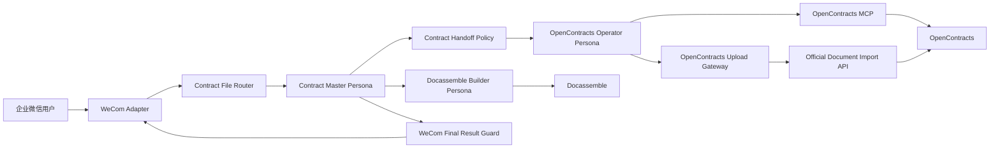
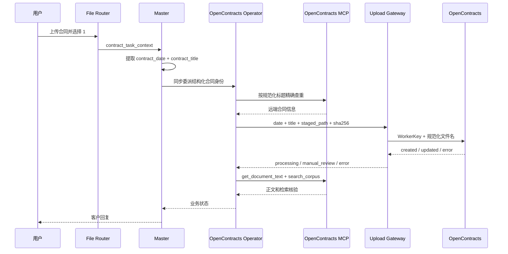

# ContractBotConfig

面向企业合同工作的 AstrBot 配置与扩展工程。项目通过企业微信接收合同文件，由主人格协调合同上传、合同问答、风险分析和文书生成，并以 OpenContracts 作为合同存储、解析、标注和检索系统。

当前仓库已进入 Phase 2。Phase 2-A 完成 OpenContracts MCP 能力面与 WorkerKey 文件导入面分离、合同远端身份规范化、不确定提交状态保护，并将上传 Gateway 拆分为职责明确的运行模块。

## 项目背景

合同处理流程包含四类核心能力：

1. 接收并暂存企业微信上传的合同文件。
2. 从合同正文提取合同日期和正式标题，建立稳定远端身份。
3. 使用 WorkerKey 将合同写入 OpenContracts，并通过 MCP 跟踪正文解析和检索状态。
4. 基于现有合同、批准模板和用户信息生成 DOCX 文书。

## 系统架构



## OpenContracts 集成

OpenContracts 官方 `docs/mcp/`、MCP 服务实现和运行时 `tools/list` 是 MCP 能力与参数的事实来源。本项目不复制远端读取实现。

推荐 corpus-scoped MCP 地址：

```text
http://opencontracts-api:8000/mcp/corpus/contracts/
```

当前能力包括：

```text
get_corpus_info
list_documents
get_document_text
list_annotations
list_relationships
search_corpus
list_threads
get_thread_messages
create_thread_message
```

`create_thread_message` 需要认证用户上下文。MCP 认证由 AstrBot MCP 连接管理，不属于上传 Gateway 配置。

合同文件写入使用 WorkerKey 调用官方单文档导入端点：

```text
POST /api/imports/documents/
Authorization: WorkerKey <token>
```

写入目标由 WorkerKey 绑定。Gateway 不要求或显示配置 Corpus ID。当前 corpus-scoped MCP 应指向同一业务 Corpus，写入后通过 MCP 核验实际远端结果。

| 能力 | 执行组件 | 配置位置 |
|---|---|---|
| Corpus、文档、正文、标注、关系、语义搜索和讨论线程 | OpenContracts Operator 使用 MCP Tools | AstrBot MCP 管理界面 |
| 新合同上传和确认后的版本写入 | `astrbot_plugin_opencontracts_gateway` | 插件 GUI 中的 WorkerKey |
| 合同日期、标题和远端文件名规范化 | Gateway `FileService` | Tool 参数 |
| 本地文件路径、大小和 SHA-256 校验 | Gateway `FileService` | 插件 GUI |
| 重新上传确认校验 | Gateway `ConfirmationService` | Router 状态文件 |
| 追加式上传审计 | Gateway `ReceiptStore` | 插件数据目录 |

## 合同远端身份

上传前主人格从合同正文提取：

```text
contract_date = YYYY-MM-DD
contract_title = 合同正文中的正式标题
```

统一生成：

```text
document_title = YYYY-MM-DD 合同标题
normalized_filename = YYYY-MM-DD_合同标题.原扩展名
```

MCP 查重使用规范化 `document_title`，并对返回结果做标题完全一致比较。日期或标题无法可靠取得时停止上传，不进行猜测。

## 工程结构

```text
.
├── config/                 示例配置
├── docs/
│   ├── architecture/       架构边界和 UML
│   ├── review/             代码审计与重构计划
│   └── uml/                架构入口文档
├── personas/               AstrBot Persona 导入文件
├── plugins/                AstrBot 插件
├── scripts/                发布打包工具
├── skills/                 AstrBot Skills
├── README.md
└── VERSIONS.md
```

## 组件职责

### Personas

- `contract_master_orchestrator`：唯一客户入口，提取合同身份、选择流程、协调子助手并生成最终回复。
- `contract_opencontracts_operator`：使用 OpenContracts MCP 和上传 Gateway 执行合同库操作，返回结构化业务状态。
- `contract_docassemble_builder`：基于合同库资料、批准模板和用户输入生成 DOCX 文书。

### Plugins

- `astrbot_plugin_contract_file_router`：文件暂存、会话状态、菜单选择、任务上下文和当前事件内的 LLM 请求。
- `astrbot_plugin_contract_handoff_policy`：规范委派参数，保留合同身份、安全约束和同步执行模式。
- `astrbot_plugin_opencontracts_gateway`：WorkerKey 文件导入、身份规范化、文件校验、确认校验和追加式审计。
- `astrbot_plugin_wecom_final_result_guard`：将内部状态转换为企业微信客户回复，并优先处理人工核查、重复确认和迟到结果。

### Skills

- `contract-orchestrator`：主人格的身份提取和上传编排。
- `contract-opencontracts`：MCP 精确查重、WorkerKey 文件导入和处理核验步骤。
- `contract-result-verification`：上传状态优先级和完成条件。
- `contract-conversation-control`：结束、取消、偏离输入和超时恢复。
- `contract-direct-analysis`：当前合同快速分析。
- `contract-docassemble`：文书生成和交付检查。

## 安装与配置

### 1. 安装 Plugins

运行发布脚本后，在 AstrBot WebUI 的插件管理中依次上传 `dist/plugins/` 中的 ZIP。安装后重载插件或重启 AstrBot。

### 2. 安装 Skills

在 AstrBot WebUI 中导入 `dist/skills/` 下的 Skill ZIP，并为相应 Persona 选择 Skill。

### 3. 导入 Personas

导入 `personas/` 中的最新版本 JSON。Persona JSON 只包含人格内容，Tools 和 Skills 在 WebUI 中单独分配。

### 4. 配置 OpenContracts MCP

在 AstrBot MCP 管理界面添加：

```text
http://opencontracts-api:8000/mcp/corpus/contracts/
```

上传流程至少需要：

```text
get_corpus_info
list_documents
get_document_text
search_corpus
```

分析、关系、标注和讨论场景按需分配其他 MCP Tools。

### 5. 配置上传 Gateway

在 `astrbot_plugin_opencontracts_gateway` 的 WebUI 配置中填写：

```text
auth_token = <OpenContracts WorkerKey>
import_path = /api/imports/documents/
```

`auth_token` 保存 CorpusAccessToken 的 WorkerKey。写入目标由 WorkerKey 绑定；Gateway 不保存 MCP 读取凭证，也不配置 Corpus ID。

### 6. 分配 Tools

| Persona | Tools |
|---|---|
| Master | `transfer_to_opencontracts_operator`、`transfer_to_docassemble_builder`、当前合同文件读取工具 |
| OpenContracts Operator | OpenContracts MCP 当前合同操作工具、`opencontracts_gateway_status`、`opencontracts_upload_document` |
| Docassemble Builder | Docassemble 生成工具和所需合同读取工具 |

## 用户流程

用户上传合同后收到：

```text
已收到合同文件。请选择需要执行的操作：

1. 上传进合同系统
2. 快速分析（提取关键信息 + 风险审查）
3. 自由提问（直接输入要查询的问题）
```

上传流程：



## 上传状态

```text
[CONTRACT_UPLOAD:DUPLICATE_CONFIRMATION_REQUIRED]
[CONTRACT_UPLOAD:BLOCKED]
[CONTRACT_UPLOAD:PROCESSING]
[CONTRACT_UPLOAD:COMPLETE]
[CONTRACT_UPLOAD:MANUAL_REVIEW]
[CONTRACT_UPLOAD:FAILED]
```

传输异常、服务端 5xx、成功响应结构异常和未确认版本写入均进入 `MANUAL_REVIEW`，禁止自动重试。`COMPLETE` 只表示正文可读并已进入检索；没有核验标注时不声明标注完成。

## OpenContracts Gateway 0.6.1 模块

```text
plugins/astrbot_plugin_opencontracts_gateway/
├── main.py
├── config/settings.py
├── domain/models.py
├── domain/results.py
├── clients/import_client.py
├── services/confirmation_service.py
├── services/file_service.py
├── services/import_response_policy.py
├── services/import_result_service.py
├── services/upload_service.py
└── storage/receipt_store.py
```

`main.py` 只负责 AstrBot Tool 注册和服务装配。各运行模块保持明确职责。

## MVP 验证策略

当前阶段不新增测试目录。合并前执行：

```bash
python3 -m compileall -q plugins scripts
python scripts/build_release.py --clean
```

随后在 AstrBot WebUI 中加载 Plugin、Skill、Persona 和 MCP 配置，并在真实环境验证首次上传、重复确认、人工核查、正文读取和检索状态。

## 发布打包

```bash
python scripts/build_release.py --clean
```

输出：

```text
dist/
├── plugins/
├── skills/
├── personas/
└── MANIFEST.json
```

## 开发阶段

1. Phase 1：冻结架构，补齐 UML、审计、README 和发布工具。
2. Phase 2-A：MCP 能力面与 WorkerKey 文件导入面拆分；完成合同身份规范化、提交状态保护和 Upload Gateway 模块化。
3. Phase 2-B：拆分 Contract File Router。
4. Phase 2-C：拆分 WeCom Final Result Guard。
5. 运行时代码、Skill 或 Persona 行为发生变化时更新对应版本；纯文档变更维持组件版本。
