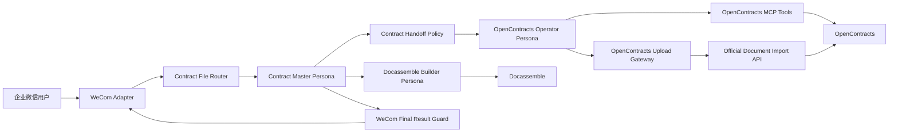
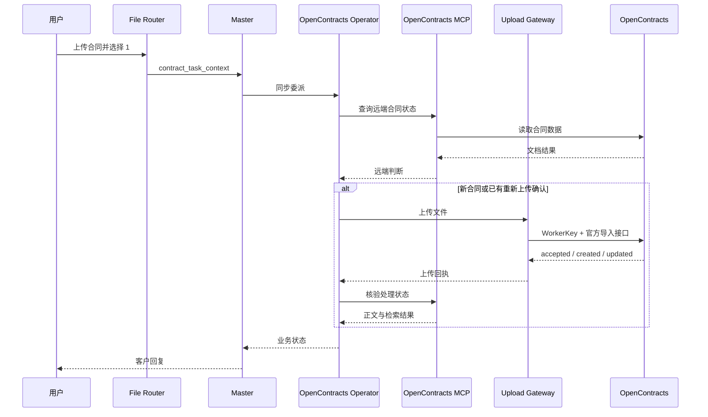

# ContractBotConfig

面向企业合同工作的 AstrBot 配置与扩展工程。项目通过企业微信接收合同文件，由主人格协调合同上传、合同问答、风险分析和文书生成，并以 OpenContracts 作为合同存储、解析和检索系统。

当前仓库保存可恢复的运行基线，同时记录 Phase 1 冻结后的目标架构。Phase 1 只完善架构、审计和发布工程，不调整插件、Skill 或 Persona 版本号；运行时代码重构在 Phase 2 进行。

## 项目背景

合同处理流程包含四类核心能力：

1. 接收并暂存企业微信上传的合同文件。
2. 将合同写入 OpenContracts，跟踪解析和处理状态。
3. 通过 OpenContracts MCP 查询合同、读取正文并完成检索验证。
4. 基于现有合同、批准模板和用户信息生成 DOCX 文书。

## 系统架构



### OpenContracts 集成边界

| 能力 | 执行组件 | 凭证与配置 |
|---|---|---|
| 合同列表、合同识别、正文读取、搜索和处理状态核验 | AstrBot 中配置的 OpenContracts MCP Tools | 由 AstrBot MCP 配置管理 |
| 新合同上传和确认后的版本化重新上传 | `astrbot_plugin_opencontracts_gateway` 调用 OpenContracts 官方导入接口 | WorkerKey |
| 本地文件校验、SHA-256 校验、允许目录校验 | `astrbot_plugin_opencontracts_gateway` | 插件 GUI 配置 |
| 上传回执和恢复线索 | Gateway 本地 receipt | 插件数据目录 |

Gateway 的 Phase 2 目标职责是上传写入、文件安全校验和回执记录。合同读取和重复判断由 OpenContracts MCP 返回的远端数据完成。

当前基线中的 Gateway 0.5.1 仍包含 `/api/imports/documents/lookup/` 查询实现。该差异已记录在架构审计中，后续代码重构会先迁移读取与重复判断，再拆分大文件。

## 工程结构

```text
.
├── config/                 示例配置
├── docs/
│   ├── architecture/       架构边界和 UML
│   ├── review/             Phase 1 代码审计与重构计划
│   └── uml/                架构入口文档
├── personas/               AstrBot Persona 导入文件
├── plugins/                AstrBot 插件
├── scripts/                发布打包工具
├── skills/                 AstrBot Skills
├── README.md
└── VERSIONS.md
```

## 组件职责

### Personas

- `contract_master_orchestrator`：唯一面向客户的主助手，理解用户目标、选择流程、协调子助手并生成最终回复。
- `contract_opencontracts_operator`：执行 OpenContracts 读取、上传和核验任务，向主人格返回结构化业务状态。
- `contract_docassemble_builder`：基于合同库资料、批准模板和用户输入生成 DOCX 文书。

### Plugins

- `astrbot_plugin_contract_file_router`：文件暂存、会话状态、菜单选择、任务上下文和当前事件内的 LLM 请求。
- `astrbot_plugin_contract_handoff_policy`：规范主人格到专业子助手的委派参数和同步执行模式。
- `astrbot_plugin_opencontracts_gateway`：WorkerKey 写入、文件校验和上传回执。
- `astrbot_plugin_wecom_final_result_guard`：将内部状态转换为企业微信客户回复，并维护重复确认和迟到结果处理。

### Skills

- `contract-orchestrator`：主人格的上传编排。
- `contract-opencontracts`：OpenContracts 操作步骤和结果契约。
- `contract-result-verification`：上传状态标记和核验标准。
- `contract-conversation-control`：结束、取消、偏离输入和超时恢复。
- `contract-direct-analysis`：当前合同快速分析。
- `contract-docassemble`：文书生成和交付检查。

## 安装与配置

### 1. 安装 Plugins

在 AstrBot WebUI 的插件管理中，依次上传 `dist/plugins/` 中生成的插件 ZIP。安装后重载插件或重启 AstrBot。

### 2. 安装 Skills

在 AstrBot WebUI 中导入 `dist/skills/` 下的 Skill ZIP，并为相应 Persona 选择 Skill。

### 3. 导入 Personas

导入 `personas/` 中的 JSON 文件。Persona JSON 只包含人格内容，Tools 和 Skills 在 WebUI 中单独分配。

### 4. 配置 OpenContracts MCP

在 AstrBot MCP 管理界面添加 OpenContracts 提供的 MCP 服务。OpenContracts Operator 至少需要合同列表、文档正文和语义搜索相关工具，例如：

```text
list_public_corpuses
list_documents
get_document_text
search_corpus
```

具体工具名称以当前 OpenContracts MCP 的工具发现结果为准。

### 5. 配置上传 Gateway

在 `astrbot_plugin_opencontracts_gateway` 的 WebUI 配置中填写：

```text
auth_mode = worker_key
auth_token = <OpenContracts WorkerKey>
default_corpus_id = <目标 Corpus ID>
default_corpus_slug = contracts
```

插件上传路径使用 OpenContracts 官方文档导入接口。读取能力由 MCP 提供，因此 Gateway 配置不包含独立的读取 Bearer Token。

### 6. 分配 Tools

| Persona | 主要 Tools |
|---|---|
| Master | `transfer_to_opencontracts_operator`、`transfer_to_docassemble_builder`、文件读取工具 |
| OpenContracts Operator | OpenContracts MCP 读取工具、`opencontracts_gateway_status`、`opencontracts_upload_document` |
| Docassemble Builder | Docassemble 生成工具和所需的合同读取工具 |

## 用户流程

用户上传合同后收到：

```text
已收到合同文件。请选择需要执行的操作：

1. 上传进合同系统
2. 快速分析（提取关键信息 + 风险审查）
3. 自由提问（直接输入要查询的问题）
```

上传流程：



## 发布打包

```bash
python scripts/build_release.py --clean
```

脚本逐个打包 `plugins/*` 和 `skills/*`，并生成 Persona 包及 SHA-256 清单：

```text
dist/
├── plugins/
├── skills/
├── personas/
└── MANIFEST.json
```

详见 `scripts/README.md`。

## 开发流程

1. Phase 1：冻结架构，补齐 UML、审计、README 和发布工具。
2. Phase 2：按 `docs/review/refactor-target.md` 拆分 Gateway 和 Router。
3. 每次运行时代码修改同步更新对应插件 README 中的 UML。
4. 插件、Skill 或 Persona 行为发生变化时更新对应版本；纯文档变更维持当前组件版本。

## 架构文档

- `docs/architecture/system-context.md`
- `docs/architecture/opencontracts-integration.md`
- `docs/architecture/upload-sequence.md`
- `docs/review/phase1-code-audit.md`
- `docs/review/refactor-target.md`
- `docs/review/persona-skill-plugin-matrix.md`
