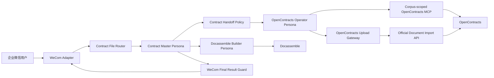
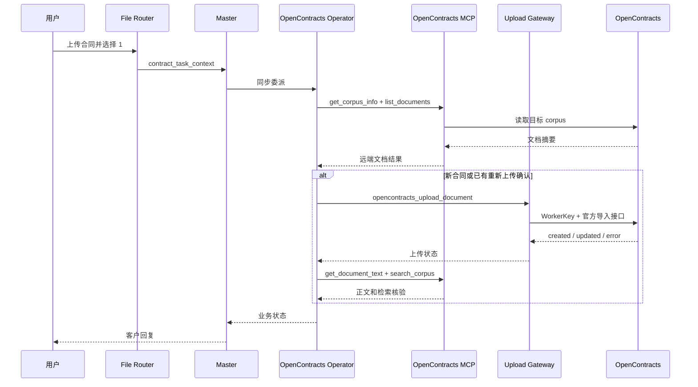

# ContractBotConfig

面向企业合同工作的 AstrBot 配置与扩展工程。项目通过企业微信接收合同文件，由主人格协调合同上传、合同问答、风险分析和文书生成，并以 OpenContracts 作为合同存储、解析和检索系统。

当前仓库已进入 Phase 2。第一阶段完成 OpenContracts 读取与写入职责拆分，并将上传 Gateway 从单文件重构为可测试模块。

## 项目背景

合同处理流程包含四类核心能力：

1. 接收并暂存企业微信上传的合同文件。
2. 将合同写入 OpenContracts，跟踪解析和处理状态。
3. 通过 OpenContracts MCP 查询合同、读取正文并完成检索验证。
4. 基于现有合同、批准模板和用户信息生成 DOCX 文书。

## 系统架构



## OpenContracts 集成

| 能力 | 执行组件 | 配置位置 |
|---|---|---|
| Corpus 信息、合同列表、合同发现、正文读取、语义搜索和处理核验 | OpenContracts Operator 使用 OpenContracts MCP Tools | AstrBot MCP 管理界面 |
| 新合同上传和确认后的版本写入 | `astrbot_plugin_opencontracts_gateway` | 插件 GUI 中的 WorkerKey |
| 本地文件路径、大小和 SHA-256 校验 | Upload Gateway `FileService` | 插件 GUI |
| 重新上传确认校验 | Upload Gateway `ConfirmationService` | Router 状态文件 |
| 上传回执 | Upload Gateway `ReceiptStore` | 插件数据目录 |

推荐 MCP 地址：

```text
http://opencontracts-api:8000/mcp/corpus/contracts/
```

该 scoped endpoint 为 Operator 提供 `get_corpus_info`、`list_documents`、`get_document_text` 和 `search_corpus`。MCP 连接由 AstrBot 管理；上传插件不保存 MCP 读取凭证。

Gateway 使用 WorkerKey 调用 OpenContracts 官方单文档导入端点：

```text
POST /api/imports/documents/
Authorization: WorkerKey <token>
```

## 工程结构

```text
.
├── config/                 示例配置
├── docs/
│   ├── architecture/       架构边界和 UML
│   ├── review/             代码审计与重构计划
│   └── uml/                架构入口文档
├── personas/               AstrBot Persona 导入文件
├── plugins/                AstrBot 插件
├── scripts/                发布打包工具
├── skills/                 AstrBot Skills
├── README.md
└── VERSIONS.md
```

## 组件职责

### Personas

- `contract_master_orchestrator`：唯一面向客户的主助手，理解用户目标、选择流程、协调子助手并生成最终回复。
- `contract_opencontracts_operator`：执行 OpenContracts 合同发现、读取、写入和核验任务，向主人格返回结构化业务状态。
- `contract_docassemble_builder`：基于合同库资料、批准模板和用户输入生成 DOCX 文书。

### Plugins

- `astrbot_plugin_contract_file_router`：文件暂存、会话状态、菜单选择、任务上下文和当前事件内的 LLM 请求。
- `astrbot_plugin_contract_handoff_policy`：规范主人格到专业子助手的委派参数和同步执行模式。
- `astrbot_plugin_opencontracts_gateway`：WorkerKey 写入、文件校验、确认校验和上传审计。
- `astrbot_plugin_wecom_final_result_guard`：将内部状态转换为企业微信客户回复，并维护重复确认和迟到结果处理。

### Skills

- `contract-orchestrator`：主人格的上传编排。
- `contract-opencontracts`：MCP 读取、WorkerKey 写入和核验步骤。
- `contract-result-verification`：上传状态标记和核验标准。
- `contract-conversation-control`：结束、取消、偏离输入和超时恢复。
- `contract-direct-analysis`：当前合同快速分析。
- `contract-docassemble`：文书生成和交付检查。

## 安装与配置

### 1. 安装 Plugins

运行发布脚本后，在 AstrBot WebUI 的插件管理中依次上传 `dist/plugins/` 中的 ZIP。安装后重载插件或重启 AstrBot。

### 2. 安装 Skills

在 AstrBot WebUI 中导入 `dist/skills/` 下的 Skill ZIP，并为相应 Persona 选择 Skill。

### 3. 导入 Personas

导入 `personas/` 中的 JSON 文件。Persona JSON 只包含人格内容，Tools 和 Skills 在 WebUI 中单独分配。

### 4. 配置 OpenContracts MCP

在 AstrBot MCP 管理界面添加 corpus-scoped OpenContracts MCP：

```text
http://opencontracts-api:8000/mcp/corpus/contracts/
```

OpenContracts Operator 分配以下工具：

```text
get_corpus_info
list_documents
get_document_text
search_corpus
```

### 5. 配置上传 Gateway

在 `astrbot_plugin_opencontracts_gateway` 的 WebUI 配置中填写：

```text
auth_token = <OpenContracts WorkerKey>
import_path = /api/imports/documents/
default_corpus_id = <目标 Corpus ID，可留空使用 WorkerKey 绑定>
default_corpus_slug = contracts
```

`auth_token` 字段保存 CorpusAccessToken 的 WorkerKey。插件只使用 `WorkerKey` 认证模式。

### 6. 分配 Tools

| Persona | Tools |
|---|---|
| Master | `transfer_to_opencontracts_operator`、`transfer_to_docassemble_builder`、文件读取工具 |
| OpenContracts Operator | `get_corpus_info`、`list_documents`、`get_document_text`、`search_corpus`、`opencontracts_gateway_status`、`opencontracts_upload_document` |
| Docassemble Builder | Docassemble 生成工具和所需合同读取工具 |

## 用户流程

用户上传合同后收到：

```text
已收到合同文件。请选择需要执行的操作：

1. 上传进合同系统
2. 快速分析（提取关键信息 + 风险审查）
3. 自由提问（直接输入要查询的问题）
```

上传流程：



## OpenContracts Gateway 0.6.0 模块

```text
plugins/astrbot_plugin_opencontracts_gateway/
├── main.py
├── config/settings.py
├── domain/models.py
├── domain/results.py
├── clients/import_client.py
├── services/confirmation_service.py
├── services/file_service.py
├── services/upload_service.py
├── storage/receipt_store.py
└── tests/
    ├── test_confirmation_service.py
    └── test_upload_service.py
```

`main.py` 只负责 AstrBot Tool 注册和服务装配。各模块可以单独测试，不依赖模型推理。

## 验证

```bash
python -m compileall -q plugins
python -m unittest discover -s plugins/astrbot_plugin_opencontracts_gateway/tests -v
```

## 发布打包

```bash
python scripts/build_release.py --clean
```

输出：

```text
dist/
├── plugins/
├── skills/
├── personas/
└── MANIFEST.json
```

## 开发阶段

1. Phase 1：冻结架构，补齐 UML、审计、README 和发布工具。
2. Phase 2-A：MCP 读取与 WorkerKey 写入拆分；完成 Upload Gateway 模块化。
3. Phase 2-B：拆分 Contract File Router。
4. Phase 2-C：拆分 WeCom Final Result Guard，并减少自然语言错误兼容分类。
5. 运行时代码、Skill 或 Persona 行为发生变化时更新对应版本；纯文档变更维持组件版本。
