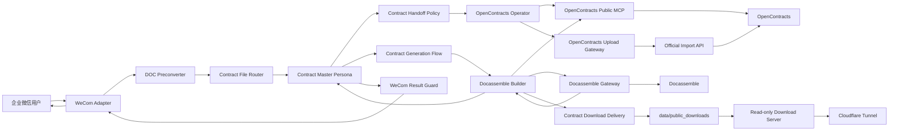

# ContractBotConfig

面向企业合同工作的 AstrBot 配置与扩展工程。系统通过企业微信接收合同文件，由主人格协调上传、问答、风险分析和文书生成；OpenContracts 负责合同存储、解析和检索，Docassemble 负责文书生成，Contract Generation Flow 负责生成确认与阶段提示，独立 Download Delivery 负责把生成的 DOCX 以短时 HTTPS 链接交付给用户。

## 当前能力

1. 接收并暂存企业微信合同文件；
2. 将旧版 Word `.doc` 通过 Gotenberg/LibreOffice 转换为 PDF；
3. 提取合同日期和正式标题，生成稳定远端身份；
4. 使用 OpenContracts 公开 MCP 执行查重、正文读取和语义检索；
5. 使用 WorkerKey 调用官方导入 API 写入合同；
6. 对重复、阻断、处理中、完成、人工核查和失败状态执行确定性会话控制；
7. 文书生成先向用户发送即时回执、整理信息并等待明确确认，再进入正式生成；
8. 正式生成前实时读取合同库参考正文，并通过 Docassemble allowlist interview 生成真实 DOCX；
9. 将 Docassemble Gateway 输出的 DOCX 发布为带高熵 token 和 TTL 的临时 HTTPS 下载链接，供企业微信用户在浏览器下载。

## 系统架构



## OpenContracts 集成

AstrBot 配置公开 MCP：

```text
http://opencontracts-api:8000/mcp/
```

读取链路使用：

```text
list_documents
get_document_text
search_corpus
```

目标 Corpus slug 由任务上下文提供。上传流程不使用 `list_public_corpuses` 猜测目标，也不调用旧的 `opencontracts_check_duplicate`。

写入使用官方端点：

```text
POST /api/imports/documents/
Authorization: WorkerKey <token>
```

写入目标由 WorkerKey 绑定。Gateway 不配置 Corpus ID，也不保存 MCP 读取凭证。

## 文书生成确认流程

新的合同生成请求不再直接进入 Builder。目标流程：

```text
用户提出生成请求
→ Generation Flow 立即发送“已收到”
→ Master 整理已知信息 / 缺失信息
→ 发送确认清单
→ 等待用户修改或回复“确认生成”
→ 用户确认
→ 提示开始读取合同库
→ Builder 实时读取 OpenContracts 参考合同
→ Docassemble 生成 DOCX
→ Download Delivery 发布临时 HTTPS 链接
→ Master 向用户交付下载链接
```

确认门由运行时插件确定性控制。首次待确认委派会清空 Builder ToolSet，不能依赖模型自行遵守 `must_not_execute`。

正式生成时 Builder 必须同时具备完整 7 个工具：

```text
list_documents
get_document_text
search_corpus
docassemble_gateway_status
docassemble_generate_document
contract_download_delivery_status
publish_contract_download
```

缺少任一工具时正式生成直接 BLOCKED。正式客户合同还必须在本轮触发 `list_documents` 和 `get_document_text` 后才能进入 `docassemble_generate_document`。

## Docassemble 与临时下载交付

AstrBot 与 Docassemble 共用 Docker `legal-network` 时，Docassemble Gateway 默认访问：

```text
http://docassemble
```

生成和交付工具：

```text
docassemble_gateway_status
docassemble_generate_document
contract_download_delivery_status
publish_contract_download
```

完整链路：

```text
Docassemble Builder
→ list_documents / get_document_text
→ docassemble_gateway_status
→ contract_download_delivery_status
→ 选择正式 allowlist interview
→ docassemble_generate_document
→ GET /api/session/new
→ POST /api/session
→ interview json_response(contractbot_document)
→ GET /api/file/<file_number>?extension=docx
→ Gateway 校验并保存 DOCX
→ publish_contract_download(output_path, output_filename)
→ data/public_downloads/<48-hex-token>/<filename>.docx
→ https://download.ri0n72y.top/contracts/<token>/<filename>
→ Master 将链接发送给企业微信用户
```

`api_key` 只保存在 Docassemble Gateway 插件配置中，不进入 Persona、Skill、LLM 上下文、日志或用户回复。MVP 暂允许使用管理员 API Key；独立服务账户由安全 Issue #7 跟踪。

### Interview 返回契约

ContractBot 使用的 API-first interview 完成时必须返回：

```json
{
  "contractbot_document": {
    "status": "complete",
    "file_number": 123,
    "filename": "contract.docx",
    "extension": "docx"
  }
}
```

`file_number` 必须来自 Docassemble 生成文件的 `DAFile.number`。Gateway 不接受模型自行生成的本地文件冒充 Docassemble 输出。

仓库中的：

```text
docs/docassemble/contractbot_api_smoke.yml
```

只用于 API → DOCX → `/api/file` 链路 smoke。正式客户合同禁止使用文件名包含 `smoke` 的 interview，Gateway 会确定性阻断。

仓库同时提供最小非 smoke 生成 interview 样例：

```text
docs/docassemble/contractbot_document_generation.yml
```

生产环境仍应优先使用经批准的真实 Docassemble package/interview 和模板。

### 临时下载安全边界

Delivery Plugin 默认只允许发布 Docassemble Gateway 的输出目录，并复制到：

```text
data/public_downloads/<48-hex-token>/<filename>.docx
```

主要约束：

- 来源必须位于 `allowed_source_dirs`；
- 拒绝符号链接和非 DOCX；
- 校验 DOCX ZIP 必需结构和最大文件大小；
- 发布后重新计算 SHA-256，必须与源文件一致；
- token 使用 `secrets.token_hex(24)`；
- 默认 TTL 1800 秒；
- 长期审计不保存 token 和下载 URL；
- 清理器不使用递归删除，只处理 `public_root` 直属且名称严格匹配 token 规则的目录。

### Builder WebUI 绑定

`contract_docassemble_builder` 应绑定：

```text
Skill:
- contract-docassemble

Tools:
- list_documents
- get_document_text
- search_corpus
- docassemble_gateway_status
- docassemble_generate_document
- contract_download_delivery_status
- publish_contract_download
```

不得向 Builder 绑定用于生成或交付替代路径的 Shell、Python、`python-docx`、通用 HTTP 或通用文件写入/编辑能力。

只有 `docassemble_generate_document` 成功取得真实 DOCX，并且 `publish_contract_download` 成功返回 HTTPS `download_url`，Builder 才能输出 `[CONTRACT_DOCASSEMBLE:READY]`。Master 只向客户展示下载链接、文件名和有效期，不展示本地 `output_path`。

## 下载基础设施

已验证部署拓扑：

```text
bot.ri0n72y.top
→ Cloudflare Tunnel
→ http://localhost:6185
→ AstrBot / Hypercorn

download.ri0n72y.top + ^/contracts/.*
→ Cloudflare Tunnel
→ http://localhost:6198
→ 独立只读下载服务
```

AstrBot `/AstrBot/data` 使用宿主机 bind mount，因此 `data/public_downloads` 可由 AstrBot 写入、下载服务只读挂载。生产环境不要使用 smoke 阶段的 `python -m http.server`；使用仓库提供的：

```text
docs/deployment/contract-download-nginx.conf
docs/deployment/contract-download-delivery.md
```

下载服务端口只绑定 `127.0.0.1:6198`，公网入口只通过 Cloudflare Tunnel。

## 合同身份与上传状态

远端身份格式：

```text
document_title = YYYY-MM-DD 合同标题
normalized_filename = YYYY-MM-DD_合同标题.原扩展名
```

上传状态：

```text
[CONTRACT_UPLOAD:DUPLICATE_CONFIRMATION_REQUIRED]
[CONTRACT_UPLOAD:BLOCKED]
[CONTRACT_UPLOAD:PROCESSING]
[CONTRACT_UPLOAD:COMPLETE]
[CONTRACT_UPLOAD:MANUAL_REVIEW]
[CONTRACT_UPLOAD:FAILED]
```

Router 在 `BLOCKED` 后保留暂存文件和 pending 状态；客户补充缺失信息或系统修复后回复“继续”时复用原文件，回复“结束”或“取消”时才清理。

## 当前版本

以 [VERSIONS.md](VERSIONS.md) 为唯一版本基线。当前关键组件：

```text
astrbot_plugin_contract_doc_preconverter 0.1.3
astrbot_plugin_contract_download_delivery 0.1.0
astrbot_plugin_contract_file_router 0.5.4
astrbot_plugin_contract_generation_flow 0.1.1
astrbot_plugin_contract_handoff_policy 0.4.6
astrbot_plugin_docassemble_gateway 0.1.2
astrbot_plugin_opencontracts_gateway 0.6.1
astrbot_plugin_wecom_final_result_guard 0.3.5
contract-docassemble 1.17
contract-orchestrator 1.16
contract-result-verification 1.16.4
contract_docassemble_builder 1.16
contract_master_orchestrator 1.20
contract_opencontracts_operator 1.17
```

## 安装与配置

### Plugins

在 AstrBot WebUI 中安装构建后的插件 ZIP。

本轮生成链路重点组件：

```text
astrbot_plugin_contract_generation_flow
astrbot_plugin_docassemble_gateway
astrbot_plugin_contract_download_delivery
```

### Skills

导入 `dist/skills/` 中构建后的 Skill ZIP，并在对应 Persona 中手动绑定。

### Personas

Persona 不再生成或导入 ZIP。构建后 `dist/personas/` 为每个人格输出一份 Markdown。管理员在 AstrBot WebUI 中手动创建或更新 Persona：

1. 按 Markdown 文件头的 `persona_id` 和 `version` 确认目标人格；
2. 把 `System Prompt` 代码块完整复制到 Persona；
3. 按文件头 `tools` 列表手动绑定 Tools；
4. 按文件头 `skills` 列表手动绑定 Skills。

绑定源数据维护在：

```text
personas/bindings.json
```

详细规则见：

```text
docs/deployment/persona-manual-config.md
```

### OpenContracts Gateway

```text
auth_token = <OpenContracts WorkerKey>
import_path = /api/imports/documents/
```

### Docassemble Gateway

```text
base_url = http://docassemble
api_key = <Docassemble API Key>
allowed_interviews = [<完整正式 interview filename>]
default_interview = <完整正式 interview filename>
result_descriptor_key = contractbot_document
```

正式环境不要把 smoke interview 设置为默认生产 interview。

### Contract Download Delivery

```text
public_root = data/public_downloads
public_base_url = https://download.ri0n72y.top/contracts
allowed_source_dirs = [data/plugins_data/astrbot_plugin_docassemble_gateway/output]
ttl_seconds = 1800
cleanup_interval_seconds = 60
max_file_bytes = 31457280
```

## Persona 手动绑定

### contract_master_orchestrator

Tools：

```text
transfer_to_opencontracts_operator
transfer_to_docassemble_builder
```

Skills：

```text
contract-orchestrator
contract-direct-analysis
contract-conversation-control
contract-result-verification
```

### contract_opencontracts_operator

Tools：

```text
list_documents
get_document_text
search_corpus
opencontracts_gateway_status
opencontracts_upload_document
```

Skills：

```text
contract-opencontracts
contract-result-verification
```

### contract_docassemble_builder

Tools：

```text
list_documents
get_document_text
search_corpus
docassemble_gateway_status
docassemble_generate_document
contract_download_delivery_status
publish_contract_download
```

Skills：

```text
contract-docassemble
```

下载交付工具只绑定给 Builder，不绑定给 Master。

## 工具边界

上传期间：

- Master 只读取当前合同并调用 `transfer_to_opencontracts_operator`；
- Operator 只使用公开 MCP Tools、`opencontracts_gateway_status` 和 `opencontracts_upload_document`；
- Master 和 Operator 不使用 Shell、Python、通用 HTTP、配置文件读取或直接 MCP JSON-RPC 绕过标准流程。

文书生成期间：

- Master 只负责确认和 `transfer_to_docassemble_builder`；
- Builder 使用 OpenContracts 只读工具取得本轮参考正文；
- 最终 DOCX 只允许由 Docassemble Gateway 生成；
- 临时公网链接只允许由 Contract Download Delivery 发布；
- `contract_download_delivery_status` 和 `publish_contract_download` 只绑定给 `contract_docassemble_builder`；
- Builder 不使用 Shell、Python、`python-docx`、通用 HTTP、本地脚本或任意文件写入/编辑作为后备方案。

## 构建发布包

```bash
python3 -m compileall -q plugins scripts
python3 scripts/build_release.py --clean
```

输出：

```text
dist/
├── plugins/     # 插件 ZIP
├── skills/      # Skill ZIP
├── personas/    # 每个人格一份手动配置 Markdown
└── MANIFEST.json
```

Persona 示例：

```text
dist/personas/
├── contract_master_orchestrator-1.20.md
├── contract_opencontracts_operator-1.17.md
└── contract_docassemble_builder-1.16.md
```

仓库中的 `personas/persona_*_v*.json` 继续作为版本化 Prompt 源文件，不直接作为部署产物。

## 工程结构

```text
config/       示例配置
docs/         架构、审计和部署说明
personas/     Persona JSON 源文件与 bindings.json 手动绑定清单
plugins/      AstrBot 插件
scripts/      发布工具
skills/       AstrBot Skills
```
