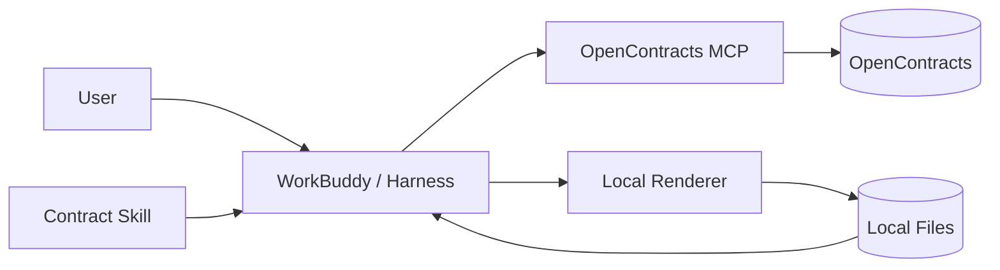
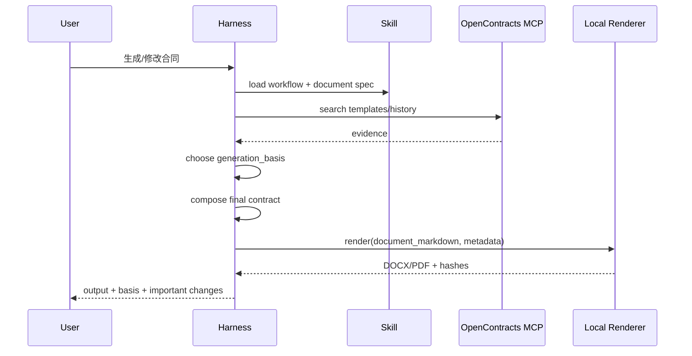

# 合同生成与本地产物架构

## 1. 目标

正式合同生成、重写和修改不再依赖 AstrBot Builder / Generation Flow。客户选择的 WorkBuddy 或其他 harness 负责模型推理，Contract Skill Pack 负责业务流程与格式规则，本地确定性脚本负责 DOCX/PDF 产物。

## 2. 组件



### Harness / Model

负责：

- 理解用户交易事实；
- 判断是分析、修改、重写还是新合同；
- 搜索企业模板和历史资料；
- 组织最终合同正文；
- 生成修改说明和差异摘要。

### Skill Pack

负责：

- generation basis 选择；
- 历史事实迁移限制；
- 指定模板 fail-closed 规则；
- 合同文档规范；
- 产物文件命名；
- 归档前检查。

### Local Renderer

从旧 `contract_docx_generator` 抽取可复用的确定性逻辑，禁止依赖 AstrBot runtime。输入为结构化 Markdown/JSON，输出为 DOCX；PDF 作为可选转换步骤。

## 3. Generation basis

继续保留旧方案中有效的证据顺序：

```text
specific_template
→ history_reference
→ ai_scaffold
```

默认允许找不到模板时继续使用历史参考或 AI scaffold；只有用户明确要求“必须使用指定模板/找不到不要生成”时，才进入 `require_specific_template`。

## 4. 模板与历史合同规则

- 模板必须来自本轮 OpenContracts MCP 检索结果，不允许根据名称猜 URL/ID；
- 历史合同主要参考结构、条款组合和措辞；
- 金额、日期、比例、税率、地址、账户、工期、项目名称等项目特定事实默认不得迁移；
- 只有用户明确授权的字段才可从历史合同复用；
- 企业规则与用户本轮明确事实冲突时，先提示冲突，不静默覆盖。

## 5. 文档规范

`contract-document-specification` 的核心内容保留，但从 AstrBot grounding 机制改为普通 Skill 组成部分。它只约束：

- 封面；
- 标题层级；
- 条款编号；
- 表格；
- 金额/日期表达；
- 留白与分页；
- 签署页；
- 附件。

它不提供固定合同条款，也不决定 generation basis。

## 6. 正式生成流程



## 7. 修改已有合同

修改流程应优先保持原合同结构：

```text
source file
→ parse/read locally
→ identify requested changes
→ query OpenContracts only when enterprise evidence is needed
→ edit the minimum necessary content
→ produce revised file
→ produce change summary / diff
```

不要求每次修改都搜索模板库。

## 8. Draft 与版本

旧 Draft Store 不再是必须组件。首版使用工作目录中的显式文件版本：

```text
contract-name.v1.docx
contract-name.v2.docx
```

同时生成 sidecar metadata：

```json
{
  "source_file": "...",
  "source_hash": "...",
  "generation_basis": "specific_template|history_reference|ai_scaffold|user_source",
  "reference_documents": [],
  "created_at": "..."
}
```

若后续需要跨设备版本管理，再优先映射到 OpenContracts document version，而不是重建本地数据库。

## 9. 交付

办公室场景直接使用本地产物，不再需要独立 HTTPS Download Delivery。

微信场景先依赖 WorkBuddy 自己的产物/远程通道能力。是否需要重新引入临时下载链接必须由 PoC 决定；未验证前不得把旧 Download Delivery 重新设为核心依赖。

## 10. 安全门槛

Renderer 只处理明确输入/输出路径：

- 不执行模型生成的任意 shell；
- 不允许路径逃逸工作目录；
- 不覆盖原文件，除非用户明确要求且宿主允许；
- 输出前计算 hash；
- 临时目录与产物目录分离；
- 真实合同内容不写入应用日志。
