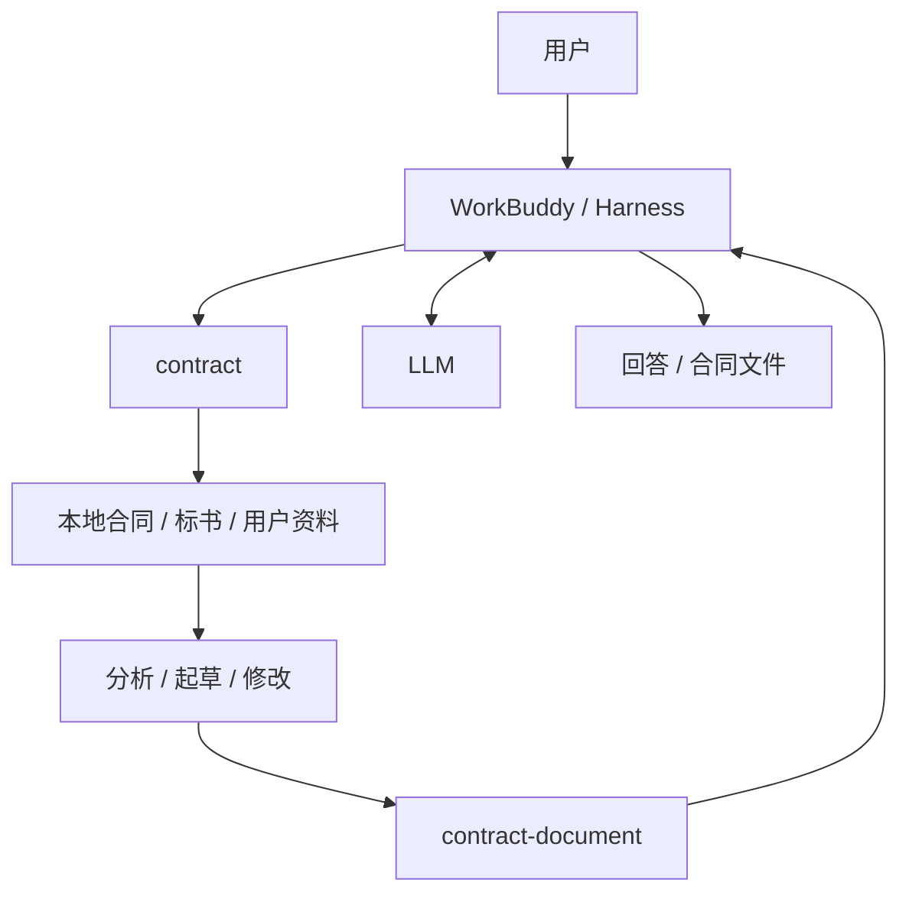
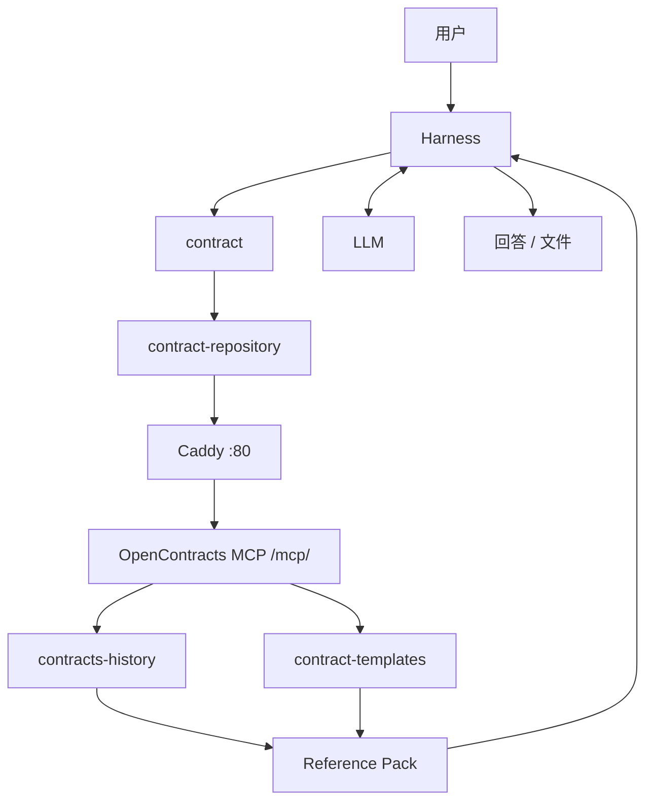
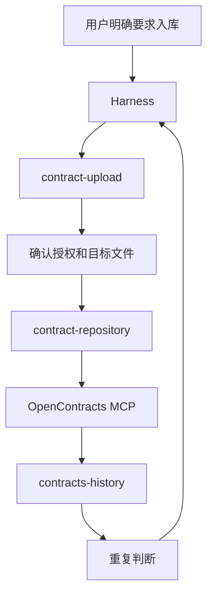
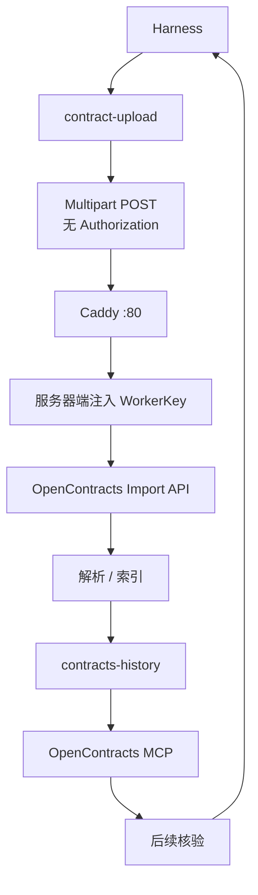
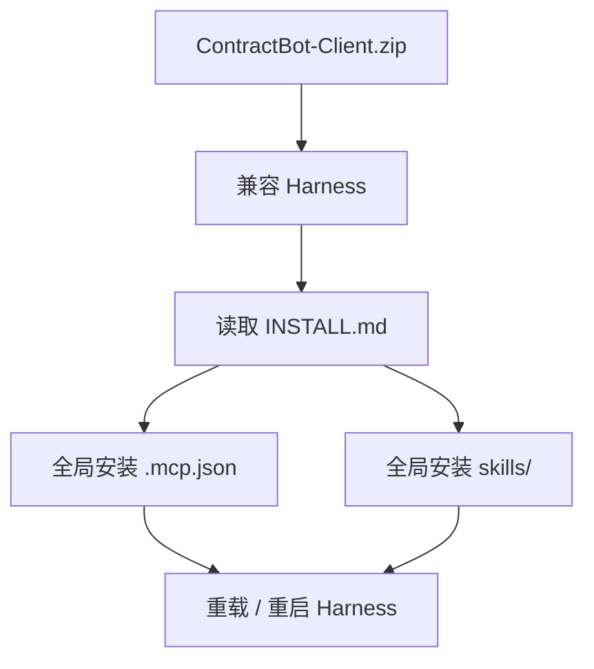
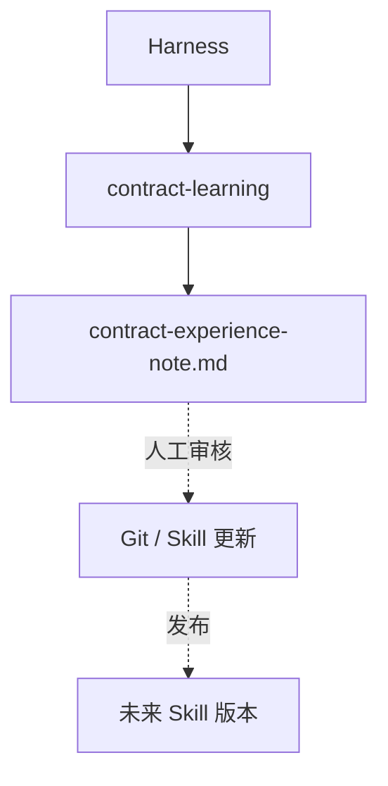

# Contract Skill Pack MVP — 业务主链图

当前 MVP 的共同模式：Harness 加载 ContractBot Skills；需要资料库时通过固定内网 IP 的 OpenContracts MCP；正式入库时客户端不持有 WorkerKey，由服务器端 Caddy 注入。

## 1. 本地分析 / 起草 / 修改



这条链不需要 OpenContracts，当前文件默认留在 Harness 本地。

## 2. 历史合同 / 模板检索

固定 Corpus：

```text
contracts-history
contract-templates
```



客户端 MCP URL 由分发包中的 `.mcp.json` 提供，例如：

```text
http://<fixed-lan-ip>/mcp/
```

## 3A. 正式入库前检查



正式入库与分析、修改、文件生成相互独立，必须有用户明确授权。

## 3B. 正式入库写入链



关键边界：

```text
客户端
  无 WorkerKey
  无 add_to_corpus_id
  只发送文件和业务元数据

Caddy
  从服务器 .env 获得 WorkerKey
  覆盖 Authorization header

OpenContracts
  WorkerKey 绑定 contracts-history
```

因此正式写凭据不进入客户 ZIP、Skill、MCP 或用户环境。

## 4. 客户端安装



Windows fallback 是 `client-setup.ps1`，只负责 MCP 和 Skills，不安装证书、不写 WorkerKey、不创建 ContractBot runtime 目录。

## 5. 经验沉淀



经验材料不进入 OpenContracts，也不存在 learning Corpus。

## 6. 资源总览

```text
RESOURCE · SKILL · contract
RESOURCE · SKILL · contract-repository
RESOURCE · SKILL · contract-upload
RESOURCE · SKILL · contract-document
RESOURCE · SKILL · contract-learning

RESOURCE · MCP · OpenContracts /mcp/
RESOURCE · CORPUS · contracts-history
RESOURCE · CORPUS · contract-templates

RUNTIME · WorkBuddy / Harness
RUNTIME · LLM
RUNTIME · Caddy
RUNTIME · OpenContracts
```

当前受信任网络 MVP：

```text
Harness
→ Skill
→ http://<fixed-lan-ip>/mcp/ 或 formal-import route
→ Caddy
→ OpenContracts
→ Harness
↔ LLM
→ 用户结果
```
