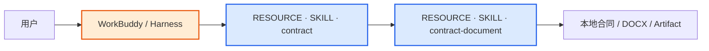
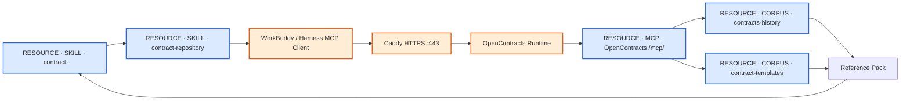
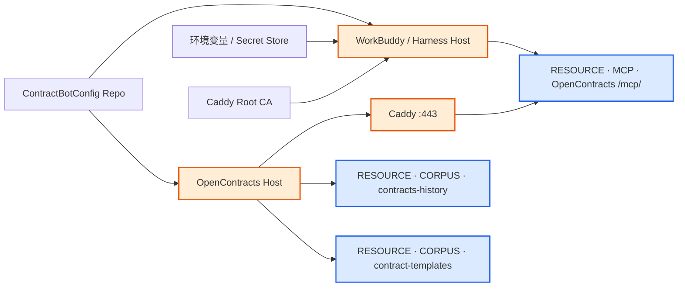

# Contract Skill Pack MVP — 业务主链图

为提高 Mermaid 渲染兼容性，这里只使用基础 `flowchart`，并按业务主链拆成小图。

统一视觉规则：

- **蓝色：资源实体** — `RESOURCE · SKILL`、`RESOURCE · MCP`、`RESOURCE · CORPUS`；
- **橙色：运行载体 / 基础设施** — WorkBuddy / Harness、Caddy、OpenContracts Runtime 等；
- **普通白色：流程步骤** — 用户授权、重复检查、解析索引、Reference Pack、人工审核等。

节点名称直接写明资源类型，避免仅靠颜色理解实体性质。

## 1. 本地合同处理主链



这条链完全可以在 Harness 本地完成。当前文件、分析、修改、起草和文档生成都不要求访问 OpenContracts。

## 2. 历史合同 / 模板检索主链



这条链中的持久业务资源只有两个 Corpus；MCP 是访问这些资源的协议资源，两个 Skill 是 Agent 可加载的行为资源。Harness、Caddy 和 OpenContracts Runtime 负责承载与转发。

## 3. 正式合同入库主链


正式写入只进入 `contracts-history`。`OPENCONTRACTS_UPLOAD_WORKER_KEY` 绑定这个 Corpus，`upload_document.py` 只是受控写入流程，不是新的业务数据实体。

## 4. 经验沉淀 / Skill 更新主链


这条链不经过 MCP、OpenContracts 或 Corpus。经验记录是待审核工作材料；只有人工修改并发布 Skill 后，经验才会成为下一版本 Agent 行为。

## 5. 部署 / 配置链



部署配置本身不增加新的合同业务实体。Agent 只需要固定 IP HTTPS 地址、两个 Corpus slug、Caddy CA，以及正式入库时使用的 history WorkerKey。

## 当前资源实体清单

### Skill 资源

```text
RESOURCE · SKILL · contract
RESOURCE · SKILL · contract-repository
RESOURCE · SKILL · contract-upload
RESOURCE · SKILL · contract-document
RESOURCE · SKILL · contract-learning
```

### MCP 资源

```text
RESOURCE · MCP · OpenContracts /mcp/
```

### Corpus 资源

```text
RESOURCE · CORPUS · contracts-history
RESOURCE · CORPUS · contract-templates
```

当前 MVP 没有 knowledge Corpus，也没有 learning Corpus。经验文档属于人工维护流程中的工作材料，不作为 OpenContracts 检索实体。