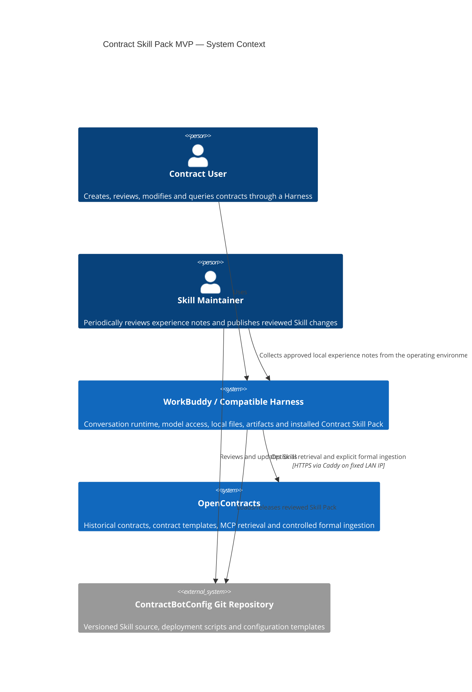
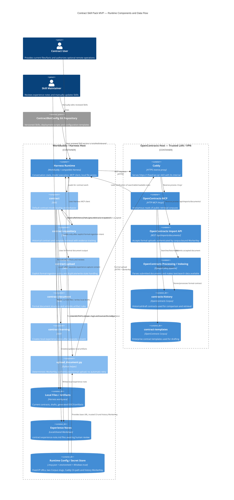

# C4 Architecture — Contract Skill Pack MVP

This document shows the entities that participate in the current MVP. OpenContracts contains only two runtime retrieval corpuses: `contracts-history` and `contract-templates`. Session experience is a separate local/manual maintenance flow and never enters OpenContracts automatically.

## Level 1 — System Context

## Level 3 — Runtime Components and Full Flow

## Boundaries represented in the diagrams

- **Local-first boundary:** current user files, drafts and experience notes remain on the Harness side unless formal ingestion is explicitly authorized.
- **Network boundary:** OpenContracts is reachable only through the trusted LAN/VPN at a fixed private IP; Caddy is the intended network-facing HTTPS endpoint.
- **Read boundary:** MCP reads are anonymous in the MVP because `contracts-history` and `contract-templates` are public inside the trusted network.
- **Write boundary:** `OPENCONTRACTS_UPLOAD_WORKER_KEY` is bound to `contracts-history` and is only used by the deterministic upload helper.
- **Learning boundary:** experience notes are reviewed by a human maintainer and become future behavior only through normal Git-reviewed Skill changes.

Channel-specific integrations such as WeCom/WeChat are Harness concerns and are intentionally outside the Contract Skill Pack boundary shown here.
