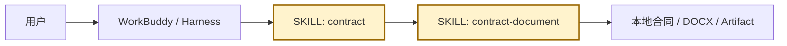
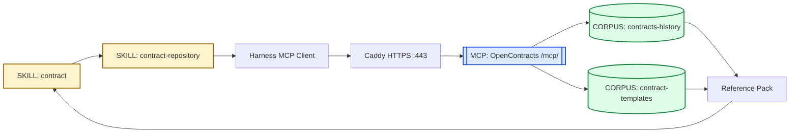

# Contract Skill Pack MVP — 业务主链图

此前的 Mermaid C4 DSL 在部分渲染器中不受支持。这里改用基础 `flowchart`，按业务主链拆成小图。

资源实体统一显式标注：

- `SKILL:` — 可加载的 Skill 资源；
- `MCP:` — OpenContracts MCP 资源；
- `CORPUS:` — OpenContracts Corpus 资源。

其他节点只表示普通运行步骤、基础设施或人工流程。

## 1. 本地合同处理主链



这条链不依赖 OpenContracts。当前文件、分析、修改、起草和正式文档生成默认都留在 Harness 本地。

## 2. 历史合同 / 模板检索主链



这里真正的远程业务资源只有一个 MCP 和两个 Corpus。Caddy、MCP Client、Reference Pack 都只是访问或处理中间环节。

## 3. 正式合同入库主链


正式写入只进入 `contracts-history`。`OPENCONTRACTS_UPLOAD_WORKER_KEY` 绑定这个 Corpus，上传 helper 不允许调用方另选目标 Corpus。

## 4. 经验沉淀 / Skill 更新主链


这条链完全不经过 MCP 或 Corpus。经验只有经过人工审核并修改 Git 中的 Skill 后，才会影响后续运行行为。

## 当前资源实体清单

### Skills

```text
SKILL: contract
SKILL: contract-repository
SKILL: contract-upload
SKILL: contract-document
SKILL: contract-learning
```

### OpenContracts MCP

```text
MCP: OpenContracts /mcp/
```

### OpenContracts Corpuses

```text
CORPUS: contracts-history
CORPUS: contract-templates
```

当前 MVP 没有 knowledge Corpus，也没有 learning Corpus。
