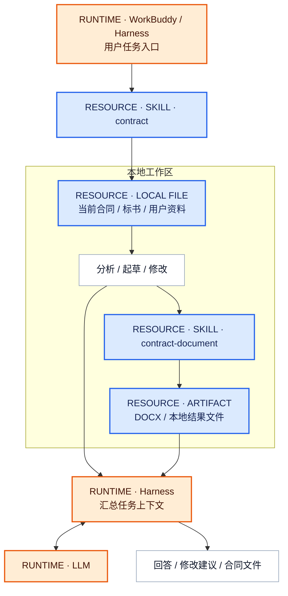
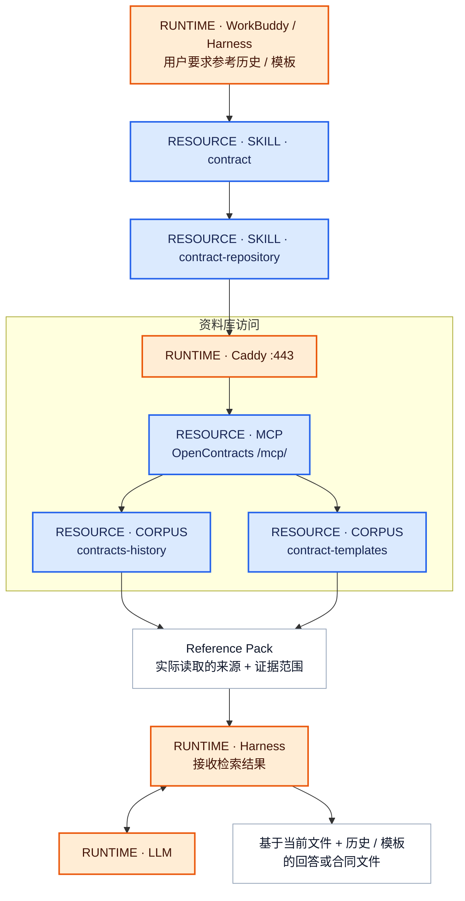
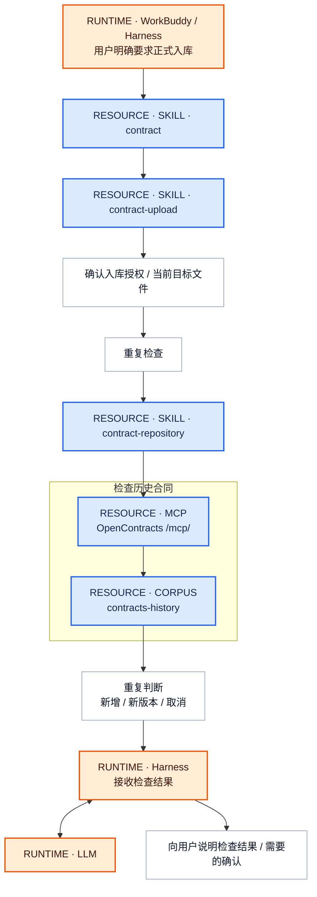
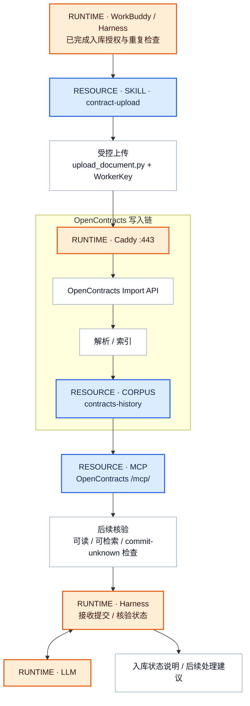
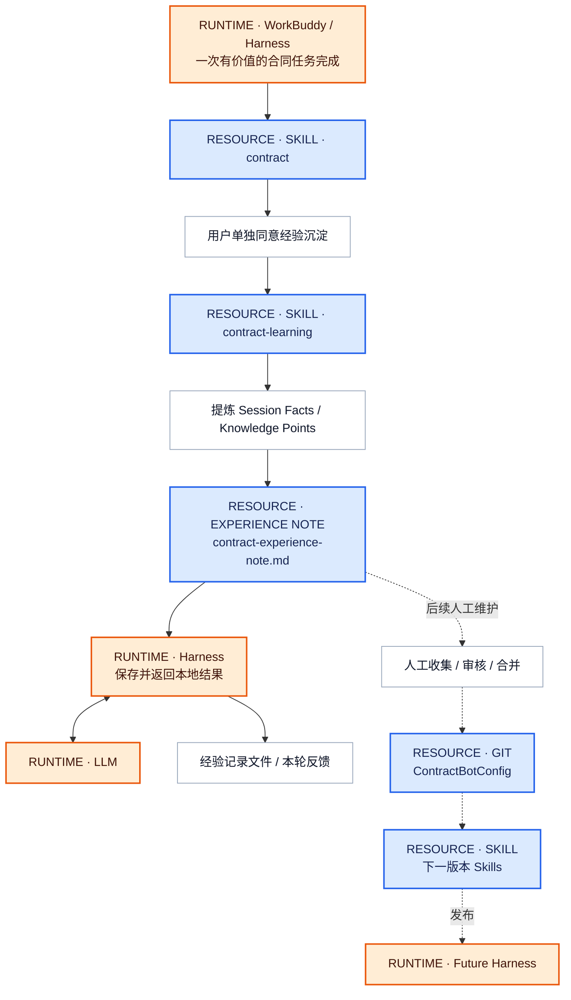

# Contract Skill Pack MVP — 业务主链图

这里使用兼容性更高的基础 Mermaid `flowchart`，不依赖 `C4Context` / `C4Component` 扩展语法。图按业务主链拆分，每张图都从用户正在使用的 Harness 开始；Skill 访问所需资源后，结果回到 Harness，由 Harness 结合 LLM 生成最终回答或文件。

## Skill 一句话说明

| Skill | 一句话说明 |
| --- | --- |
| `contract` | 合同任务总入口：判断当前任务需要本地处理、资料库检索、正式入库、文档输出还是经验沉淀。 |
| `contract-repository` | 资料库检索：通过 OpenContracts MCP 查询历史合同和合同模板，并形成可追溯的 Reference Pack。 |
| `contract-upload` | 正式入库：只在用户明确授权后执行重复检查、受控上传和写入状态处理。 |
| `contract-document` | 文档输出：把当前合同内容整理为稳定、正式、可编辑的合同文件。 |
| `contract-learning` | 经验沉淀：经单独授权，把本次有价值的纠正和处理经验整理为本地经验记录。 |

## 图例

- **蓝色：资源实体** — 节点名称会直接标注 `RESOURCE · SKILL`、`RESOURCE · MCP`、`RESOURCE · CORPUS` 等类型。
- **橙色：运行载体 / 基础设施** — WorkBuddy / Harness、LLM、Caddy、OpenContracts Runtime 等实际承载执行的环境。
- **白色：普通流程** — 分析、授权、重复检查、Reference Pack、解析索引等中间步骤。

> 为避免图被拉成很长的横线或竖线，每张图采用“上方入口 → 中部资源区 → 下方回到 Harness”的布局；并在资源区内部尽量横向展开。

---

## 1. 本地分析 / 起草 / 修改 / 文件生成

这条链不需要 OpenContracts。当前文件始终留在 Harness 本地。



主链：

```text
Harness
→ contract
→ 本地文件 / 本地处理
→ contract-document（需要正式文件时）
→ Harness
↔ LLM
→ 回答 / 文件
```

---

## 2. 历史合同 / 合同模板检索

这条链只访问两个 OpenContracts Corpus：`contracts-history` 和 `contract-templates`。



主链：

```text
Harness
→ contract
→ contract-repository
→ MCP
→ contracts-history / contract-templates
→ Reference Pack
→ Harness
↔ LLM
→ 回答 / 文件
```

其中：

- `contract-repository` 是 **Skill 资源**；
- `/mcp/` 是 **MCP 资源入口**；
- 两个 Corpus 是 **持久业务数据资源**；
- Caddy 只是网络运行载体，不增加新的业务实体。

---

## 3A. 正式入库 — 入库前检查

正式入库先检查用户授权和潜在重复。重复检查仍然复用已有 MCP 和 `contracts-history`。



如果检查结果明确可以继续写入，进入下一条链。

---

## 3B. 正式入库 — 写入、处理、核验

WorkerKey 只绑定 `contracts-history`，正式合同不会写入模板 Corpus。



主链：

```text
Harness
→ contract-upload
→ 受控上传
→ Caddy / Import API
→ contracts-history
→ MCP 核验
→ Harness
↔ LLM
→ 入库状态说明
```

---

## 4. 经验沉淀 / 后续 Skill 更新

经验记录属于 Harness 侧工作材料，不进入 OpenContracts，也没有 learning Corpus。



本轮业务链仍然是：

```text
Harness
→ contract
→ contract-learning
→ 本地经验记录
→ Harness
↔ LLM
→ 经验文件
```

虚线部分表示跨会话的人工维护流程：经验只有经过人工审核并修改 Git 中的 Skill 后，才会影响未来 Harness。

---

## 5. 资源实体总览

### Skill 资源

```text
RESOURCE · SKILL · contract
RESOURCE · SKILL · contract-repository
RESOURCE · SKILL · contract-upload
RESOURCE · SKILL · contract-document
RESOURCE · SKILL · contract-learning
```

### OpenContracts 访问资源

```text
RESOURCE · MCP · OpenContracts /mcp/
```

### OpenContracts 数据资源

```text
RESOURCE · CORPUS · contracts-history
RESOURCE · CORPUS · contract-templates
```

### Harness 本地资源

```text
RESOURCE · LOCAL FILE / ARTIFACT
RESOURCE · EXPERIENCE NOTE
```

### 运行载体 / 基础设施

```text
RUNTIME · WorkBuddy / Harness
RUNTIME · LLM
RUNTIME · Caddy
RUNTIME · OpenContracts Runtime / Import API processing environment
```

当前 MVP 没有 knowledge Corpus，也没有 learning Corpus。所有业务主链的共同模式都是：

```text
Harness
→ Skill
→ 所需资源
→ Harness
↔ LLM
→ 用户需要的回答 / 文件 / 状态反馈
```
