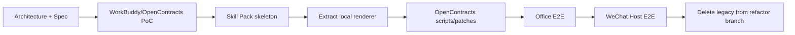

# AstrBot → WorkBuddy/Harness 迁移映射

## 1. 总体策略

`astrbot-solution` 冻结旧方案；`workbuddy-refactor` 不做原插件的逐行改造，而按职责重新归位。

## 2. 组件映射

| 旧组件 | 新位置 | 处理 |
| --- | --- | --- |
| Master Persona | Contract Skill `SKILL.md` + harness runtime | 删除 Persona 依赖，迁移任务识别与合同总规则 |
| OpenContracts Operator Persona | Skill `references/archive.md` + OpenContracts MCP | 删除 handoff，直接调用 MCP |
| Builder Persona | Skill `references/drafting.md` / `modification.md` | 删除 Persona，保留生成规则 |
| `contract-direct-analysis` | 新 Contract Skill 子规则 | 保留并重写为 harness-agnostic |
| `contract-conversation-control` | host adapter / workflow guidance | 大部分删除；不再维护 Router 状态机 |
| `contract-document-specification` | Skill `references/document-specification.md` | 保留内容，移除 AstrBot grounding 机制 |
| File Router | harness 本地文件能力 | 删除；仅迁移必要的 hash/文件安全脚本 |
| Handoff Policy | Skill workflow | 删除插件；保留 corpus 选择和 fail-closed 规则 |
| OpenContracts Gateway | OpenContracts 原生 API + upload helper + patch scripts | 拆分，不保留独立服务 |
| Generation Flow | Skill workflow + local scripts | 拆分 |
| DOCX Generator | `skills/.../scripts/render_docx.py` | 抽取纯 Python renderer |
| Download Delivery | 默认删除 | 微信 PoC 后决定是否需要替代方案 |
| WeCom Final Result Guard | WorkBuddy 渠道层 | 删除 AstrBot 实现 |
| DOC Preconverter | Skill/local helper | 若 WorkBuddy/解析库不能直接处理 `.doc` 再保留 |

## 3. 代码迁移原则

### 直接保留/抽取

- DOCX renderer 的纯函数和样式处理；
- SHA-256 / 文件安全校验；
- OpenContracts 上传后核验语义；
- strict template identity；
- commit-unknown / no-auto-retry 规则；
- 文档规范；
- 历史项目特定事实默认不迁移规则。

### 删除而不是迁移

- AstrBot decorators；
- Star registry；
- Persona/WebUI binding；
- `read_bound_skill` bridge；
- handoff protocol；
- `_no_save` transient context；
- Router pending/blocked state；
- WeCom status marker parser；
- AstrBot ToolSet ownership checks。

## 4. 目标仓库结构

```text
ContractBotConfig/
  docs/
    architecture/
    spec/
    deployment/
  skills/
    opencontracts-contract/
      SKILL.md
      references/
      scripts/
      adapters/
      tests/
  scripts/
    opencontracts/
      check_version.py
      configure_public_mcp.py
      bootstrap_tenant.py
      apply_patch.py
      verify.py
  patches/
    opencontracts/
  config/
    workbuddy/
    opencontracts/
  legacy/
    README.md
```

是否物理移动旧 `plugins/` / `personas/` 到 `legacy/` 在实现阶段再决定；本阶段先以 `astrbot-solution` 分支作为完整历史备份。

## 5. OpenContracts 调整脚本

计划脚本必须覆盖：

```text
check_version
→ validate target OpenContracts version/commit

configure_public_mcp
→ ensure HTTPS-facing MCP routes and auth settings

bootstrap_tenant
→ create/verify user, corpuses, permission bindings, optional WorkerKey

apply_patch
→ apply only required upstream delta

verify
→ test auth isolation + MCP discovery + read/search + upload/verification
```

所有脚本默认 `--dry-run` 或提供等价检查模式。

## 6. 迁移顺序



## 7. 删除旧代码的门槛

在 `workbuddy-refactor` 删除旧插件前，必须通过：

- WorkBuddy 能连接认证 OpenContracts MCP；
- 合同分析可使用本地文件 + 企业检索；
- 修改/生成可输出 DOCX；
- upload helper 能归档并通过 MCP 核验；
- 私有 corpus 越权测试失败（即被正确拒绝）；
- 微信 Host 至少完成文本分析和一次文件修改任务；
- 旧 AstrBot 分支已确认可独立 checkout/build。

## 8. 兼容性态度

本分支不追求同时兼容 AstrBot 与 WorkBuddy。若保留兼容层会增加运行时耦合，优先删除。历史方案通过 Git 分支保留，而不是在新代码中保留双栈条件分支。
