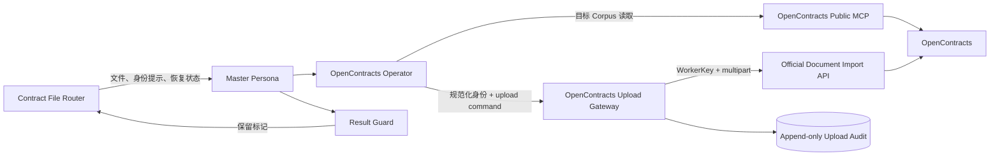
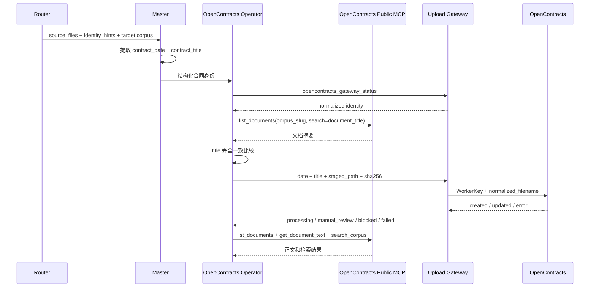
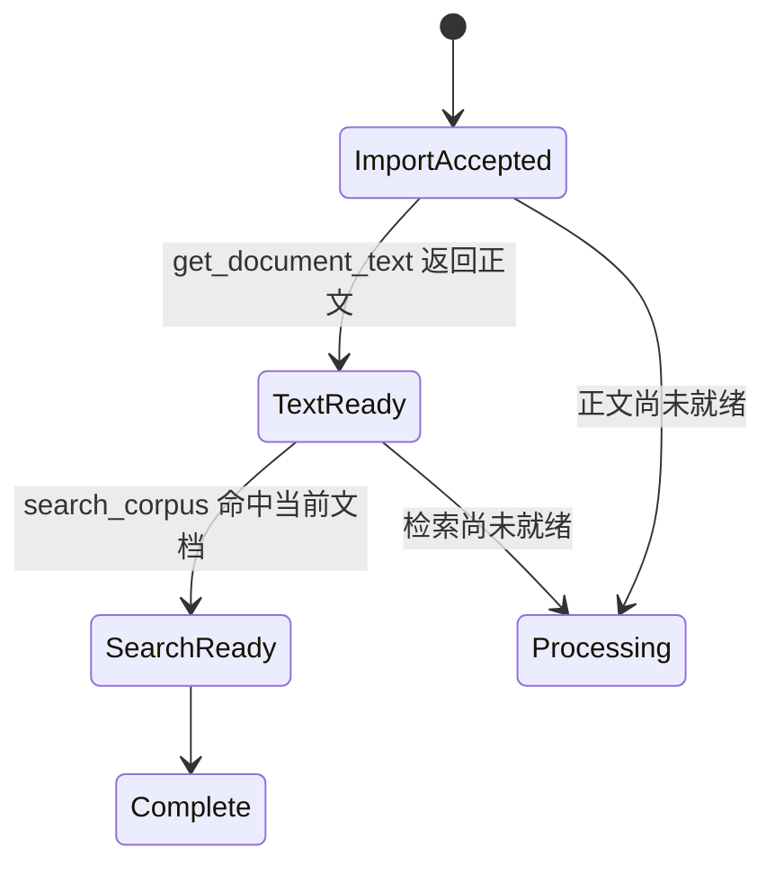

# OpenContracts 集成架构

## 运行模型

OpenContracts 集成由公开 MCP 能力面和 WorkerKey 文件导入面组成。



## MCP 能力面

AstrBot 配置公开 endpoint：

```text
http://opencontracts-api:8000/mcp/
```

上传流程使用：

```text
list_documents
get_document_text
search_corpus
```

目标 Corpus slug 由 Router 配置 `opencontracts_target` 提供，经 `targets.opencontracts` 和 Handoff 传给 Operator。上传流程不调用 `list_public_corpuses` 猜测目标，不依赖 `get_corpus_info`，也不拼接 corpus-scoped URL。

其他分析场景可按需使用标注、关系和讨论线程工具。MCP 连接与认证由 AstrBot MCP 管理；Gateway 不保存 MCP 读取凭证。

## 合同身份

远端身份：

```text
contract_date = YYYY-MM-DD
contract_title = 合同正文中的正式标题
document_title = YYYY-MM-DD 合同标题
normalized_filename = YYYY-MM-DD_合同标题.原扩展名
```

日期来源优先级：

1. 正文明确合同日期；
2. 明确签署日期；
3. 明确生效日期；
4. 正文日期字段为空时，使用 Router 从原始文件名确定性提取的唯一日期。

Router 支持 `YYYY-M-D`、`YYYY.M.D`、`YYYY_M_D`、中文年月日和 `YYYYMMDD`，并把结果放入 `identity_hints.contract_date`。正文无日期且提示存在时，Master 直接采用，不向客户追问。多个不同日期不会生成提示。

`list_documents(corpus_slug=targets.opencontracts, search=document_title)` 只缩小候选集；Operator 必须对返回 `title` 做完全一致比较。

## WorkerKey 文件导入面

Gateway 使用 CorpusAccessToken 的 WorkerKey 调用：

```text
POST /api/imports/documents/
Authorization: WorkerKey <token>
```

写入目标由 WorkerKey 绑定。Gateway 不要求或展示配置 Corpus ID，也不发送 `add_to_corpus_id`。

写入路径负责：

- 合同日期、标题和远端文件名规范化；
- 暂存路径、大小和 SHA-256 校验；
- 客户重新上传确认校验；
- 新合同导入和确认后的同路径版本写入；
- 不确定提交状态保护；
- 追加式上传审计 receipt。

## 合同发现与上传流程



## Persona 与 Skill 工具边界

- Master 只读取当前合同并执行同步 Handoff；
- Operator 只使用公开 MCP Tools 和 Gateway Tools；
- 不调用 Shell、Python、通用 HTTP、直接 MCP JSON-RPC、配置文件读取或 URL 探测；
- 任一 `[CONTRACT_UPLOAD:*]` 标记均结束当前轮次工具调用；
- `BLOCKED` 不是整个会话终态，后续由 Router 复用原文件恢复。

Handoff 会重建 Operator 的 `branch_task`，清除旧上下文中的 `opencontracts_check_duplicate`、`get_corpus_info` 和 corpus-scoped MCP 契约。

## 状态语义

- `processing`：导入已接收，正文或检索尚未完成；
- `confirmation_required`：写入前已确认远端同一合同存在，需要客户授权版本写入；
- `blocked`：身份、目标 Corpus、MCP、配置、文件、确认或权限条件未满足，尚未写入；
- `manual_review_required`：写入可能已经发生，禁止自动重试；
- `failed`：已确认没有发生提交的正式请求失败。

### 可恢复 BLOCKED

Result Guard 对 BLOCKED 设置：

```text
contract_preserve_pending_reason = blocked
contract_blocked_reason = missing_date | missing_title | missing_identity | system
```

Router 转入 `awaiting_blocked_resolution`，保留 pending、`staged_path` 和文件哈希。客户补充信息或管理员修复后回复“继续”时，任务上下文包含：

```text
resume.blocked_reason
resume.user_input
```

客户回复“结束/取消”时清理。后续达到 `PROCESSING`、`COMPLETE`、`MANUAL_REVIEW` 或 `FAILED` 时普通暂存流程结束。

以下结果必须进入人工核查，而不是可恢复 BLOCKED：

```text
unexpected_unconfirmed_update
transport_commit_unknown
upstream_commit_unknown
unexpected_success_response
```

## 处理完成条件



`created` 或 `updated` 只表示写入结果。客户侧 `COMPLETE` 仅在正文可读并进入检索后产生。没有调用 `list_annotations` 时，不声明标注完成。

## 本地 Receipt

Receipt 采用 append-only 记录，包括合同身份、原始及规范化文件名、文件哈希、文档 ID、服务端状态、任务 ID、提交状态和人工核查标志。Receipt 用于审计和诊断，不替代 MCP 远端事实。
