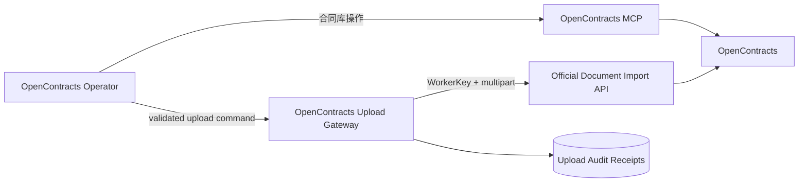
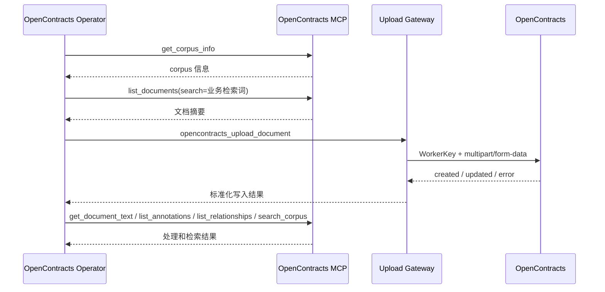
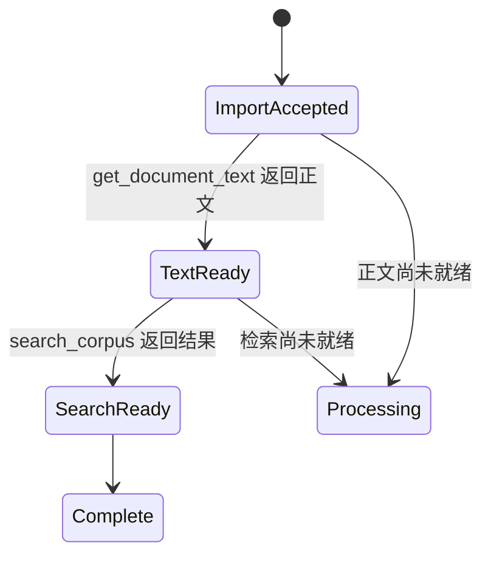

# OpenContracts 集成架构

## 运行模型

OpenContracts 集成由 MCP 能力面和 WorkerKey 文件导入面组成。



## MCP 能力面

OpenContracts 官方 `docs/mcp/`、MCP 服务实现和运行时 `tools/list` 是 MCP 能力、参数和返回结构的事实来源。项目内的 Skill 和 Persona 根据具体业务任务选择工具，不复制 OpenContracts 的远端读取实现。

推荐 corpus-scoped endpoint：

```text
http://opencontracts-api:8000/mcp/corpus/contracts/
```

当前 scoped endpoint 提供：

| Tool | 用途 |
|---|---|
| `get_corpus_info` | 读取目标 Corpus 信息和标签集 |
| `list_documents` | 列出和搜索合同文档 |
| `get_document_text` | 分窗口读取解析后的合同正文 |
| `list_annotations` | 读取文档标注，可按页、标签和文本筛选 |
| `list_relationships` | 读取文档关系和结构化关系数据 |
| `search_corpus` | 在 Corpus 中执行语义检索 |
| `list_threads` | 读取 Corpus 或文档讨论线程 |
| `get_thread_messages` | 读取线程消息和层级关系 |
| `create_thread_message` | 在已有线程中创建消息，需要认证用户上下文 |

MCP Resources：

```text
corpus://{corpus_slug}
document://{corpus_slug}/{document_slug}
annotation://{corpus_slug}/{document_slug}/{annotation_id}
thread://{corpus_slug}/threads/{thread_id}
```

上传流程通常使用：

```text
get_corpus_info
list_documents
get_document_text
search_corpus
```

合同问答、风险分析、结构化关系、标注和讨论流程按任务增加 `list_annotations`、`list_relationships`、`list_threads`、`get_thread_messages` 和 `create_thread_message`。

MCP 连接与认证属于 AstrBot MCP 管理界面。上传 Gateway 不保存 MCP 读取凭证。`create_thread_message` 由 OpenContracts MCP 在 Tool 内校验认证和资源权限。

## WorkerKey 文件导入面

Upload Gateway 使用 CorpusAccessToken 的 WorkerKey 调用：

```text
POST /api/imports/documents/
Authorization: WorkerKey <token>
```

写入路径负责：

- 暂存文件路径、大小和 SHA-256 校验；
- 原始文件名和标题传递；
- 客户重新上传确认校验；
- 新合同导入和同路径版本写入；
- 导入结果标准化；
- 上传审计 receipt。

## 合同发现与上传流程



具体合同识别策略属于 Skill，可随着业务规则和 MCP 能力演进。Gateway 接收 OpenContracts 导入结果并记录实际写入状态。

## 处理完成条件



`created` 或 `updated` 表示导入端点已执行写入。客户侧 `COMPLETE` 由 Operator 根据当前任务要求，通过 MCP 的正文、标注、关系或检索结果确认。

## 本地 Receipt

Receipt 记录上传发生过的事实，包括文件哈希、原始文件名、文档 ID、服务端导入状态和任务 ID。它用于审计和诊断，不替代 MCP 提供的远端合同数据。
