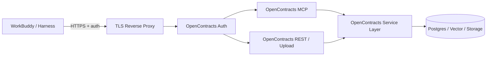
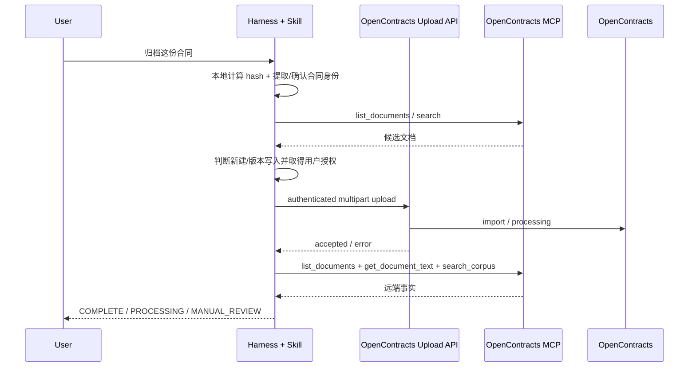

# OpenContracts 公网集成架构

> 本文定义 WorkBuddy/Harness 方案下 OpenContracts 的正式边界。AstrBot Operator/Gateway 方案仅保留在 `astrbot-solution` 分支。

## 1. 目标

OpenContracts 直接作为企业合同数据与能力服务器对外提供服务。客户端通过公网 HTTPS 连接 OpenContracts MCP；合同文件需要归档时，使用 OpenContracts 自身的文件导入 API 或经过最小扩展的同域上传接口。

不再要求在 Agent 与 OpenContracts 之间部署独立 ContractBot Gateway。

## 2. 生产拓扑



### 边缘层只做

- TLS termination；
- host/path routing；
- request/body size limit；
- basic rate limit / abuse protection；
- 可选关闭匿名 `/mcp/`；
- 日志脱敏。

边缘层不解析合同业务、不决定 corpus、不伪造租户身份。

## 3. MCP 入口

OpenContracts 当前公开文档提供：

```text
/mcp/       anonymous / public corpus surface
/mcp/me/    authenticated user surface
```

并在新版本中提供 corpus-scoped MCP endpoint。企业私有部署的默认选择是 `/mcp/me/`；只有明确允许公开的 corpus 才允许匿名 MCP。

WorkBuddy 支持 MCP URL、认证字段及标准 OAuth，因此客户端应直接持有自己的 OpenContracts 登录态或专用访问凭证。

## 4. 权限与租户隔离

### 4.1 权限事实来源

租户隔离依赖 OpenContracts 自己的用户、对象权限和 service layer。Skill 只表达“要访问什么”，不能表达“我有权访问什么”。

```text
client credential
→ OpenContracts authenticated user/service identity
→ visible corpuses/documents
→ service-layer permission check
→ result
```

### 4.2 Corpus 组织建议

每个客户至少区分：

```text
contracts-history    历史合同
contract-assets      模板、标准条款、制度资料
```

是否做成独立 corpus、folder 或 group 由 OpenContracts 实际版本和权限模型决定，但 Skill 只使用逻辑名称；真实 corpus slug/ID 写入客户安装配置，不硬编码在公共 Skill 正文中。

### 4.3 凭证原则

- 用户级读写优先使用 OpenContracts 用户认证/OAuth/JWT；
- 后台批量导入可继续使用 corpus-scoped WorkerKey；
- Skill 包不得携带固定 WorkerKey；
- 任何 token 均不得出现在 Git 历史、日志正文或模型可见的示例输出里。

## 5. 原生 MCP 能力

目标首版以 OpenContracts 上游实际 MCP discovery 为准，不在 Skill 中复制静态能力清单。当前已知核心能力包括：

```text
get_corpus_info
list_documents
get_document_text
search_corpus
list_annotations
list_relationships
list_threads
get_thread_messages
create_thread_message
```

不同 OpenContracts 版本可能增加可写工具；运行时以 MCP discovery 为权威。

## 6. 为什么文件上传不强行塞进 MCP

本地 DOCX/PDF 通常是二进制且可能较大。MCP 更适合工具调用、结构化参数和文本结果，不应为了“统一接口”把大文件 base64 进 JSON。

正式策略：

```text
需要分析但不归档
→ harness 本地读取文件
→ MCP 只查询企业知识

需要归档
→ Skill 调用确定性 upload helper
→ HTTPS multipart / OpenContracts 官方导入 API
→ 再通过 MCP 查询确认文档可读/可检索
```

上传 helper 属于 Skill 的脚本能力，不是另一个 Agent 服务。

## 7. OpenContracts 调整原则

后续 `scripts/opencontracts/` 只能做可重复、可审计的调整，优先级如下：

1. 配置层：环境变量、反向代理、认证、CORS/allowed hosts、MCP endpoint；
2. 数据层：创建客户 corpus、权限、服务账号、WorkerKey；
3. 最小 patch：只有上游缺少产品必需能力时才修改 OpenContracts；
4. 上游已经提供的能力不得在 ContractBotConfig 中复制第二份实现。

所有 patch 必须：

- 幂等或可检测已应用；
- 明确目标 OpenContracts commit/tag；
- 应用前检查版本；
- 失败不留下半应用状态；
- 提供 dry-run / verify；
- 能在 CI 或测试实例验证。

## 8. 可能的最小 MCP 扩展

只有 PoC 证明原生 MCP 不足时，才考虑在 OpenContracts 内部新增合同领域工具，例如：

```text
resolve_contract_identity
find_contract_assets
find_similar_contracts
archive_contract_metadata
```

这些工具必须调用 OpenContracts service layer，并继承当前 request user 权限；不得直接 ORM 绕过权限，不得允许客户端传任意数据库 ID 绕开可见性校验。

不计划把“AI 合同分析”“AI 起草”放到 OpenContracts MCP：这些由客户 harness 的模型完成。

## 9. 归档时序



## 10. 写入状态语义

沿用旧方案中值得保留的安全语义，但不绑定 AstrBot：

```text
COMPLETE        已写入且正文可读/可检索
PROCESSING      服务已接受，解析/索引未完成
BLOCKED         写入前条件未满足，确认没有提交
MANUAL_REVIEW   请求可能已提交，状态不确定，禁止自动重试
FAILED          已确认未提交的失败
```

网络 timeout、连接中断、异常成功响应等 commit-unknown 场景必须进入 `MANUAL_REVIEW`，不能自动重复上传。

## 11. 审计

OpenContracts/反向代理至少记录：

- authenticated principal；
- corpus/document；
- operation/tool；
- request id；
- result status；
- write request hash / file hash（写入场景）；
- 时间。

不得记录完整合同正文、access token 或用户私密提示词。

## 12. 退出旧 Gateway 的条件

只有以下验收全部通过，才删除 `astrbot_plugin_opencontracts_gateway` 的 WorkBuddy 分支代码：

1. 私有 MCP 可从 WorkBuddy 认证连接；
2. corpus 权限隔离测试通过；
3. upload helper 可在不暴露 WorkerKey 的情况下完成客户场景；
4. commit-unknown 有明确人工核查状态；
5. 上传后可通过 MCP 核验；
6. 旧 Gateway 没有仍未迁移的业务规则。
