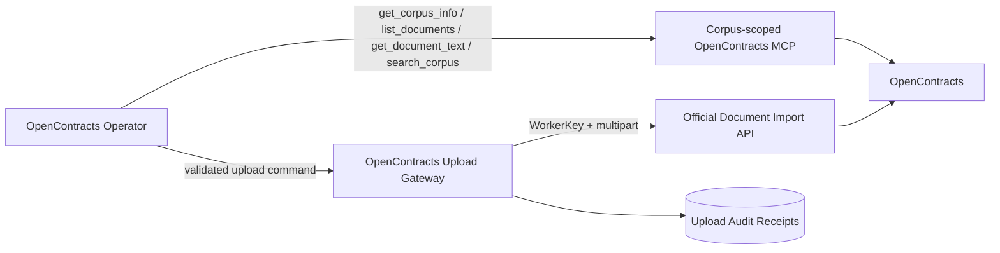
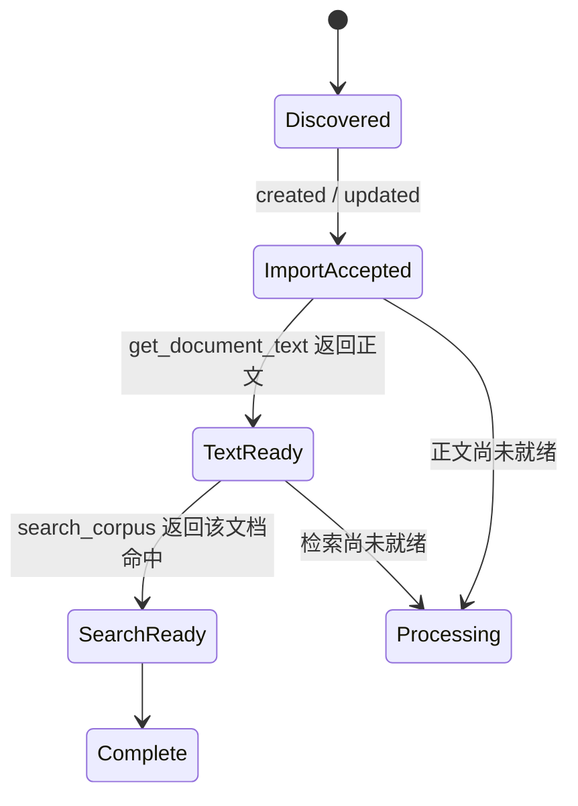

# OpenContracts 集成架构

## 运行模型

OpenContracts 集成由读取路径和写入路径组成。



## 读取路径

OpenContracts Operator 使用 AstrBot 中配置的 corpus-scoped MCP：

```text
http://opencontracts-api:8000/mcp/corpus/contracts/
```

该 endpoint 提供：

```text
get_corpus_info
list_documents
get_document_text
search_corpus
```

读取路径负责：

- 确认目标 corpus；
- 按原始文件名主体搜索文档；
- 获取文档 slug 和标题；
- 读取解析后的正文窗口；
- 通过语义搜索核验检索可用性。

MCP 连接配置属于 AstrBot MCP 管理界面。上传插件不保存 MCP 读取凭证。

## 写入路径

Upload Gateway 使用 CorpusAccessToken 的 WorkerKey 调用：

```text
POST /api/imports/documents/
Authorization: WorkerKey <token>
```

写入路径负责：

- 暂存文件路径、大小和 SHA-256 校验；
- 原始文件名和标题传递；
- 客户重新上传确认校验；
- 新合同导入和同文件名版本写入；
- 导入结果标准化；
- 上传审计 receipt。

## 合同发现规则

首次检查使用 `list_documents(search=<原始文件名主体>)`。Operator 对返回文档的 `title` 做精确比较：

- 精确匹配：远端已有对应合同；
- 没有匹配：可以进入新合同写入；
- MCP 调用失败或结构不完整：状态为 `BLOCKED`；
- 检查后发生写入竞争：Gateway 根据导入端点的路径冲突返回 `confirmation_required`。

导入端点仍是最终并发保护层。

## 处理完成条件



`created`、`updated` 或 HTTP 201 表示导入已接收。`COMPLETE` 由 MCP 正文读取和语义检索共同确认。

## 本地 Receipt

Receipt 记录上传发生过的事实，包括文件哈希、原始文件名、文档 ID、服务端导入状态和任务 ID。它用于审计和诊断，不参与远端读取。
