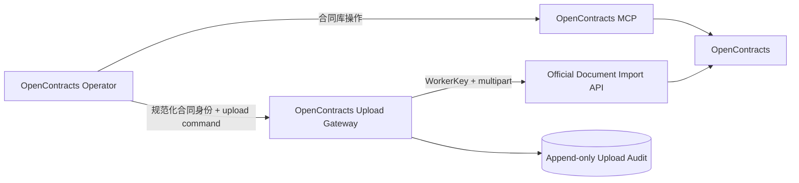
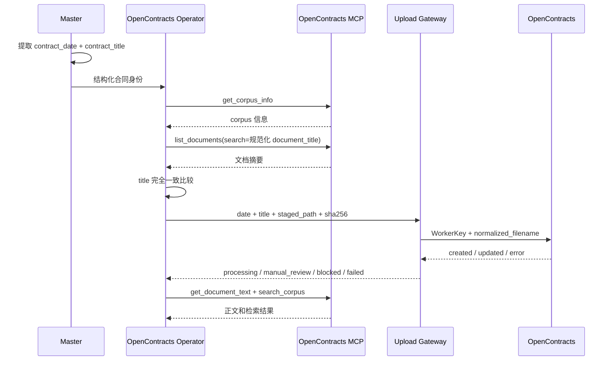
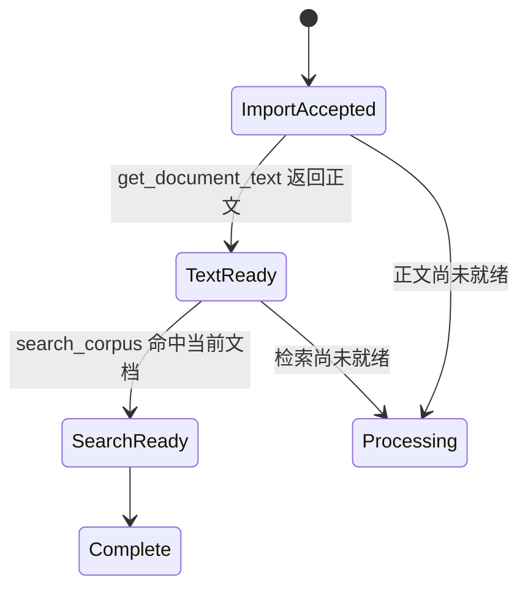

# OpenContracts 集成架构

## 运行模型

OpenContracts 集成由 MCP 能力面和 WorkerKey 文件导入面组成。



## MCP 能力面

OpenContracts 官方 `docs/mcp/`、MCP 服务实现和运行时 `tools/list` 是 MCP 能力、参数和返回结构的事实来源。项目内的 Skill 和 Persona 根据具体业务任务选择工具，不复制 OpenContracts 的远端读取实现。

推荐 corpus-scoped endpoint：

```text
http://opencontracts-api:8000/mcp/corpus/contracts/
```

当前 scoped endpoint 提供：

| Tool | 用途 |
|---|---|
| `get_corpus_info` | 读取目标 Corpus 信息和标签集 |
| `list_documents` | 列出和搜索合同文档 |
| `get_document_text` | 分窗口读取解析后的合同正文 |
| `list_annotations` | 读取文档标注，可按页、标签和文本筛选 |
| `list_relationships` | 读取文档关系和结构化关系数据 |
| `search_corpus` | 在 Corpus 中执行语义检索 |
| `list_threads` | 读取 Corpus 或文档讨论线程 |
| `get_thread_messages` | 读取线程消息和层级关系 |
| `create_thread_message` | 在已有线程中创建消息，需要认证用户上下文 |

上传流程通常使用：

```text
get_corpus_info
list_documents
get_document_text
search_corpus
```

合同问答、风险分析、结构化关系、标注和讨论流程按任务增加其他 MCP 工具。MCP 连接与认证属于 AstrBot MCP 管理界面。Gateway 不保存 MCP 读取凭证。

## 合同身份

上传前从合同正文取得：

```text
contract_date = YYYY-MM-DD
contract_title = 合同正文中的正式标题
```

统一生成：

```text
document_title = YYYY-MM-DD 合同标题
normalized_filename = YYYY-MM-DD_合同标题.原扩展名
```

`list_documents(search=document_title)` 只负责缩小候选集，Operator 还必须对返回结果的 `title` 做完全一致比较。日期或标题无法可靠取得时停止写入。

## WorkerKey 文件导入面

Upload Gateway 使用 CorpusAccessToken 的 WorkerKey 调用：

```text
POST /api/imports/documents/
Authorization: WorkerKey <token>
```

写入目标由 WorkerKey 绑定。Gateway 不要求或展示配置 Corpus ID，也不发送 `add_to_corpus_id`。

写入路径负责：

- 合同日期、标题和远端文件名规范化；
- 暂存文件路径、大小和 SHA-256 校验；
- 客户重新上传确认校验；
- 新合同导入和确认后的同路径版本写入；
- 不确定提交状态保护；
- 追加式上传审计 receipt。

## 合同发现与上传流程



## 状态语义

- `processing`：导入已接收，正文或检索尚未完成。
- `confirmation_required`：写入前已确认远端同一合同存在，需要客户授权版本写入。
- `blocked`：身份、MCP、配置、文件、确认或权限条件未满足，尚未写入。
- `manual_review_required`：写入可能已经发生，或已经发生未确认版本写入；禁止自动重试。
- `failed`：已确认没有发生提交的正式请求失败。

以下结果必须进入人工核查：

```text
unexpected_unconfirmed_update
transport_commit_unknown
upstream_commit_unknown
unexpected_success_response
```

## 处理完成条件



`created` 或 `updated` 只表示写入结果。客户侧 `COMPLETE` 仅在正文可读并进入检索后产生。没有调用 `list_annotations` 时，不声明标注已经完成。

## 本地 Receipt

Receipt 采用 append-only 记录，每次上传或不确定提交形成独立审计记录。内容包括合同身份、原始及规范化文件名、文件哈希、文档 ID、服务端状态、任务 ID、提交状态和人工核查标志。

Receipt 用于审计和诊断，不替代 MCP 提供的远端合同数据，也不能作为远端合同不存在的依据。
