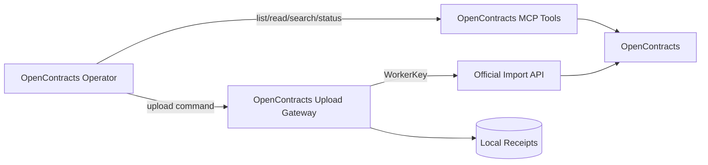

# OpenContracts 集成边界

## 设计目标

OpenContracts 集成分为读取路径和写入路径，两条路径在 AstrBot 中由不同组件承担。



## 读取路径

OpenContracts Operator 通过 AstrBot 已配置的 MCP Tools 完成：

- Corpus 发现；
- 文档列表；
- 远端文档身份解析；
- 文档正文读取；
- Corpus 搜索；
- 上传后的处理状态和检索可用性核验。

工具名称由 OpenContracts MCP 工具发现结果决定。当前可能使用：

```text
list_public_corpuses
list_documents
get_document_text
search_corpus
```

Phase 2 应在 Skill 和任务上下文中引用实际可用的 MCP Tool 名称。

## 写入路径

Upload Gateway 使用 WorkerKey 调用 OpenContracts 官方文档导入接口，完成：

- 新合同上传；
- 客户确认后的版本化重新上传；
- 文件名、标题、Corpus 和 custom metadata 传递；
- 导入响应标准化；
- 本地上传回执保存。

## 合同身份解析

Phase 2 将合同身份解析集中到 OpenContracts Operator 的 MCP 读取流程中。身份判定输入包括：

```text
original_name
source_sha256
target corpus
MCP 返回的 document id/path/title/source metadata
```

最终匹配规则应由独立的 `DocumentIdentityResolver` 表达，并以单元测试覆盖：

1. 远端无匹配文档；
2. 远端存在同文件名和同内容；
3. 远端存在同文件名但内容变化；
4. MCP 查询不完整或服务不可用；
5. 确认后的版本化重新上传。

## 凭证模型

Gateway 的插件配置只保存写入所需 WorkerKey：

```text
auth_mode = worker_key
auth_token = <WorkerKey>
```

OpenContracts MCP 的连接配置由 AstrBot MCP 管理界面维护。Gateway 状态返回中不需要读取 Bearer Token 字段。

## 当前实现差异

Gateway 0.5.1 当前仍包含：

```text
GET /api/imports/documents/lookup/
```

并以该结果作为重复判断来源。Phase 2 的第一项代码变更是将此读取流程迁移到 MCP，然后缩减 Gateway Tool 契约。

## Phase 2 目标 Tool 集

OpenContracts Operator：

```text
OpenContracts MCP list/read/search tools
opencontracts_gateway_status
opencontracts_upload_document
```

Gateway：

```text
opencontracts_gateway_status
opencontracts_upload_document
```

`opencontracts_check_duplicate` 的职责将在 MCP 身份解析流程稳定后重新评估：可以移除，也可以改为接收已解析的远端文档结果并执行确定性规则，不再自行发起远端读取请求。
