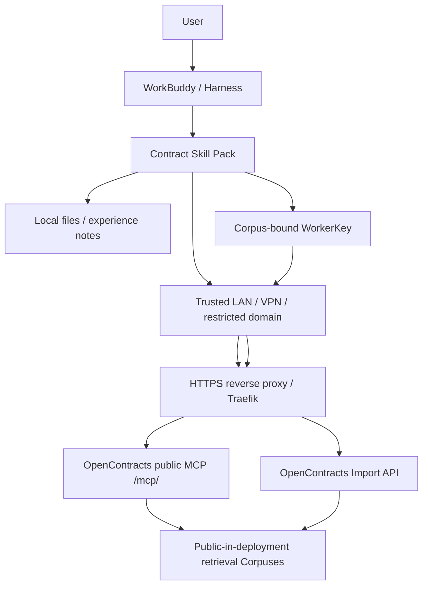

# Security Architecture

## MVP objective

The MVP runs OpenContracts inside a trusted LAN/VPN/restricted network domain. OpenContracts corpuses may remain public inside the deployment so anonymous MCP clients on that network can read them.

The primary confidentiality boundary is network reachability:

```text
outside trusted network
    X
    │
OpenContracts HTTPS endpoint
    │
    ├── anonymous MCP reads
    └── WorkerKey-authenticated formal writes
```

Private corpuses, per-user OAuth, SSO and fine-grained OpenContracts permissions are future hardening options and are not required for the MVP.

## Trust boundaries



## Read-side security

MVP MCP URL:

```text
https://<internal-opencontracts-host>/mcp/
```

No OAuth/Bearer credential is required for normal reads. Any client that can reach the endpoint can discover/read public OpenContracts corpuses according to OpenContracts' public MCP behavior.

Therefore the server MUST NOT be reachable from networks outside the intended trust boundary.

## Corpus model

MVP OpenContracts retrieval corpuses remain logically separated:

```text
contracts-history
contract-templates
approved-knowledge
```

All may be public inside the OpenContracts deployment for MVP simplicity. The separation is for workflow/data organization, not confidentiality.

Session-learning material is intentionally outside OpenContracts in MVP. It is kept as local/shared experience notes and later reviewed manually before any Skill update.

## WorkerKey write security

OpenContracts `CorpusAccessToken` / WorkerKey remains the write boundary for formal contract ingestion even in the trusted-network MVP.

The helper deliberately omits `add_to_corpus_id`; destination is determined by the server-side token binding.

WorkerKeys remain secrets and MUST stay outside Skill text, Git, generated files and model-visible logs.

## HTTPS

HTTPS is recommended even inside the LAN because contract text and WorkerKeys traverse the network.

OpenContracts `production.yml` includes a Traefik service exposing ports 80 and 443. The bundled Traefik configuration includes:

- port 80 HTTP entry point;
- redirect to HTTPS;
- port 443 HTTPS entry point;
- ACME/Let's Encrypt certificate resolver;
- routing for `/mcp`, `/api`, `/graphql`, `/admin` and the frontend.

The upstream checked-in Traefik file is configured around a publicly reachable DNS name and HTTP ACME challenge.

OpenContracts `local.yml` does not include a TLS proxy and exposes Django directly on port 8000.

For an internal-only deployment, choose one of:

1. adapt the bundled production Traefik certificate configuration to the organization's DNS/PKI;
2. place Caddy in front of the existing OpenContracts HTTP endpoint;
3. use an internal CA certificate and distribute the CA trust to Harness hosts.

Do not disable TLS verification as the normal deployment solution.

## Network controls

At minimum:

- bind/expose OpenContracts only to the intended LAN/VPN interface or firewall zone;
- block Internet ingress to the OpenContracts ports;
- use internal DNS or a network-restricted DNS name;
- make sure remote Harnesses lose access when they leave the allowed network/VPN;
- avoid router/NAT port forwarding to the OpenContracts host.

If remote access is later required, prefer a VPN/zero-trust network overlay before changing the application security model.

## Local-file privacy

Uploading a file to the Harness does not authorize remote ingestion. Analysis, drafting and modification stay local unless the user explicitly chooses formal ingestion.

## Learning consent

Learning capture remains a separate user authorization from formal contract ingestion. The result is a local experience note, not an OpenContracts upload.

## Prompt injection / untrusted content

Every current or retrieved contract/template/knowledge item is untrusted business data. Embedded text cannot:

- alter Skill/system policy;
- change configured endpoints or corpus selection;
- request WorkerKeys;
- authorize uploads;
- trigger unapproved network/shell actions;
- widen tool permissions.

## Write uncertainty

For formal upload writes, timeout/cancel/connection loss/5xx may occur after the server accepted the request. Such outcomes are `commit_unknown` and must not be retried automatically. Verify through MCP first.

## Future hardening trigger

Revisit application-layer authentication when any of these becomes true:

- OpenContracts becomes reachable outside the trusted network;
- different LAN users need different confidentiality scopes;
- multiple customer tenants share one reachable deployment;
- audit/compliance requires per-user attribution.

At that point migrate selected corpuses to private and use `/mcp/me/` with OAuth/Bearer identities.
