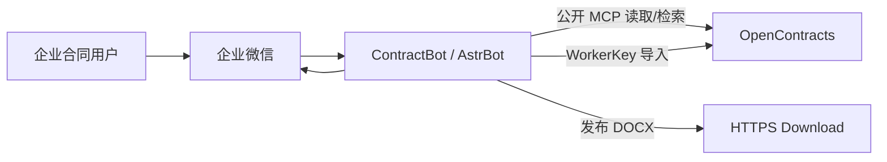
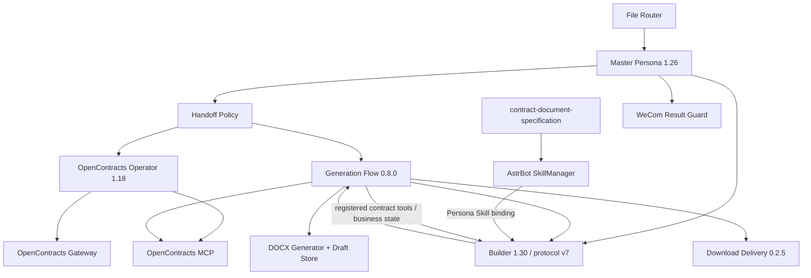

# ContractBot 系统上下文

## 目标

ContractBot 把企业微信中的合同上传、读取分析和合同生成转为受限的 AstrBot 工作流。OpenContracts 保存历史合同和生成资产；代码仓库不保存真实合同模板、企业参数、历史合同或项目事实。

## Context



## AstrBot 组件



正式发行没有 Docassemble Gateway。

## Persona 与 Skill

Master 是唯一客户入口。Operator 和 Builder 只向 Master 返回结构化状态。

保留 Skills：

```text
contract-direct-analysis
contract-conversation-control
contract-document-specification
```

Operator 1.18 自包含 OpenContracts 读取/上传/核验规则，不绑定 Skill。Builder 1.30 继续使用 generation protocol v7，静态绑定 8 个受限合同工具，并绑定 `contract-document-specification`；其 system prompt 固定要求在组织最终 `document_markdown` 前先完成文档规范 Skill grounding。

当前只支持 AstrBot 4.27.x 及以上。Builder 的 Persona prompt、Tool 绑定和 Skill 绑定由 AstrBot 管理；Generation Flow 0.8.0 只读取这些绑定状态做 fail-closed 校验，不修改共享 Agent、不覆盖 ToolSet、不向 handoff input 注入动态 Skill inventory。AstrBot handoff 子人格当前不会自动展开 Persona Skill 正文，因此 Skill 正文仍通过受限 `read_bound_skill(skill_name)` 读取。

`read_bound_skill` 只接受 Builder 已绑定、active 且当前本地受限 reader 可读取的 Skill 名称。模型不能传文件路径，该工具也不提供 Shell、Python、通用 HTTP 或任意文件能力。同一 handoff 对已经完成 grounding 的文档规范 Skill 再次调用时返回 `already_grounded`。

`contract-document-specification` 只规范合同文档的封面、标题层级、编号、表格、留白、签署页、附件和分页表达。它不决定 generation basis，不提供固定合同条款，也不替代 OpenContracts 模板/历史资料。

## OpenContracts 数据面

历史合同 Corpus：

```text
astrbot_plugin_contract_handoff_policy.default_opencontracts_corpus_slug
```

生成资产 Corpus：

```text
astrbot_plugin_contract_generation_flow.generation_asset_corpus_slug
```

两者都是外部受控业务数据。Master handoff、Router task context 和模型输出不得覆盖权威 corpus 配置。

## 上传链

```text
WeCom 文件
→ DOC Preconverter（仅 .doc）
→ File Router 暂存 / transient 正文
→ Master
→ Handoff Policy
→ Operator
→ opencontracts_gateway_status
→ list_documents 精确查重
→ opencontracts_upload_document / WorkerKey
→ list_documents + get_document_text + search_corpus 核验
→ CONTRACT_UPLOAD:*
→ Result Guard
```

传输/上游提交状态未知时进入 MANUAL_REVIEW，禁止自动重试。

## 读取链

```text
Master
→ Operator
→ list_documents
→ get_document_text(offset=0 → next_offset=null)
→ search_corpus（按需补充）
→ CONTRACT_READ:READY/PARTIAL/PENDING/FAILED
```

正文为空不能用 search、历史记忆或本地文件代替。

## 生成链

Master → Flow generation policy：

```text
generation_policy_protocol=2
fallback_policy=allow_ai_fallback | require_specific_template
```

Builder prompt：

```text
<contract_generation_protocol version="7">
```

全新合同正常路径：

```text
read_bound_skill(contract-document-specification)
→ find_generation_assets + find_similar_contracts
→ specific_template / history_reference / ai_scaffold
→ Builder 自由组织适用条款
→ contract-document-specification 规范最终 document_markdown
→ generate_and_publish_contract
   → generate_contract_docx
   → publish_contract_download
   → finalize_contract_draft
→ READY / PARTIAL / BLOCKED / FAILED
```

Builder 1.30 的固定 system 规则要求先 grounding，再开始组织最终正文。Generation Flow 不向 handoff input 注入动态 Skill inventory；`contract-document-specification` 未绑定、未启用、当前本地受限 reader 不可读或未在本轮成功读取时，正式生成在任何 DOCX 写操作前 BLOCKED，不允许静默跳过 Skill。

普通模板绑定必须来自本轮生成资产搜索候选；strict 模式按精确 slug 或唯一标准化标题做身份验证。历史项目特定值默认不迁移，只有 `reference_value_fields` 明确授权的字段才可有限参考。

格式规范与内容证据链相互独立：用户事实、模板、历史合同和通用合同知识决定“写什么”；文档规范 Skill 负责“如何组织和呈现”。格式规范不得强迫 Builder 复制不适用条款。

`source_draft_id` 记录版本来源；`generation_basis` 记录本轮主要依据。修改上一版时按 basis 最小化知识检索，但仍需加载正式文档规范 Skill。

完整 READY 必须同时有 DOCX、HTTPS publication 和 finalized draft。HTTPS 已发布但 Draft Store 未保存时返回 PARTIAL，保留已有链接；写操作 timeout/cancel/commit-unknown 禁止自动重试。

## 平台与结果

WeCom Final Result Guard 负责上传/读取结果归一、长文本按 UTF-8 字节分段和迟到结果抑制。生成 READY 的真实性还由 Download Delivery 校验当前 generation publication。

Generation Flow 对模型可见工具 JSON 使用 `ensure_ascii=False` 紧凑输出；详细 traceback 只写服务日志。

## 正式组件边界

- Persona：角色、业务判断、静态 Tool/Skill 绑定，以及不随请求变化的固定执行契约；
- Skill：跨场景复用的分析、会话控制和合同文档表达规范；
- Generation Flow：合同领域工具、AstrBot handoff Skill 正文的最小受限桥、生成证据与写入状态机；
- 其他 Plugin：确定性状态、Corpus 绑定、文件、写入、交付和平台适配；
- MCP：OpenContracts 远端只读发现/正文/语义检索；
- Gateway：WorkerKey 历史合同写入。

Generation Flow 不复制 Skill 正文、不维护独立 Skill registry，也不接管 Agent runtime；Skill 绑定与启用状态仍以 AstrBot PersonaManager/SkillManager 为权威，受限 grounding 可读性由 Flow 在本轮运行时确认。

不保留旧生成网关或重复的 OpenContracts/结果核验 Skill 作为回滚兼容层。

## AstrBot runtime ownership boundary

ContractBot 插件不接管 AstrBot 的 Agent runtime。Builder 的 system prompt、ToolSet 和 Persona Skill 绑定由 AstrBot Persona/WebUI 管理；Generation Flow 只注册合同业务工具并校验绑定，不修改 `agent.tools`、`agent.instructions` 或 handoff `input`。

当前保留的 `read_bound_skill` 是最小兼容桥：AstrBot handoff 子人格尚未自动展开 Persona Skill 正文，因此该工具只验证 Builder 当前真实 Skill 绑定并读取对应 `SKILL.md`。它不生成动态 Skill inventory、不注入 handoff prompt，也不开放任意文件读取。同一 handoff 对同一文档规范 Skill 的重复读取返回 `already_grounded`。

File Router 的事件处理只通过 `main.py` 中的官方 decorators 注册；实现基类不再直接修改 `star_map`、`star_registry` 或 `star_handlers_registry`。

本轮同时审计 Handoff Policy、DOC Preconverter、DOCX Generator、Download Delivery、OpenContracts Gateway 和 WeCom Result Guard：这些组件通过 AstrBot 官方事件/工具 hooks 执行业务策略、消息预处理、工具实现或结果规范化，没有发现同类 Agent/Persona/ToolSet/Star registry 接管。
