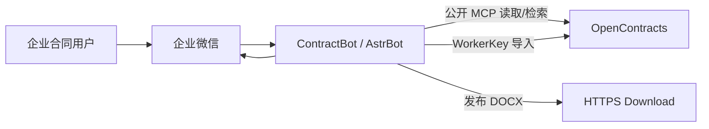
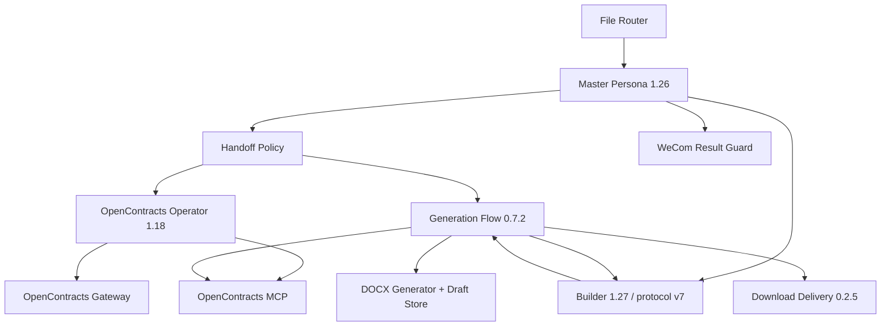

# ContractBot 系统上下文

## 目标

ContractBot 把企业微信中的合同上传、读取分析和合同生成转为受限的 AstrBot 工作流。OpenContracts 保存历史合同和生成资产；代码仓库不保存真实合同模板、企业参数、历史合同或项目事实。

## Context



## AstrBot 组件



正式发行没有 Docassemble Gateway。

## Persona 与 Skill

Master 是唯一客户入口。Operator 和 Builder 只向 Master 返回结构化状态。

保留 Skills 只有：

```text
contract-direct-analysis
contract-conversation-control
```

Operator 1.18 自包含 OpenContracts 读取/上传/核验规则，不绑定 Skill。Builder 1.27 自包含生成规则，静态 Tools/Skills 都为空；Generation Flow 动态注入受限 ToolSet。

## OpenContracts 数据面

历史合同 Corpus：

```text
astrbot_plugin_contract_handoff_policy.default_opencontracts_corpus_slug
```

生成资产 Corpus：

```text
astrbot_plugin_contract_generation_flow.generation_asset_corpus_slug
```

两者都是外部受控业务数据。Master handoff、Router task context 和模型输出不得覆盖权威 corpus 配置。

## 上传链

```text
WeCom 文件
→ DOC Preconverter（仅 .doc）
→ File Router 暂存 / transient 正文
→ Master
→ Handoff Policy
→ Operator
→ opencontracts_gateway_status
→ list_documents 精确查重
→ opencontracts_upload_document / WorkerKey
→ list_documents + get_document_text + search_corpus 核验
→ CONTRACT_UPLOAD:*
→ Result Guard
```

传输/上游提交状态未知时进入 MANUAL_REVIEW，禁止自动重试。

## 读取链

```text
Master
→ Operator
→ list_documents
→ get_document_text(offset=0 → next_offset=null)
→ search_corpus（按需补充）
→ CONTRACT_READ:READY/PARTIAL/PENDING/FAILED
```

正文为空不能用 search、历史记忆或本地文件代替。

## 生成链

Master → Flow generation policy：

```text
generation_policy_protocol=2
fallback_policy=allow_ai_fallback | require_specific_template
```

Builder prompt：

```text
<contract_generation_protocol version="7">
```

全新合同正常路径：

```text
find_generation_assets + find_similar_contracts
→ specific_template / history_reference / ai_scaffold
→ generate_and_publish_contract
   → generate_contract_docx
   → publish_contract_download
   → finalize_contract_draft
→ READY / PARTIAL / BLOCKED / FAILED
```

普通模板绑定必须来自本轮生成资产搜索候选；strict 模式按精确 slug 或唯一标准化标题做身份验证。历史项目特定值默认不迁移，只有 `reference_value_fields` 明确授权的字段才可有限参考。

`source_draft_id` 记录版本来源；`generation_basis` 记录本轮主要依据。修改上一版时按 basis 最小化知识检索。

完整 READY 必须同时有 DOCX、HTTPS publication 和 finalized draft。HTTPS 已发布但 Draft Store 未保存时返回 PARTIAL，保留已有链接；写操作 timeout/cancel/commit-unknown 禁止自动重试。

## 平台与结果

WeCom Final Result Guard 负责上传/读取结果归一、长文本按 UTF-8 字节分段和迟到结果抑制。生成 READY 的真实性还由 Download Delivery 校验当前 generation publication。

Generation Flow 对模型可见工具 JSON 使用 `ensure_ascii=False` 紧凑输出；详细 traceback 只写服务日志。

## 正式组件边界

- Persona：角色、业务判断和工具使用契约；
- Skill：仅两个跨场景复用的分析/会话方法；
- Plugin：确定性状态、Corpus 绑定、文件、写入、生成、交付和平台适配；
- MCP：OpenContracts 远端只读发现/正文/语义检索；
- Gateway：WorkerKey 历史合同写入。

不保留旧生成网关或重复的 OpenContracts/结果核验 Skill 作为回滚兼容层。
