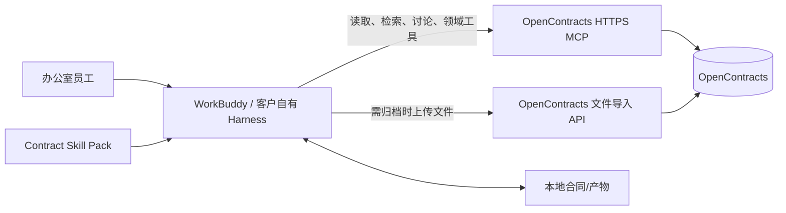
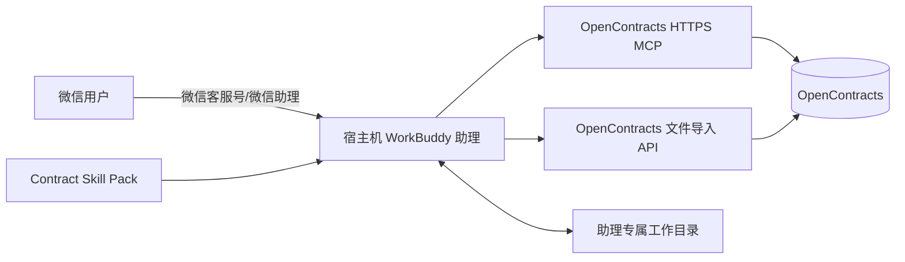
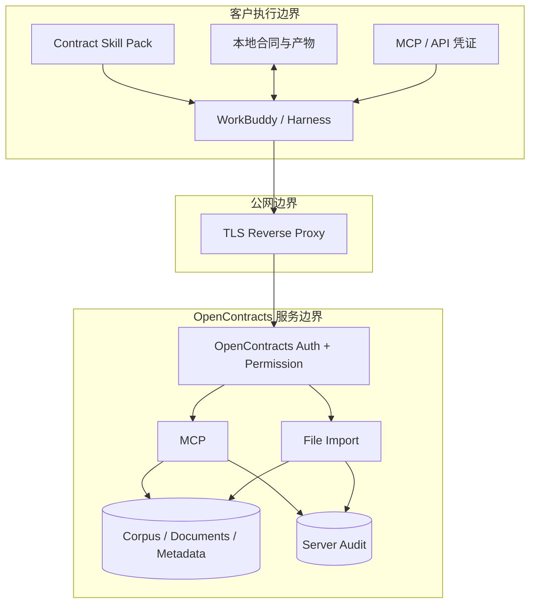

# ContractBot 目标系统上下文（WorkBuddy / Harness 架构）

> 状态：`workbuddy-refactor` 分支的目标架构。旧 AstrBot 方案冻结在 `astrbot-solution` 分支，不再作为本分支的设计基线。

## 1. 目标

ContractBot 不再充当独立 Agent 平台，而收敛为两类交付物：

1. **OpenContracts 能力面**：保存企业合同、模板、历史资料和结构化知识，通过 HTTPS MCP 与必要的文件导入接口提供受权限约束的业务数据能力；
2. **Contract Skill Pack**：安装到 WorkBuddy 或客户自己的 MCP-capable harness 中，负责合同分析、修改、生成、检索和归档流程的 Agent 侧规范与本地脚本。

模型、会话、工具调度和多数 token 成本由客户选择的 WorkBuddy / harness 承担。

## 2. 两个客户场景

### 2.1 办公室用户



办公室用户直接在自己的工作环境内处理合同；Skill Pack 只规定合同工作流和提供确定性脚本，不提供第二套聊天 UI 或 Agent runtime。

### 2.2 一线 / 微信用户



WorkBuddy 运行在客户或我方受控宿主机上，宿主机保持在线。微信只是远程控制入口，实际文件、Skill、MCP 凭证和执行环境都在宿主机。

## 3. 核心架构原则

### 3.1 Agent Runtime 与业务能力彻底分离

- WorkBuddy / harness：模型调用、会话、规划、工具调度、本地文件操作、渠道接入；
- Skill Pack：合同领域规则、工作流、输出规范、脚本；
- OpenContracts：合同事实、企业模板、历史合同、检索、权限、讨论和归档；
- ContractBotConfig：Skill、OpenContracts 调整脚本、部署说明和验收规范。

本分支不再维护 Master / Operator / Builder Persona 体系。

### 3.2 MCP 是主要远端能力面，不承担大文件二进制运输

OpenContracts MCP 用于：

```text
list_documents
get_document_text
search_corpus
list_annotations
list_relationships
list_threads
get_thread_messages
create_thread_message
以及后续经过审计的合同领域扩展工具
```

本地 PDF/DOCX 等文件由 harness 本地读取；需要归档进 OpenContracts 时，Skill 中的确定性上传脚本调用 OpenContracts HTTPS 文件导入接口。不要为二进制上传重新造一层 Agent Gateway。

### 3.3 公网暴露的是受认证的 OpenContracts 服务，不是内部数据库

生产环境仅通过 TLS 反向代理暴露必要路径。企业私有数据必须使用 OpenContracts 认证与对象权限；匿名 MCP 只允许公开语料，生产部署可以在边缘层直接禁用匿名入口。

### 3.4 不再维持独立 Contract Gateway

旧 `astrbot_plugin_opencontracts_gateway` 的职责拆分为：

- 能由 OpenContracts 原生认证 / 权限 / API 完成的，直接使用上游能力；
- 缺失但通用的能力，通过一组可重复应用的 OpenContracts patch / migration 脚本补到 OpenContracts 内部；
- 仅属于客户端工作流的能力，进入 Skill Pack；
- 不再长期维护一个夹在 Agent 与 OpenContracts 之间的第二业务服务。

### 3.5 客户 token 与服务端 AI 解耦

默认合同分析、修改和起草由客户 harness 中的模型执行。OpenContracts 主要负责数据与检索，不应隐式把请求转成由平台承担的大模型费用。

## 4. 数据与信任边界



规则：

- Skill 包不得包含真实客户 token、WorkerKey、用户 JWT、真实合同或企业秘密；
- 凭证放在 harness/宿主机自己的 secret 配置中；
- OpenContracts 权限是租户隔离的最终事实来源；
- Skill 不根据自然语言猜测 corpus 权限；
- 服务端不得因为请求来自某个 Skill 而绕过用户权限。

## 5. 合同业务流

### 快速分析

```text
本地文件 / OpenContracts 文档
→ Skill 读取合同正文
→ 必要时 MCP 检索企业历史与模板
→ 客户自己的模型完成风险分析
→ 本地输出 Markdown / DOCX / PDF（按需）
```

### 修改合同

```text
本地合同
→ 读取原文
→ Skill 确定修改目标与约束
→ MCP 查企业条款/历史（按需）
→ 模型生成修订内容
→ 本地确定性脚本输出新文件/差异
→ 用户确认后可归档 OpenContracts
```

### 新合同生成

```text
用户事实
→ MCP 搜索专用模板与历史合同
→ specific_template / history_reference / ai_scaffold
→ Skill 文档规范约束最终正文
→ 本地 DOCX/PDF renderer
→ 用户验收
→ 可选归档 OpenContracts
```

### 合同库查询

```text
用户问题
→ Skill 判断是否需要企业事实
→ MCP list/search/read
→ 回答中区分合同原文、企业历史与模型判断
```

## 6. WorkBuddy 已验证的能力边界（2026-08-25）

公开文档已经确认：

- 支持用户级和项目级 MCP 配置；
- MCP 可配置 URL 与认证，支持标准 OAuth；
- Skill 可从本地导入，并可包含脚本与工作流；
- WorkBuddy 可绑定微信客服号，远程任务实际在本地电脑执行；
- 微信远程模式要求宿主机在线，使用助理专属文件夹；
- 当前文档描述一台 WorkBuddy 与微信账号的一对一绑定。

因此首版微信方案按“每个客户/入口一个受控 WorkBuddy Host”设计，不假设单个本地会话天然具备 SaaS 多租户能力。

## 7. OpenContracts 已验证的能力边界（2026-08-25）

上游公开文档确认：

- 内建 MCP server；
- `/mcp/` 面向匿名可见的公开 corpuses；
- `/mcp/me/` 面向已认证用户；
- MCP 可执行 corpus 检索、文档读取、标注/关系/讨论等能力；
- OpenContracts 同时提供 GraphQL / REST 文件与应用 API；
- WorkerKey / CorpusAccessToken 是 corpus-scoped 的导入凭证机制之一；
- 对象可见性与权限由 OpenContracts 服务层控制。

生产环境原则是：**公网可达 ≠ 匿名可读**。企业合同必须走认证用户或受控 corpus-scoped 凭证。

## 8. 本分支不再承担的职责

```text
AstrBot Persona 生命周期
Master / Operator / Builder handoff
AstrBot ToolSet / SkillManager bridge
WeCom Result Guard
AstrBot File Router
AstrBot Star registry / event hooks
独立 Download Delivery（除非微信 PoC 证明仍有必要）
```

这些实现保留在 `astrbot-solution` 作为历史方案，不进入 WorkBuddy 目标架构。

## 9. 待 PoC 验证事项

1. WorkBuddy 对远端 OpenContracts MCP 的实际认证配置格式和 token 刷新行为；
2. 微信客服号是否能直接回传 DOCX/PDF 附件，还是只同步文本结果并在桌面端查看产物；
3. 普通办公 harness 对 Skill 包结构的兼容程度，需要多少 adapter；
4. OpenContracts 原生 MCP 是否已覆盖我们需要的归档/元数据写能力；未覆盖部分再决定 patch，而不是预先复制整个 Gateway；
5. 微信远程会话在多人客服场景的隔离方式和容量上限。
