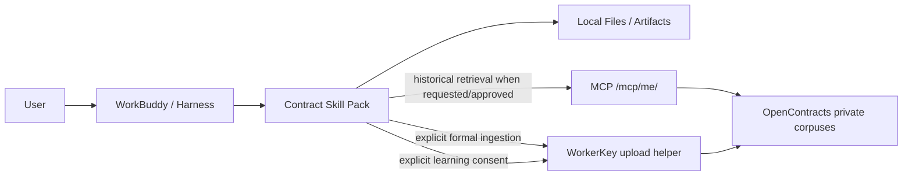

# System Context

## Goal

Provide a portable contract-assistant capability that can be installed into WorkBuddy or another capable Harness. The Harness owns the conversational runtime, local files, model access, and user experience. OpenContracts provides optional enterprise knowledge and controlled ingestion.

## Context



## Runtime ownership

The Harness owns:

- intent recognition and Skill loading;
- model/provider/token costs;
- local attachment access;
- local document editing and artifact creation;
- conversation state;
- WorkBuddy WeChat/customer-service integration when used.

The Skill Pack owns:

- contract-mode behavior;
- when to suggest historical retrieval;
- source/evidence handling;
- formal ingestion consent rules;
- contract document conventions;
- learning-material distillation and consent;
- safe helper scripts for deterministic remote writes.

OpenContracts owns:

- authenticated identities;
- Corpus permissions;
- stored contracts/templates/approved knowledge;
- extraction and retrieval;
- WorkerKey-bound ingestion;
- server-side audit/logging available in the deployment.

## Skill map

```text
contract
├── contract-repository
├── contract-upload
├── contract-document
└── contract-learning
```

`contract` is the normal entry for contract/tender/agreement work. Other Skills are loaded only when needed.

## Default behavior

### Local-first analysis

```text
uploaded contract/tender
→ contract
→ analyze with current Harness
→ answer user
→ when useful, offer historical comparison
```

No OpenContracts access is required for basic local analysis.

### Database-assisted drafting

```text
user asks to draft
→ contract
→ gather current facts
→ optionally suggest enterprise history/template retrieval
→ user agrees or already requested it
→ contract-repository
→ Reference Pack
→ draft
→ contract-document
→ local artifact
```

### Formal ingestion

```text
local/generated contract
→ explicit user ingestion intent
→ contract-upload
→ duplicate check via MCP
→ corpus-bound WorkerKey helper
→ submitted/processing feedback
→ later MCP verification
```

### Learning

```text
valuable corrections in completed session
→ suggest learning capture
→ separate user consent
→ session-facts.txt
→ knowledge-points.txt
→ Learning Inbox WorkerKey
→ later human/curation process
```

## Removed architecture

The active design has no Master/Operator/Builder Persona contract, AstrBot handoff policy, File Router state machine, Result Guard, Generation Flow, Draft Store, or AstrBot plugin lifecycle. The frozen `astrbot-solution` branch remains the historical implementation reference.
