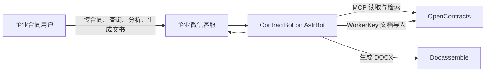
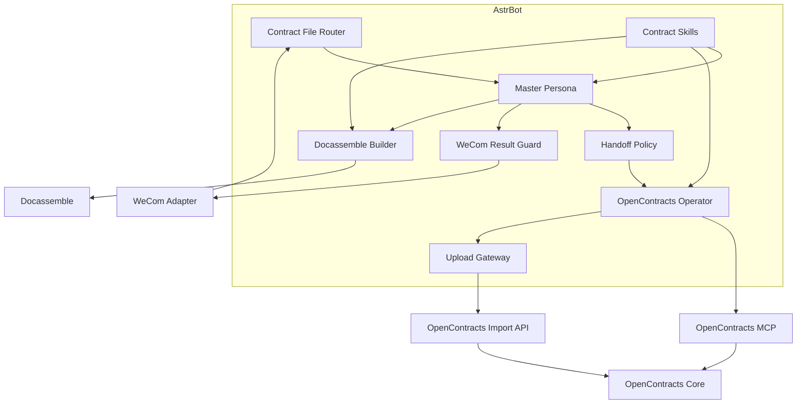

# ContractBot 系统上下文

## 目标

ContractBot 将企业微信中的合同工作转换为 AstrBot 可执行的任务，并把合同持久化、解析与检索交给 OpenContracts，把文书生成交给 Docassemble。

## C4 Context



## Container View



## 核心契约

### Router 输出

`contract_task_context` 是插件、主人格和子助手之间的结构化任务契约。

### OpenContracts Operator 输出

Operator 返回稳定业务状态和核验结果，供主人格形成客户回复：

```text
COMPLETE
PROCESSING
DUPLICATE_CONFIRMATION_REQUIRED
BLOCKED
FAILED
```

### Gateway 输出

Gateway 返回上传写入结果，包括文档 ID、导入状态、目标 Corpus 和本地回执信息。

### Result Guard 输出

Result Guard 输出一条企业微信客户文本，并在重复确认场景保留 Router pending 状态。

## 架构演进规则

- Persona 描述角色目标和沟通方式。
- Skill 描述流程、工具顺序和结果契约。
- Plugin 承担确定性事件处理、状态、文件和平台适配。
- MCP 承担 OpenContracts 远端读取与搜索。
- Gateway 承担 WorkerKey 文档写入和本地文件安全校验。
- UML 与运行时代码在同一 PR 中更新。
