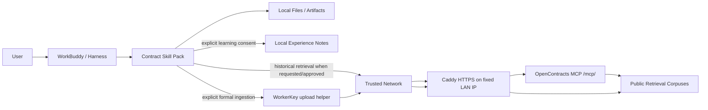

# System Context

## Goal

Provide a portable contract-assistant capability for WorkBuddy and compatible Harnesses. The Harness owns conversational runtime, local files, model access and user interaction. OpenContracts provides optional enterprise retrieval and controlled formal ingestion.

The MVP runs OpenContracts inside a trusted LAN/VPN boundary at a fixed private IPv4 address. Retrieval uses public corpuses over anonymous MCP; formal writes remain WorkerKey-authenticated.

## Context



## Runtime ownership

The Harness owns intent recognition, Skill loading, model/provider use, local attachment access, document editing/artifact creation, conversation state, and local experience-note output.

The Skill Pack owns contract-mode behavior, retrieval guidance, evidence handling, formal-ingestion consent, contract document conventions, experience distillation, and safe deterministic helpers.

OpenContracts owns stored contracts/templates/approved knowledge, extraction/retrieval, public MCP reads for the trusted-network MVP, WorkerKey-bound formal ingestion, and server-side processing state.

Infrastructure owns the fixed LAN IP, LAN/VPN routing, Caddy HTTPS termination, Caddy CA distribution, and firewall rules that prevent untrusted-network access.

Maintainers periodically collect experience notes, review/generalize useful lessons, update the relevant Skills, and release them through normal version control.

## Skill map

```text
contract
├── contract-repository
├── contract-upload
├── contract-document
└── contract-learning
```

## Default behavior

### Local-first analysis

```text
uploaded contract/tender
→ contract
→ analyze with current Harness
→ answer user
→ when useful, offer historical comparison
```

### Database-assisted drafting

```text
user asks to draft
→ contract
→ gather current facts
→ optionally suggest enterprise retrieval
→ user agrees or already requested it
→ contract-repository
→ anonymous MCP over trusted network
→ Reference Pack
→ draft
→ contract-document
→ local artifact
```

### Formal ingestion

```text
local/generated contract
→ explicit user ingestion intent
→ contract-upload
→ duplicate check via MCP
→ corpus-bound WorkerKey helper
→ submitted/processing feedback
→ later MCP verification
```

### Experience learning

```text
valuable corrections in completed session
→ separate user consent
→ local experience note
→ periodic manual collection/review
→ update relevant Skill
```

## Future hardening

If the trusted-network assumption changes, selected corpuses can move to private access and authenticated `/mcp/me/` without changing the Skill map.
