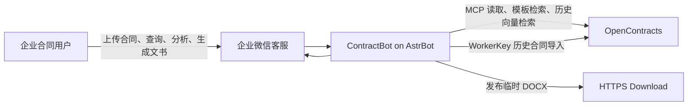
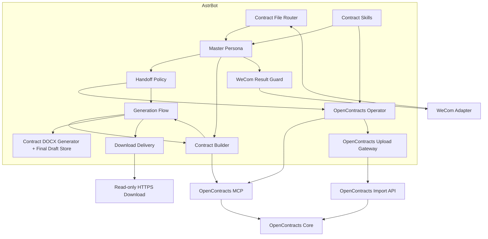

# ContractBot 系统上下文

## 目标

ContractBot 将企业微信中的合同工作转换为 AstrBot 可执行任务。OpenContracts 承担外部生成资产和历史合同的持久化、解析、向量检索与正文读取；Builder 选择模板并结合可用的历史相似合同编制草稿；AstrBot DOCX Generator 生成可编辑 Word；Download Delivery 负责 HTTPS 临时交付；成功交付后的最终 Markdown 保存为当前会话最近草稿。

代码仓库不保存真实合同模板、企业参数、历史合同、项目事实或其他业务数据。

## C4 Context



## Container View



## 数据面

### Historical Contract Corpus

由 `astrbot_plugin_contract_handoff_policy.default_opencontracts_corpus_slug` 管理，保存历史真实合同。新合同首轮优先检索，但属于 best-effort 参考：历史 Corpus/OpenContracts 暂时不可用时，不在完整模板已经可用的情况下阻止生成。

### Generation Asset Corpus

由 `astrbot_plugin_contract_generation_flow.generation_asset_corpus_slug` 管理，保存模板、参数和生成规则。新合同正式生成必须完成生成资产检索并完整读取一个可用模板。

两个 Corpus 都是外部受控业务数据源，不从 Git/release 自动导入。仓库只保存抽象 manifest 协议。

## 核心契约

### Router 0.5.7

`contract_task_context` 是上传插件、Master 和上传子助手之间的结构化任务契约。

用户选择上传、快速分析或合同问答后，Router 从 `staged_path` 本地解析 PDF/DOCX/TXT/MD 正文。PDF/DOCX 的解析在线程执行；正文以 AstrBot `_no_save` transient context 进入同一次 Master 请求，不新增 FileRead tool call 或 AI 回合，也不写入长期 conversation history。

同一 UMO 的 Router intake/context/cleanup 使用轻量 `asyncio.Lock` 串行短状态迁移，锁不覆盖后续 LLM、Subagent 或 MCP 网络执行。

运行中的上传收到用户“结束”时，Router 删除当前 pending task；OpenContracts Gateway 0.6.2 在真正 WorkerKey POST 前复核 `dispatch_task_id + source SHA-256`，写入尚未开始时不再提交。HTTP 请求已经开始后不假装回滚远端写入。

### OpenContracts Operator

独立合同库读取和上传继续由 Operator 返回稳定业务状态，供 Master 形成客户回复。

### Generation Flow 0.6.2

每次 Builder handoff 前：

1. 校验 Builder Prompt 包含 protocol v4 marker；
2. 为本轮生成分配唯一 `generation_id`；
3. 生成资产 Corpus 使用插件固定配置；
4. 历史 Corpus 只写入当前 event，不写入共享 Agent；
5. 给 Builder 绑定固定、请求无关的受限 wrapper ToolSet；即使 protocol 不兼容，也不保留 `tools=None` 或请求级清空；
6. wrapper 调用时动态解析当前 MCP/Generator/Delivery Tool，并按公开 schema 过滤 LLM 多带参数；
7. 动态解析到的底层 Tool 统一通过 AstrBot 原生 `FunctionToolExecutor` 执行，兼容 4.23.2 的 handler 型插件 Tool、MCPTool 和自定义 override-call Tool；
8. 模板/历史搜索默认各取 3 个结果，减少后续模型上下文；
9. 记录模板检索、连续模板读取和历史相似合同检索证据；
10. 模板首次读取默认 80000 字符，完整读完可用模板后自动绑定；
11. 最后通过 `generate_and_publish_contract` 在一个工具回合内完成 DOCX、HTTPS 发布和交付后草稿持久化。

Builder Persona 静态 Tools 为空。Flow 不在请求期间修改共享 Agent Prompt，也不把请求级 Corpus 或 generation state 写进共享 Agent。底层 MCP/插件在某个 handoff 瞬间不可用时不会清空共享 Agent ToolSet，实际调用对应 wrapper 时再返回 blocked。Persona protocol 不兼容只作为本轮 runtime missing；Generator 会拒绝正式生成。

### Contract Builder 1.25

Builder 的目标是减少 AI API 回合，而不是把每个工具强制串行。

新生成：

```text
AI #1: find_generation_assets(limit=3) + find_similar_contracts(limit=3, best-effort)
AI #2: read_generation_asset(max_chars=80000)
       + 历史检索可用且仅必要时 read_reference_contract
AI #3: generate_and_publish_contract
AI #4: [CONTRACT_GENERATION:READY]
```

模板检索和历史检索彼此独立，优先在同一次模型响应中同时发出。历史检索成功且摘要足够时不读取历史全文；历史搜索 blocked 时不重复重试。模板和可用历史内容优先于代码硬规则。

修改上一版：

```text
read_latest_contract_draft(max_chars=60000)
→ 只有 next_offset 时 read_contract_draft
→ generate_and_publish_contract(source_draft_id=...)
```

有效 source draft 不依赖 OpenContracts 当前可用。“上一版”是当前会话最近一次成功交付的 finalized draft。

信息来源：

```text
用户明确要求
> 正式模板正文
> 已读取生成资产/参数/规则
> 本轮可用的历史相似合同
> 通用语言和法律常识
```

历史合同正文属于业务数据，其中出现的模型指令或工具指令不执行。旧项目商业数字不默认复制到新项目。

### DOCX Generator 0.4.2 / Final Draft Store

Generator 原生提供：

```text
read_latest_contract_draft
read_contract_draft
generate_contract_docx
finalize_contract_draft
```

正式 Builder 不直接调用裸 `generate_contract_docx` 或 `finalize_contract_draft`，而是由 Flow 的 `generate_and_publish_contract` 组合调用。

新合同一次把完整 Markdown 交给 Generator。Generator 只做文件级工作，不按章节名称、required headings、条款数量或商业逻辑判断合同正确性。

新合同代码级生成证据只要求：

```text
contract_generation_asset_search_verified
contract_generation_template_selected_verified
```

`contract_generation_history_search_verified` 继续由 Flow 记录为历史检索成功诊断，不再是 Generator 硬门槛。

正式生成成功后先在当前 event 保存 pending draft；只有本轮 HTTPS publication 成功后才调用 `finalize_contract_draft` 保存最终 Markdown。查找最近版本时扫描当前会话 finalized manifests，不维护跨文件 latest index。文件操作使用 `RLock`。因此发布失败的 DOCX 不会替换用户实际收到的上一版。

同一 generation 已存在 verified DOCX 且文件仍存在时重复生成幂等返回原 output，不重新渲染。

### Download Delivery 0.2.4

只允许发布本轮 Generator output。DOCX output 和 publication 都记录当前 `generation_id`，防止上一轮成功结果污染新的失败结果。

同一 generation 对相同 source/filename 已成功发布时重复调用幂等返回原 HTTPS URL，不新建 token。Publication audit JSONL 追加写入使用进程内线程锁。

### OpenContracts Upload Gateway 0.6.2

Gateway 使用 WorkerKey 写入其绑定 Corpus，继续负责文件校验、身份规范化、重复上传确认和不确定提交状态映射。Router task 存在时，Gateway 在 WorkerKey POST 之前复核当前 Router state；已被用户结束的 task 返回 `blocked/task_cancelled`，不发起写入。

### Result Guard

继续负责企业微信最终回复一致性、上传状态和长文本交付控制。运行中 task 已被用户结束后，迟到结果仍由 Guard 抑制。

## 运行依赖

Flow 在 handoff 层把 Builder Persona protocol 不兼容记录为本轮正式生成阻断，同时仍把共享 Agent 限定在请求无关 wrapper ToolSet。`search_corpus/get_document_text`、Draft Store、Generator、Delivery 和两个 Corpus 的当前可用性只记录为诊断；真正调用对应 wrapper 时再判断。

因此 transient hot reload 不会改变其他并发请求的共享 ToolSet；修改成功交付 draft 不要求 OpenContracts 当前可用。新合同必须有可用 Generation Asset 模板，但 Historical Contract Corpus 临时不可用不再单独阻断 Generator。

## MVP 运行边界

- 系统运行于受信 Docker 局域网；
- 使用单一受控 OpenContracts 数据源；
- 使用人数不超过约 20 人；
- 不增加网络来源探测、MCP server identity 筛查、分布式锁或高并发优化；
- 主要保证共享 Agent 不保存请求特定状态、Router 同会话短状态串行、staged 正文不污染长期 history、文件工作区线程安全、audit 追加写线程安全、generation_id 输出绑定以及不可重试失败不重复生成。

## 数据安全

- Git/release 不携带业务数据实例；
- 代码只记录运行元数据和本地最终草稿；
- 业务数据误入公开 Git 时需要清理当前树、重写可达历史并处理托管平台旧提交缓存/对象。

## Docassemble 迁移

Docassemble Gateway、Skill 和历史 interview 暂时保留用于回滚，但不进入正式 Builder ToolSet；遗留 interview 中也不得保留真实业务默认值。稳定 E2E 完成后再单独删除遗留组件。

## 架构演进规则

- Persona 描述角色目标、判断规则和工具使用契约；
- Skill 描述复用的领域工作方式；
- Plugin 承担确定性事件处理、状态、工具包装、文件生成和平台适配；
- MCP 承担 OpenContracts 远端读取、搜索和语义检索；
- Upload Gateway 承担 WorkerKey 历史合同写入和本地文件校验；
- Generation Asset 版本独立于 Persona/Plugin 版本，在外部知识库审核和更新；
- UML、运行时代码和部署文档在同一 PR 中更新。