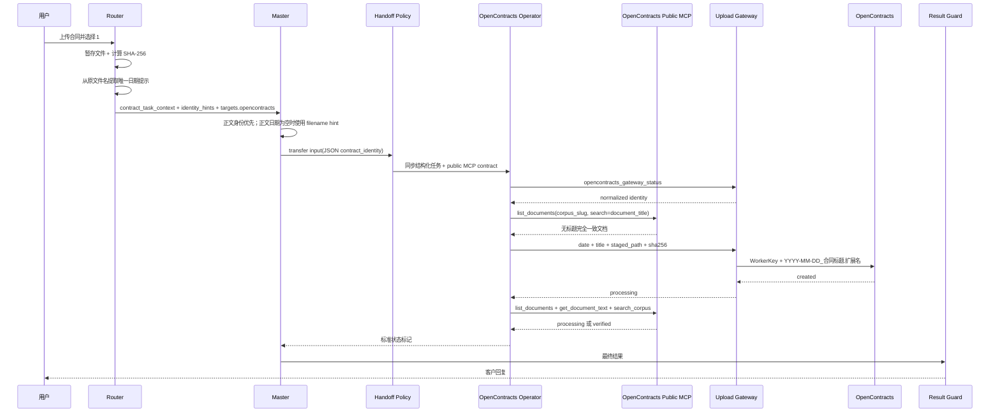
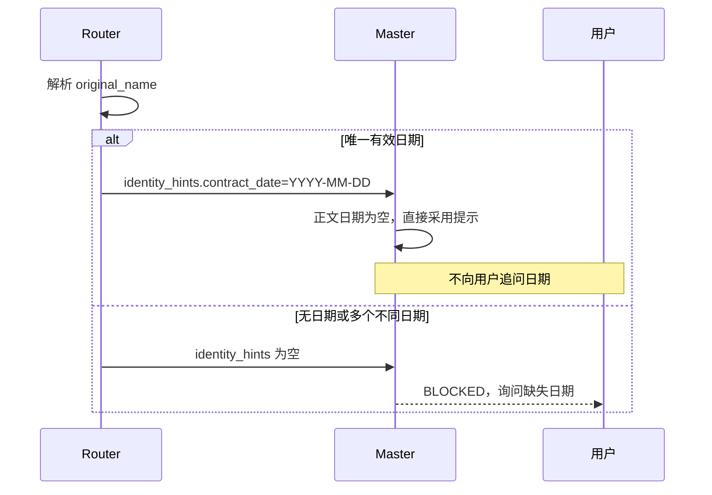
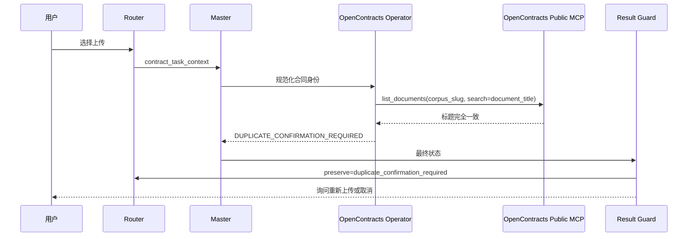
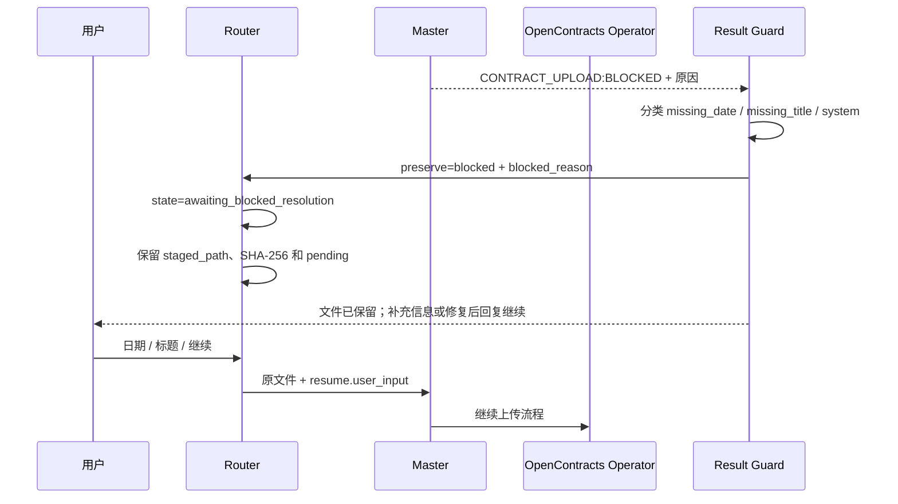
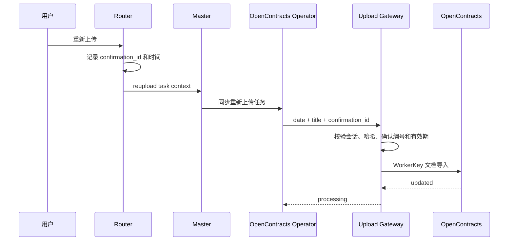
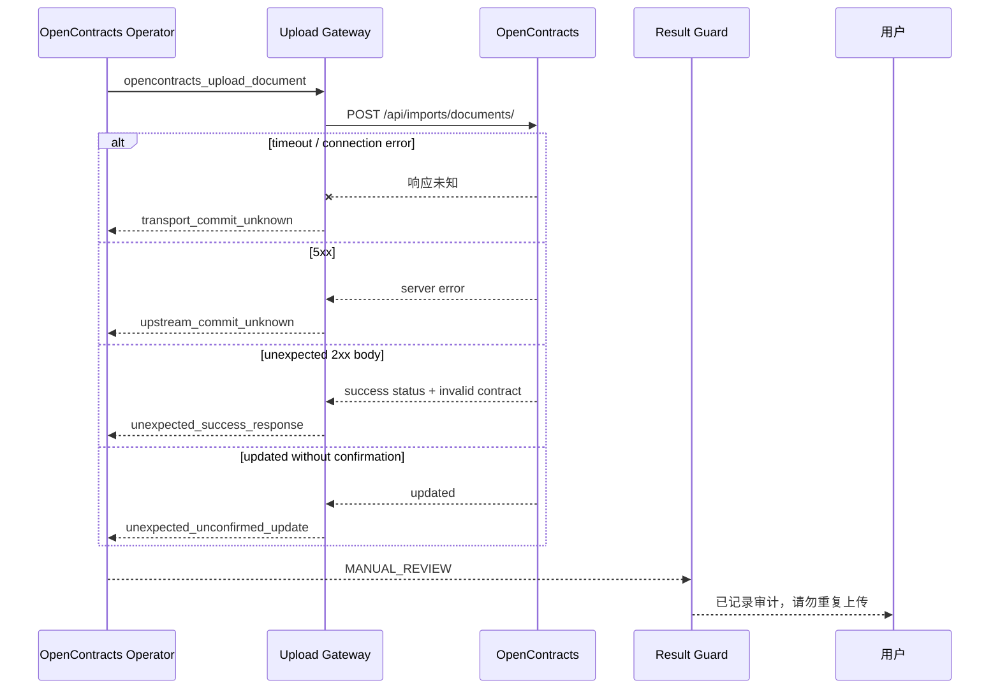

# 合同上传时序

## 新合同

公开 MCP 地址由 AstrBot 配置为 `/mcp/`。所有读取工具使用 `targets.opencontracts` 作为 `corpus_slug`；流程不调用 `get_corpus_info`、`opencontracts_check_duplicate` 或不存在的 corpus-scoped URL。

## 原文件名日期

支持 `YYYY-M-D`、`YYYY.M.D`、`YYYY_M_D`、中文年月日和 `YYYYMMDD`。

## 远端合同已存在

## BLOCKED 后恢复

`BLOCKED` 尚未写入，因此允许复用原暂存文件。客户回复“结束”或“取消”时 Router 清理；客户发送新文件时 Router 要求先结束当前保留任务。

即使模型漏写显式 BLOCKED 标记，只要最终文本明确说明日期或标题缺失，Result Guard 仍将其识别为可恢复阻断。

## 客户确认重新上传

## 提交状态未知

这些路径可能已经写入，不属于可恢复 BLOCKED。Gateway 追加 receipt，Operator 禁止再次调用上传工具。

## 写入前路径冲突

只有能够确认尚未提交的路径冲突才转换为 `DUPLICATE_CONFIRMATION_REQUIRED`，并保留当前文件等待客户确认。
