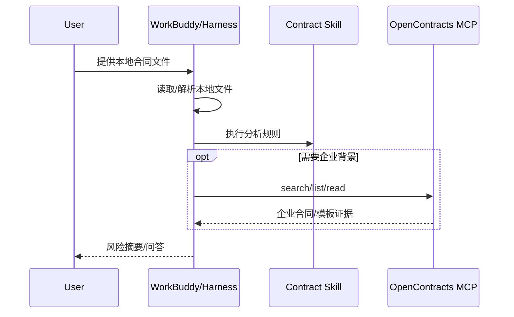
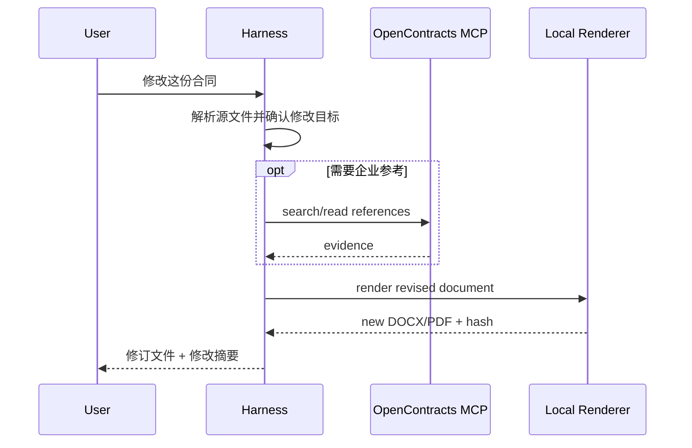
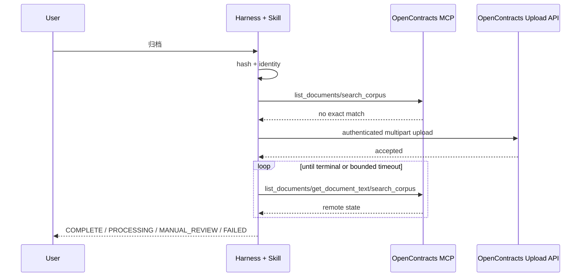
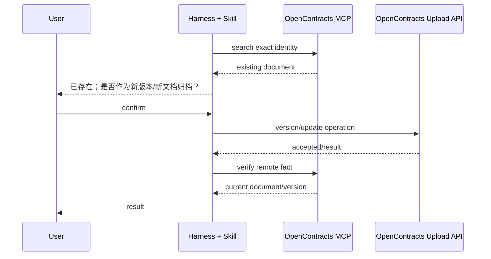

# 合同文件与归档时序

## 1. 原则

WorkBuddy/Harness 方案下，文件首先属于客户端工作目录。分析、修改、生成都优先在本地完成；只有用户明确需要进入企业合同库时才归档到 OpenContracts。

不再使用 AstrBot File Router、transient context 或 pending task state 管理所有文件。

## 2. 本地分析



本地分析不自动把文件上传到 OpenContracts。

## 3. 本地修改



原文件默认不覆盖。

## 4. 归档到 OpenContracts

### 4.1 前置条件

归档前必须至少得到：

```text
source_path
source_hash
contract_title
contract_date（有明确日期时）
target logical corpus
```

如果企业命名规范要求日期但正文无法确定日期，Skill 应询问用户或允许明确的“未知日期”策略；不得伪造日期。

### 4.2 新文档



### 4.3 已存在文档



没有用户确认时，不对已存在合同进行覆盖/版本写入。

## 5. Commit unknown

以下场景不得自动重试写入：

```text
request body 已发送后连接断开
server timeout 但不知道是否提交
返回成功状态但响应结构无法确认
客户端被取消但服务端可能已接收
```

统一返回：

```text
MANUAL_REVIEW
retry_safe=false
request_id=<if available>
source_hash=<hash>
```

后续先通过 MCP/管理端核查远端事实，再决定是否继续。

## 6. 文件生命周期

### 办公室用户

由客户 harness 的工作空间策略管理。Skill 不维护隐藏的 current-file 指针；模型根据当前任务引用的显式路径/附件工作。

### WorkBuddy 微信宿主

使用 WorkBuddy 助理专属工作目录。Skill 应把输入、临时文件和产物放在各自子目录，并使用 request/session 标识避免混淆。

建议：

```text
workspace/
  inbox/
  work/
  output/
  metadata/
```

## 7. 文件身份

本地阶段使用 SHA-256 作为完整性事实；如需短时去重可附加更快 hash，但任何远端写入确认均以 SHA-256 和远端 document/version 身份为准。

建议 sidecar：

```json
{
  "source_name": "合同.docx",
  "sha256": "...",
  "contract_title": "...",
  "contract_date": "...",
  "remote_document_id": null,
  "status": "local|processing|archived|manual_review"
}
```

## 8. 不再保留的旧状态

以下 AstrBot 专有状态不进入新架构：

```text
Router pending
awaiting_blocked_resolution
contract_preserve_pending_reason
contract_task_context
staged_contract_text
WeCom Result Guard late-result suppression
```

需要的安全语义改由 Skill 的显式步骤、OpenContracts 远端事实和本地 sidecar metadata 表达。
