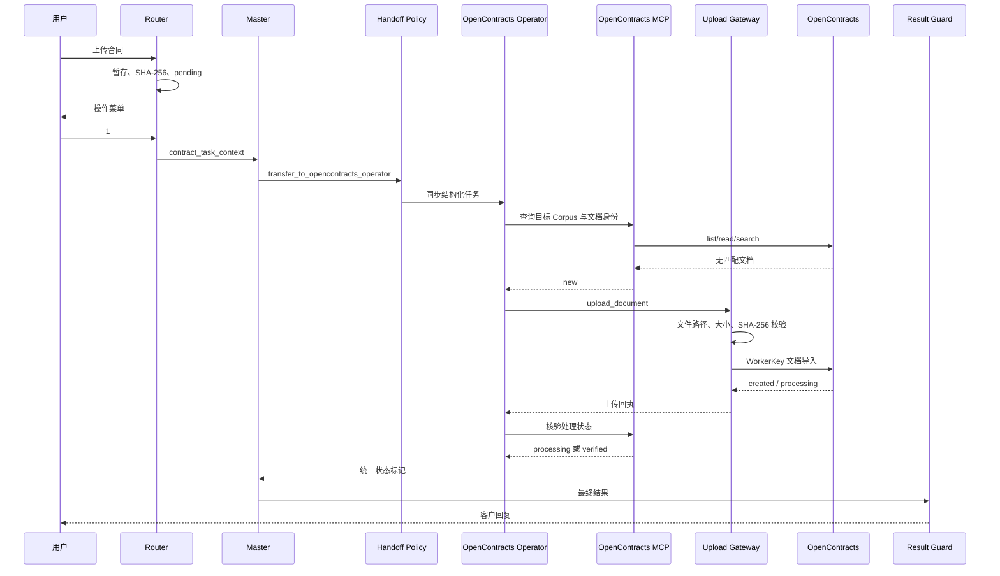
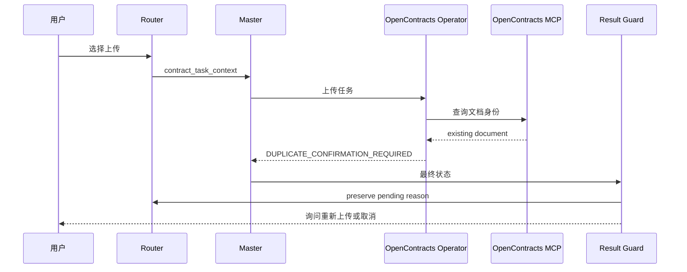
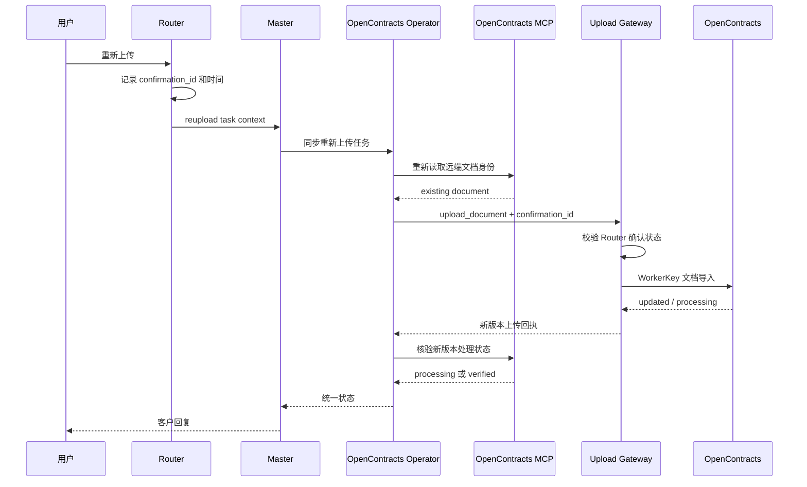

# 合同上传时序

## 新合同

## 远端合同已存在

## 客户确认重新上传

## 状态原则

- `created` 或 `updated` 表示导入接口已接收并建立文档记录或版本。
- `processing` 表示 OpenContracts 仍在解析、标注或建立检索数据。
- `complete` 由 MCP 正文读取和搜索核验共同确认。
- `duplicate_confirmation_required` 保留 Router pending，等待确定性指令。
- `blocked` 表示远端状态不足以安全决定是否写入。
