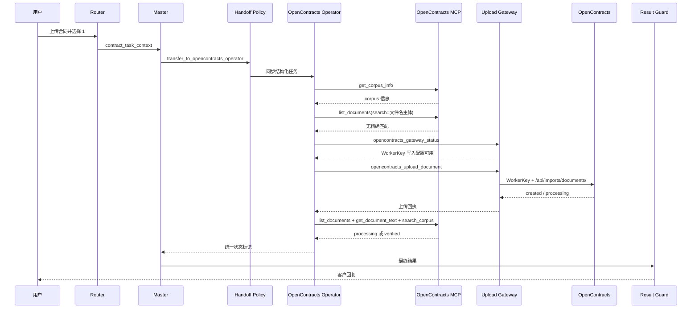
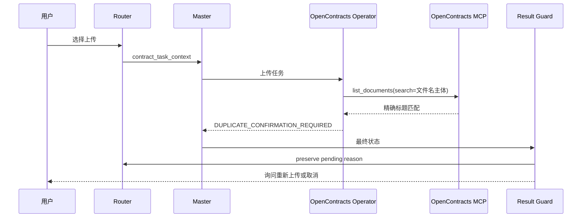
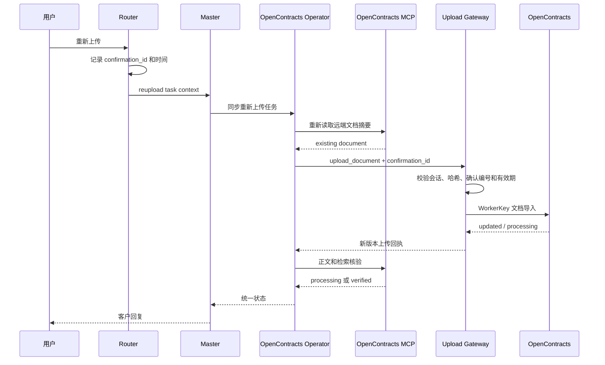
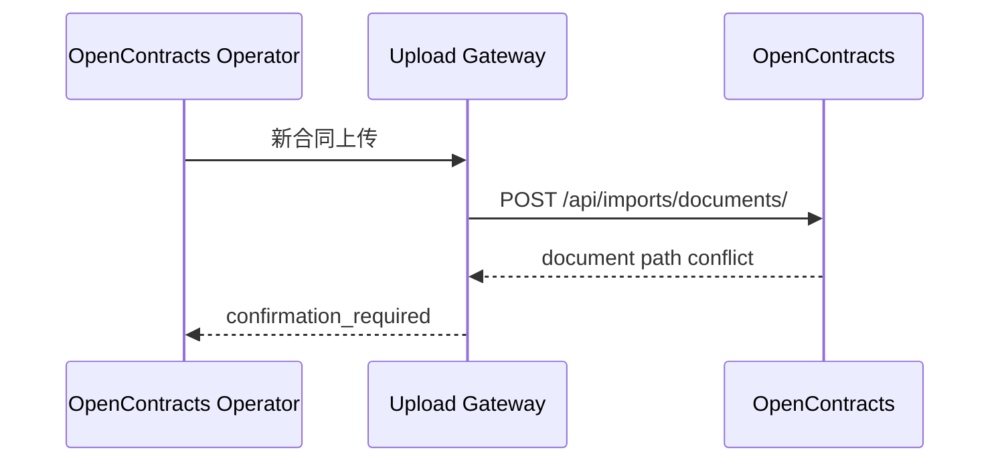

# 合同上传时序

## 新合同

```mermaid
sequenceDiagram
    participant U as 用户
    participant R as Router
    participant M as Master
    participant H as Handoff Policy
    participant O as OpenContracts Operator
    participant MCP as OpenContracts MCP
    participant G as Upload Gateway
    participant OC as OpenContracts
    participant RG as Result Guard

    U->>R: 上传合同并选择 1
    R->>M: contract_task_context
    M->>H: transfer_to_opencontracts_operator
    H->>O: 同步结构化任务
    O->>MCP: get_corpus_info
    MCP-->>O: corpus 信息
    O->>MCP: list_documents(search=文件名主体)
    MCP-->>O: 无精确匹配
    O->>G: opencontracts_gateway_status
    G-->>O: WorkerKey 写入配置可用
    O->>G: opencontracts_upload_document
    G->>OC: WorkerKey + /api/imports/documents/
    OC-->>G: created / processing
    G-->>O: 上传回执
    O->>MCP: list_documents + get_document_text + search_corpus
    MCP-->>O: processing 或 verified
    O-->>M: 统一状态标记
    M->>RG: 最终结果
    RG-->>U: 客户回复
```

## 远端合同已存在

```mermaid
sequenceDiagram
    participant U as 用户
    participant R as Router
    participant M as Master
    participant O as OpenContracts Operator
    participant MCP as OpenContracts MCP
    participant RG as Result Guard

    U->>R: 选择上传
    R->>M: contract_task_context
    M->>O: 上传任务
    O->>MCP: list_documents(search=文件名主体)
    MCP-->>O: 精确标题匹配
    O-->>M: DUPLICATE_CONFIRMATION_REQUIRED
    M->>RG: 最终状态
    RG->>R: preserve pending reason
    RG-->>U: 询问重新上传或取消
```

## 客户确认重新上传

```mermaid
sequenceDiagram
    participant U as 用户
    participant R as Router
    participant M as Master
    participant O as OpenContracts Operator
    participant MCP as OpenContracts MCP
    participant G as Upload Gateway
    participant OC as OpenContracts

    U->>R: 重新上传
    R->>R: 记录 confirmation_id 和时间
    R->>M: reupload task context
    M->>O: 同步重新上传任务
    O->>MCP: 重新读取远端文档摘要
    MCP-->>O: existing document
    O->>G: upload_document + confirmation_id
    G->>G: 校验会话、哈希、确认编号和有效期
    G->>OC: WorkerKey 文档导入
    OC-->>G: updated / processing
    G-->>O: 新版本上传回执
    O->>MCP: 正文和检索核验
    MCP-->>O: processing 或 verified
    O-->>M: 统一状态
    M-->>U: 客户回复
```

## 写入竞争

```mermaid
sequenceDiagram
    participant O as OpenContracts Operator
    participant G as Upload Gateway
    participant OC as OpenContracts

    O->>G: 新合同上传
    G->>OC: POST /api/imports/documents/
    OC-->>G: document path conflict
    G-->>O: confirmation_required
```

MCP 检查与导入写入之间可能出现并发变化，因此导入端点的路径冲突会转换为重复确认状态。
