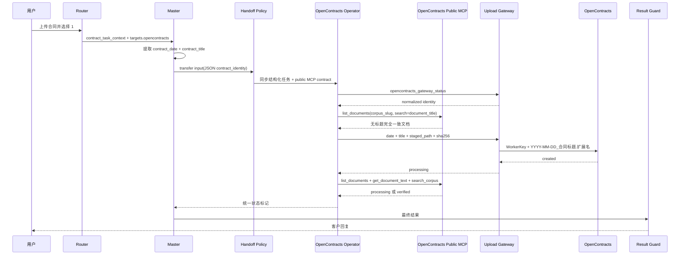
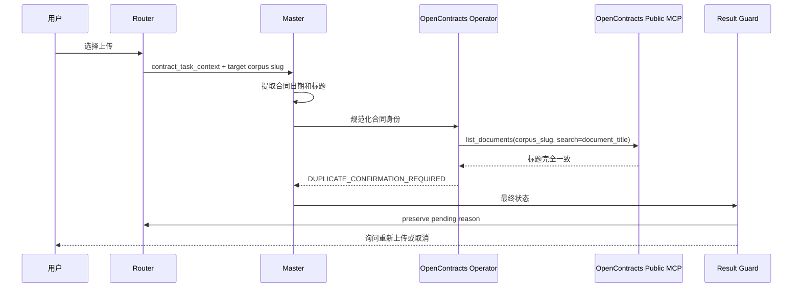
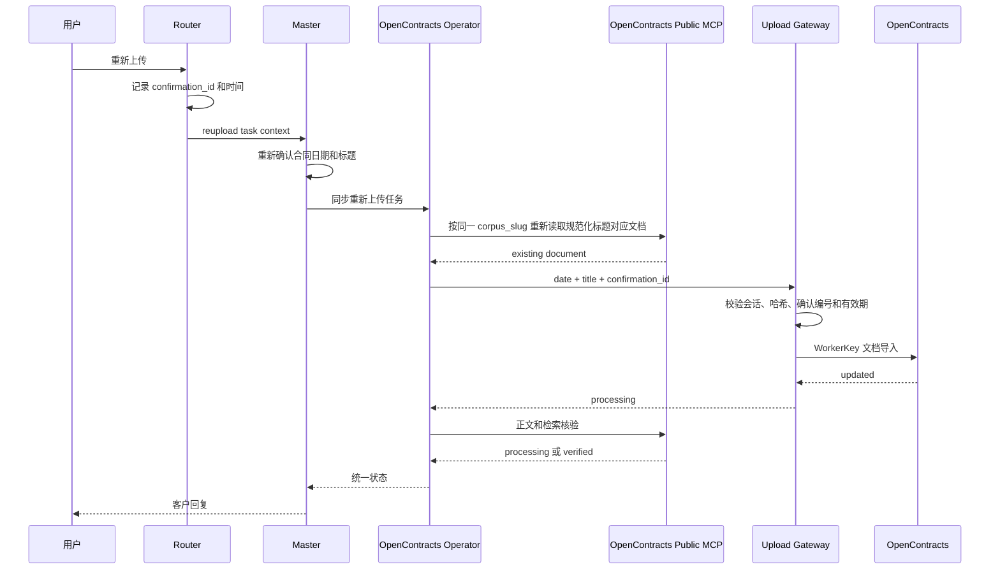
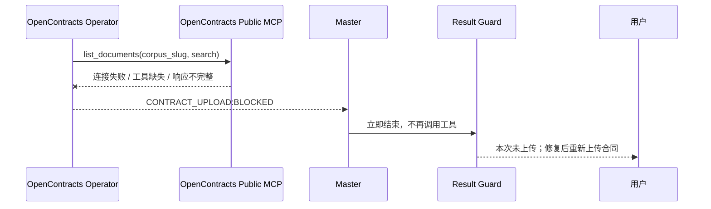
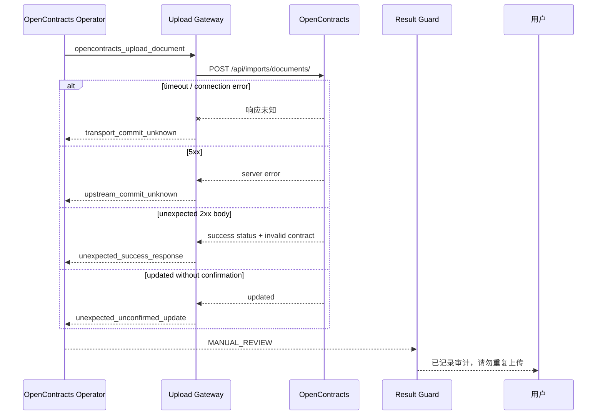
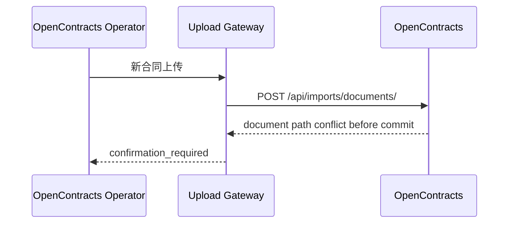

# 合同上传时序

## 新合同

公开 MCP 地址由 AstrBot 配置为 `/mcp/`。所有读取工具使用 `targets.opencontracts` 作为 `corpus_slug`；流程不调用 `get_corpus_info`、`opencontracts_check_duplicate` 或不存在的 corpus-scoped URL。

## 远端合同已存在

## 客户确认重新上传

## 公开 MCP 或工具失败

Master 和 Operator 不使用 Shell、Python、通用 HTTP、直接 MCP JSON-RPC、配置文件读取或 URL 探测补救失败。

## 提交状态未知

上述路径都可能已经写入。Gateway 追加 receipt，Operator 禁止再次调用上传工具。

## 写入前路径冲突

路径冲突只有在能够确认尚未提交时才转换为重复确认状态。
