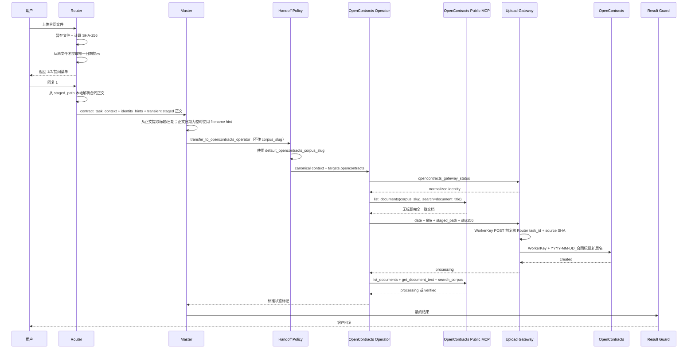
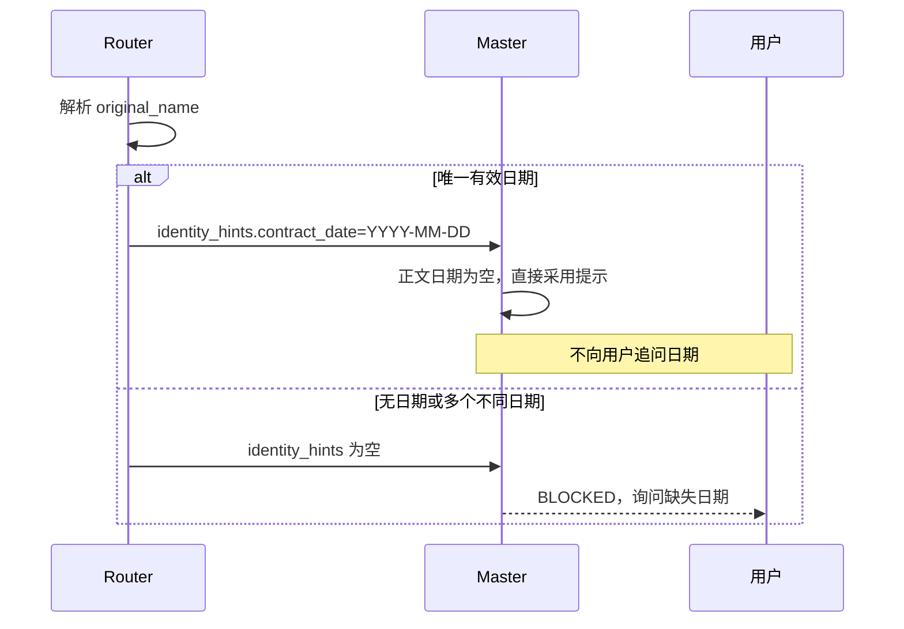
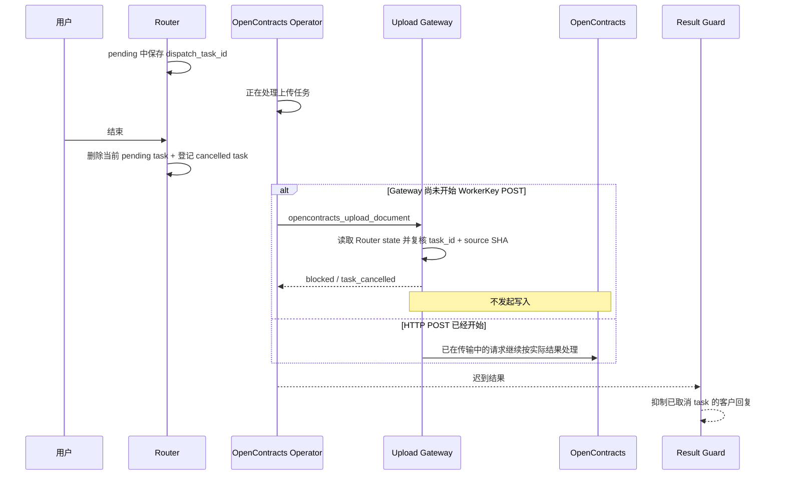
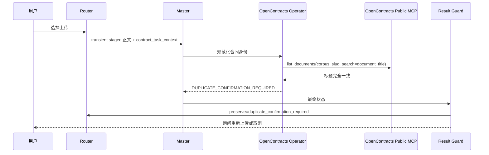
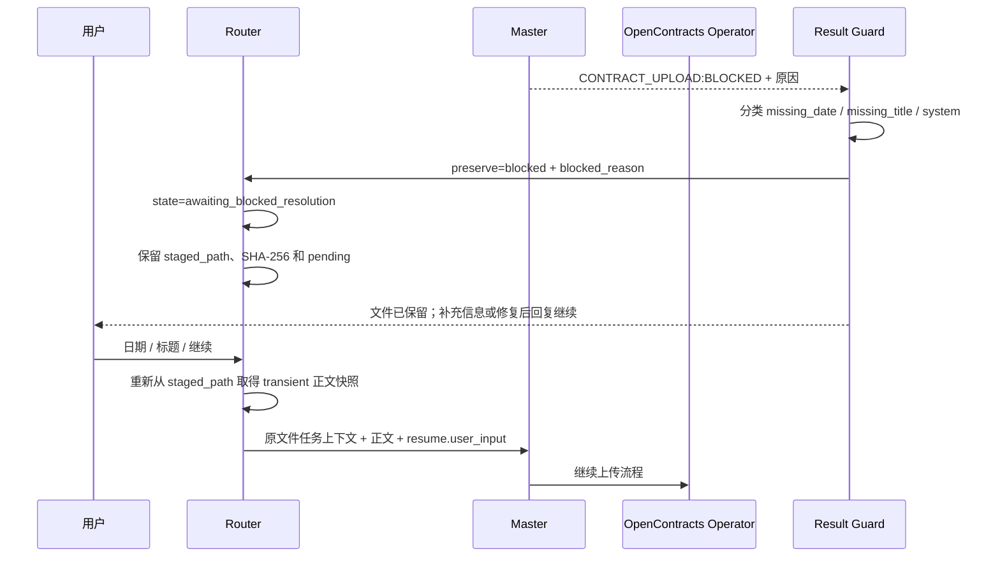
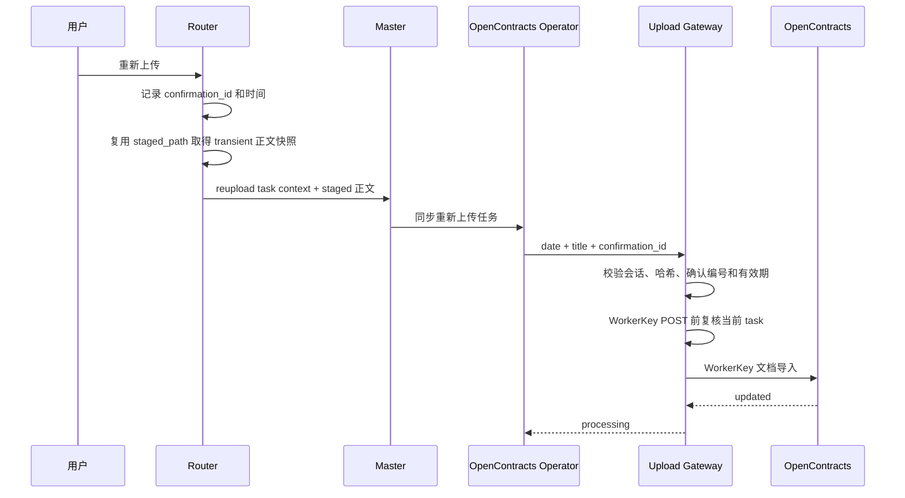
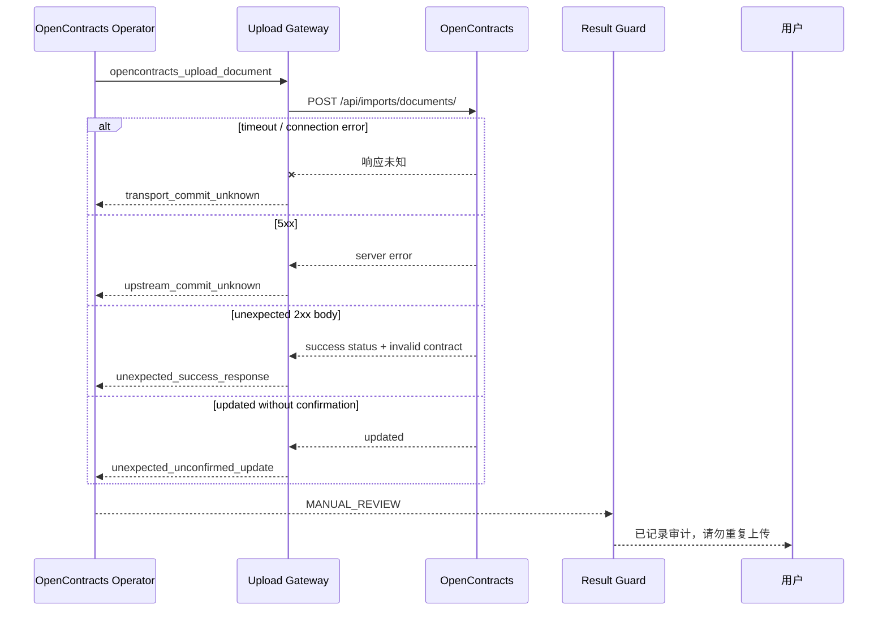

# 合同上传时序

## 新合同

Router 的 staged 正文解析发生在用户选择操作之后、真正 LLM 请求之前，正文以 AstrBot `_no_save` transient context 直接加入同一次请求，不增加 FileRead tool call 或额外 AI 回合，也不写入长期 conversation history。PDF 和 DOCX 解析都在线程中执行；TXT/MD 直接本地解码。`.doc` 先由 DOC Preconverter 转换。

公开 MCP 地址由 AstrBot 配置为 `/mcp/`。所有读取工具使用 Handoff Policy 写入的 `targets.opencontracts` 作为 `corpus_slug`；流程不调用 `get_corpus_info`、`opencontracts_check_duplicate` 或不存在的 corpus-scoped URL。`default_opencontracts_corpus_slug` 是唯一权威 Corpus 配置，Master handoff 和 Router task context 不覆盖它。

## 原文件名日期

支持 `YYYY-M-D`、`YYYY.M.D`、`YYYY_M_D`、中文年月日和 `YYYYMMDD`。

## 同会话状态串行

Router 对同一 UMO 的 intake/context/cleanup 使用一个轻量 `asyncio.Lock`。文件暂存、ACK、conversation 创建、任务登记和 staged 正文快照在同一会话内按顺序完成；锁在 LLM 请求真正进入 Agent 执行前释放，不串行不同用户，也不覆盖后续 Operator/MCP 网络执行。

因此用户快速连续发送“1”“结束”或重复选择时，第二条消息不会插入第一条消息尚未登记 active task 的 await 窗口。

## 运行中“结束”

取消保证的边界是“写入开始前”。已经开始的 HTTP 请求不能假装回滚；若提交状态未知，继续使用原有 MANUAL_REVIEW 语义。

## 远端合同已存在

## BLOCKED 后恢复

`BLOCKED` 尚未写入，因此允许复用原暂存文件。客户回复“结束”或“取消”时 Router 清理；客户发送新文件时 Router 要求先结束当前保留任务。

即使模型漏写显式 BLOCKED 标记，只要最终文本明确说明日期或标题缺失，Result Guard 仍将其识别为可恢复阻断。

## 客户确认重新上传

## 提交状态未知

这些路径可能已经写入，不属于可恢复 BLOCKED。Gateway 追加 receipt，Operator 禁止再次调用上传工具。

## 写入前路径冲突

只有能够确认尚未提交的路径冲突才转换为 `DUPLICATE_CONFIRMATION_REQUIRED`，并保留当前文件等待客户确认。
