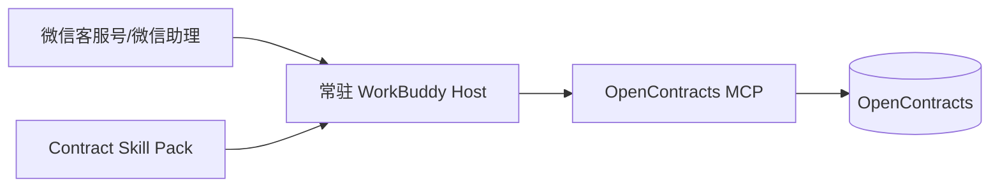

# WorkBuddy / Harness Runtime 架构

## 1. 办公室运行模式

办公室用户优先使用自己已经习惯的 WorkBuddy、Claude Code、Cursor 或其他 MCP-capable harness。交付内容不是专用客户端，而是：

```text
Contract Skill Pack
+ OpenContracts MCP connection config
+ optional upload/render helpers
```

### 客户侧职责

- 选择模型与账号；
- 承担模型 token/订阅费用；
- 保存 MCP/上传凭证；
- 决定本地文件权限；
- 安装/更新 Skill Pack。

### 我方职责

- Skill 的合同专业规则与版本；
- OpenContracts 部署、数据与权限；
- OpenContracts patch/migration；
- 客户安装模板与验收脚本。

## 2. WorkBuddy 已验证能力

截至 2026-08-25，官方公开文档确认 WorkBuddy 支持：

- 用户级 `~/.workbuddy/mcp.json`；
- 项目级 `<project>/.workbuddy/mcp.json`；
- MCP URL 与认证配置；
- MCP OAuth；
- 本地 Skill 包导入；
- Skill 内脚本与工作流；
- 本地文件/文件夹上下文；
- 产物区与 Word/PDF 等文件；
- 微信客服号、微信助理、企微等远程渠道。

## 3. Skill Pack 结构

目标结构：

```text
skills/opencontracts-contract/
  SKILL.md
  references/
    analysis.md
    drafting.md
    modification.md
    document-specification.md
    archive.md
  scripts/
    render_docx.py
    upload_contract.py
    verify_archive.py
  adapters/
    workbuddy/
      mcp.example.json
      install.md
    generic/
      install.md
  tests/
```

核心规则只维护一份；不同 harness 的差异放在 `adapters/`。

## 4. 微信运行模式

WorkBuddy 官方微信客服号方案是“手机发指令，电脑执行”。因此首版拓扑：



### Host 要求

- macOS/Windows；
- WorkBuddy >= 官方微信渠道要求版本；
- 持续登录、持续联网、禁止睡眠；
- 安装固定版本 Skill；
- 配置 OpenContracts 凭证；
- 使用独立 OS 用户或受限账户；
- 工作目录与普通办公文件隔离。

## 5. 微信约束

当前公开文档需要特别记录：

- WorkBuddy 必须保持运行；
- 微信远程任务使用助理专属目录；
- 远程任务集中在助理会话；
- 当前文档描述一对一微信账号绑定；
- 微信可看到任务输出/通知，桌面助理可查看生成文件；
- “DOCX/PDF 是否能作为微信附件直接回传”尚未作为架构既定能力。

因此首版不假设单 Host 支持 SaaS 式多租户并发，也不假设移动端一定能直接收到所有产物附件。

## 6. Harness 兼容策略

Skill Pack 分三层：

```text
portable rules     Markdown 规则与工作流
portable scripts   Python/CLI 确定性脚本
host adapter       MCP 配置、安装路径、权限说明
```

适配新 harness 时，不复制合同业务规则，只新增 adapter。

## 7. 更新策略

Skill 必须有版本号和 changelog。客户安装时需要：

```text
skill_version
supported_opencontracts_version
supported_adapter_versions
```

更新前运行 compatibility check；不允许静默覆盖客户自定义内容。

## 8. 安全

- Skill 脚本默认只能访问任务工作目录；
- OpenContracts token 使用宿主 secret/config，不写进 Skill；
- 高风险写入、覆盖、归档动作需要用户明确意图；
- 微信远程 host 不使用管理员账户运行；
- 任何 shell/helper 的参数必须结构化校验，禁止拼接模型生成的任意 shell 字符串。
