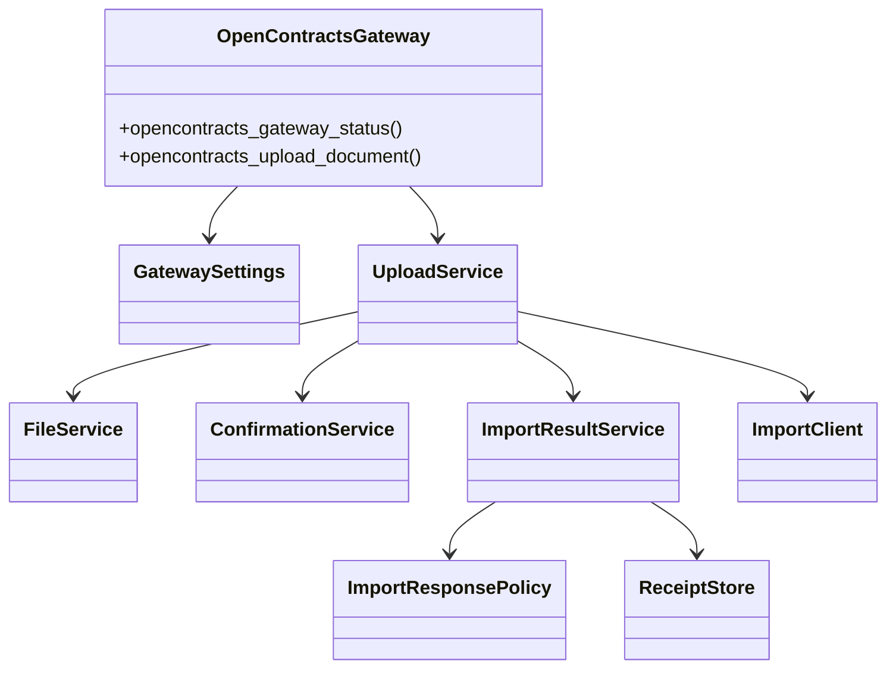

# Phase 2-A：OpenContracts MCP 与上传网关重构

## 范围

本阶段完成：

1. 将 Corpus、文档、正文、标注、关系、语义搜索和讨论线程等合同库操作统一交给 OpenContracts MCP。
2. 将 Gateway 收敛为 WorkerKey 文档导入、文件校验、确认校验和上传审计。
3. 删除 Gateway 的 `/api/imports/documents/lookup/` 实现和 `opencontracts_check_duplicate` Tool。
4. 将 Gateway `main.py` 从约 983 行缩减到约 112 行。
5. 将配置、文件校验、确认校验、导入客户端、响应策略、结果映射和 receipt 存储拆分为独立模块。

## OpenContracts MCP

OpenContracts 官方 `docs/mcp/`、MCP 服务实现和运行时工具发现是能力清单的事实来源。Corpus-scoped MCP 当前提供：

```text
get_corpus_info
list_documents
get_document_text
list_annotations
list_relationships
search_corpus
list_threads
get_thread_messages
create_thread_message
```

`create_thread_message` 需要认证用户上下文。MCP 认证由 AstrBot MCP 连接管理。

上传流程使用其中的合同发现、正文读取和语义检索能力；后续合同分析、关系、标注和讨论流程直接复用同一 MCP 能力面。

## 模块图



## 文件规模

```text
main.py                             ~112
config/settings.py                  ~113
clients/import_client.py             ~95
services/file_service.py            ~108
services/confirmation_service.py     ~50
services/upload_service.py          ~162
services/import_response_policy.py   ~51
services/import_result_service.py   <200
storage/receipt_store.py             ~85
```

运行模块保持在可直接阅读和修改的规模内。

## Tool 变化

Gateway 保留：

```text
opencontracts_gateway_status
opencontracts_upload_document
```

远端合同库操作来自 OpenContracts MCP。Gateway 只处理本地暂存文件和 WorkerKey 文件导入。

## 配置变化

写入配置：

```text
base_url
auth_token (WorkerKey)
import_path
default_corpus_id
default_corpus_slug
allowed_roots
data_dir
router_state_path
require_expected_sha256
max_file_bytes
timeout_seconds
confirmation_ttl_seconds
verify_tls
```

旧的读取和 lookup 配置已移出 Gateway。

## MVP 验证

当前项目处于快速演进阶段，本阶段不维护单元测试目录和测试矩阵。验证范围为：

```bash
python3 -m compileall -q plugins scripts
```

随后使用发布脚本生成 ZIP，并在 AstrBot WebUI 中加载 Plugin、Skill 和 Persona，确认：

- 插件能够初始化；
- MCP 工具能够被 OpenContracts Operator 发现；
- Gateway 能够读取 WorkerKey 配置；
- 企业微信上传流程能够进入当前事件内的 LLM 调度。

## 后续

Phase 2-B 拆分 Contract File Router，将 pending 状态、文件暂存、任务上下文和事件处理从大文件中提取。Router 生成的 OpenContracts 任务上下文也将在该阶段直接使用 MCP 与 Gateway 的当前工具名称。
