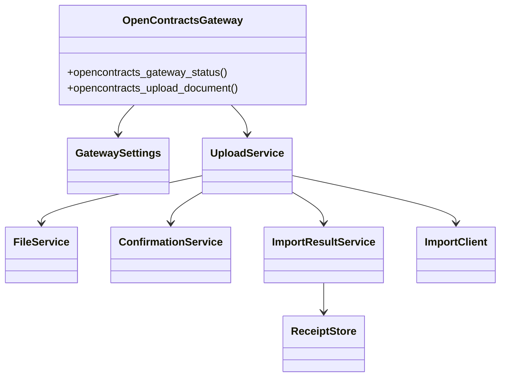

# Phase 2-A：OpenContracts MCP 读取与上传网关重构

## 范围

本阶段完成：

1. 将合同发现、正文读取、语义检索和处理核验迁移到 corpus-scoped OpenContracts MCP。
2. 将 Gateway 收敛为 WorkerKey 文档导入、文件校验、确认校验和上传审计。
3. 删除 Gateway 的 `/api/imports/documents/lookup/` 实现和 `opencontracts_check_duplicate` Tool。
4. 将 Gateway `main.py` 从 983 行缩减到约 112 行。
5. 将配置、文件校验、确认校验、HTTP 客户端、结果映射和 receipt 存储拆分为独立模块。

## 模块图



## 文件规模

```text
main.py                    ~112
config/settings.py         ~113
clients/import_client.py    ~95
services/file_service.py   ~108
services/confirmation_service.py ~50
services/upload_service.py ~162
services/import_result_service.py ~159
storage/receipt_store.py    ~85
```

重构后的运行模块均低于 200 行。

## Tool 变化

保留：

```text
opencontracts_gateway_status
opencontracts_upload_document
```

合同发现由 OpenContracts MCP 的 `get_corpus_info` 和 `list_documents` 完成。上传后的核验使用 `get_document_text` 和 `search_corpus`。

## 配置变化

保留写入配置：

```text
base_url
auth_token (WorkerKey)
import_path
default_corpus_id
default_corpus_slug
allowed_roots
data_dir
router_state_path
require_expected_sha256
max_file_bytes
timeout_seconds
confirmation_ttl_seconds
verify_tls
```

移除运行时读取配置：

```text
auth_mode
lookup_path
remote_timeout_seconds
use_receipt_path_hints
bootstrap_receipts_json
```

## 测试

```bash
python -m compileall -q plugins
python -m unittest discover -s plugins/astrbot_plugin_opencontracts_gateway/tests -v
```

覆盖：

- 成功导入返回 processing；
- 未确认的文档路径冲突返回 confirmation_required；
- 无效确认在发出网络请求前停止；
- 确认编号绑定会话和文件 SHA-256；
- receipt 在成功导入后写入。

## 后续

Phase 2-B 拆分 Contract File Router，将 pending 状态、文件暂存、任务上下文和事件处理从 1038 行 `main.py` 中提取。
