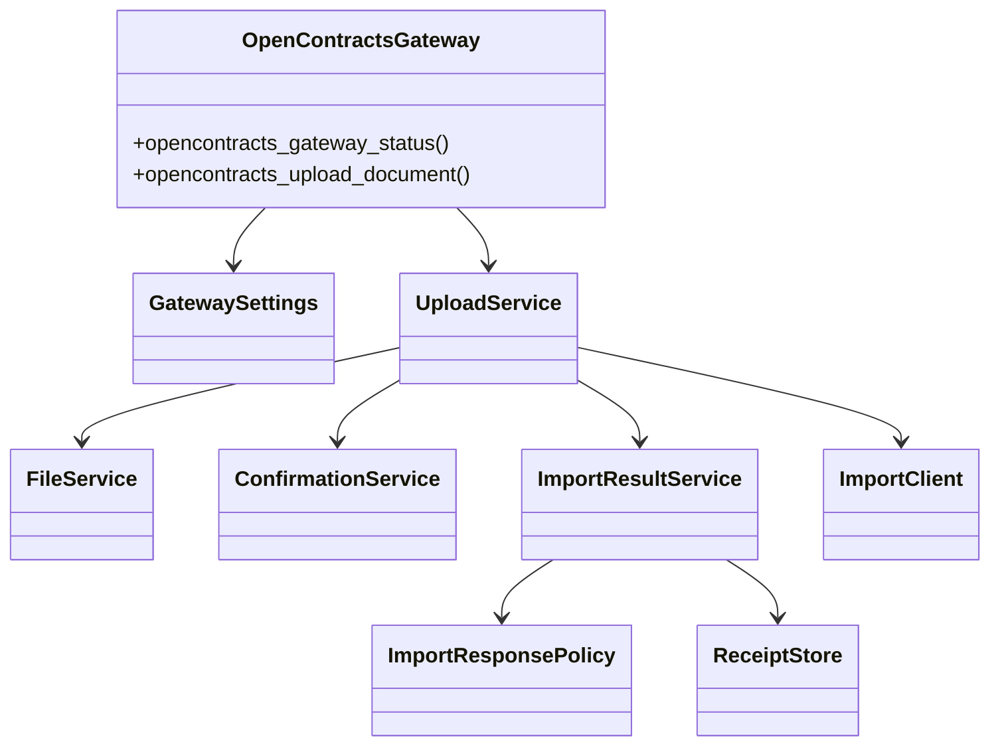

# Phase 2-A：OpenContracts MCP 与上传网关重构

## 范围

本阶段完成：

1. 将 Corpus、文档、正文、标注、关系、语义搜索和讨论线程等合同库操作统一交给 OpenContracts MCP。
2. 将 Gateway 收敛为合同身份规范化、WorkerKey 文档导入、文件校验、确认校验和追加式上传审计。
3. 删除 Gateway 的 `/api/imports/documents/lookup/` 实现和 `opencontracts_check_duplicate` Tool。
4. 将 Gateway `main.py` 收敛为 AstrBot Tool 适配器。
5. 将配置、文件校验、确认校验、导入客户端、响应策略、结果映射和 receipt 存储拆分为独立模块。
6. 将不确定提交和未确认版本写入统一归入人工核查，禁止自动重试。

## OpenContracts MCP

OpenContracts 官方 `docs/mcp/`、MCP 服务实现和运行时工具发现是能力清单的事实来源。Corpus-scoped MCP 当前提供：

```text
get_corpus_info
list_documents
get_document_text
list_annotations
list_relationships
search_corpus
list_threads
get_thread_messages
create_thread_message
```

`create_thread_message` 需要认证用户上下文。MCP 认证由 AstrBot MCP 连接管理。

## 合同身份

主人格在委派前从合同正文提取：

```text
contract_date = YYYY-MM-DD
contract_title = 合同正文中的正式标题
```

Gateway 统一生成：

```text
document_title = YYYY-MM-DD 合同标题
normalized_filename = YYYY-MM-DD_合同标题.原扩展名
```

Operator 使用 `list_documents(search=document_title)` 缩小候选集，并对返回标题做完全一致比较。日期或标题缺失时停止上传。

## WorkerKey 写入

Gateway 只使用：

```text
POST /api/imports/documents/
Authorization: WorkerKey <token>
```

写入目标由 WorkerKey 绑定。Gateway 不要求或展示配置 Corpus ID，也不发送 `add_to_corpus_id`。当前 corpus-scoped MCP 应指向同一业务 Corpus，并在写入后核验远端结果。

## 模块图



## Tool 变化

Gateway 保留：

```text
opencontracts_gateway_status
opencontracts_upload_document
```

`opencontracts_upload_document` 输入：

```text
staged_path
expected_sha256
contract_date
contract_title
source_filename
description
custom_meta
duplicate_confirmation_id
```

远端合同库操作来自 OpenContracts MCP。Gateway 只处理本地暂存文件、规范化身份和 WorkerKey 文件导入。

## 配置

```text
base_url
auth_token (WorkerKey)
import_path
default_make_public
allowed_roots
data_dir
router_state_path
require_expected_sha256
max_file_bytes
timeout_seconds
confirmation_ttl_seconds
verify_tls
```

旧的读取、lookup 和配置 Corpus ID 已移出 Gateway。

## 提交状态保护

以下状态进入 `manual_review_required`：

```text
unexpected_unconfirmed_update
transport_commit_unknown
upstream_commit_unknown
unexpected_success_response
```

统一返回：

```text
manual_review_required=true
retry_safe=false
```

如果确认已经写入，则 `write_committed=true`；无法确认时为 `write_committed=unknown`。Operator 输出 `[CONTRACT_UPLOAD:MANUAL_REVIEW]`，不得再次调用上传工具。

## Receipt

Receipt schema v4 采用 append-only 记录。每次成功写入或提交状态未知都会形成独立审计条目，不再按文件名或 SHA 覆盖旧记录。

## 版本

```text
astrbot_plugin_opencontracts_gateway 0.6.1
astrbot_plugin_contract_handoff_policy 0.4.4
astrbot_plugin_wecom_final_result_guard 0.3.1
contract_master_orchestrator 1.16
contract_opencontracts_operator 1.16
```

## MVP 验证

当前阶段不新增测试目录。合并前执行：

```bash
python3 -m compileall -q plugins scripts
python scripts/build_release.py --clean
```

随后在 AstrBot WebUI 中加载 Plugin、Skill 和 Persona，验证：

- 插件和 MCP 工具能够初始化；
- 主人格能够提取合同日期和标题并结构化委派；
- 首次上传与重复确认能够完成；
- 不确定提交进入人工核查且不会自动重试；
- 客户完成文案只声明正文可读和已进入检索。

## 后续

Phase 2-B 拆分 Contract File Router，将 pending 状态、文件暂存、任务上下文和事件处理从大文件中提取，并移除 Router 中遗留的 `opencontracts_check_duplicate` 名称。
