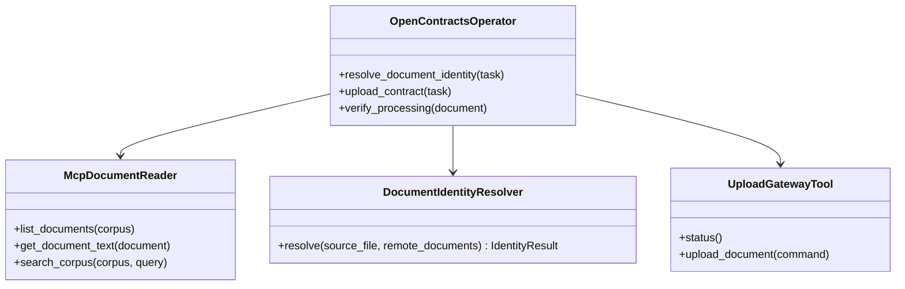
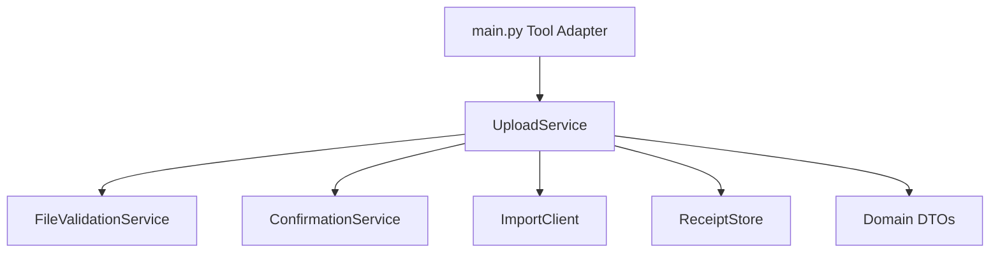
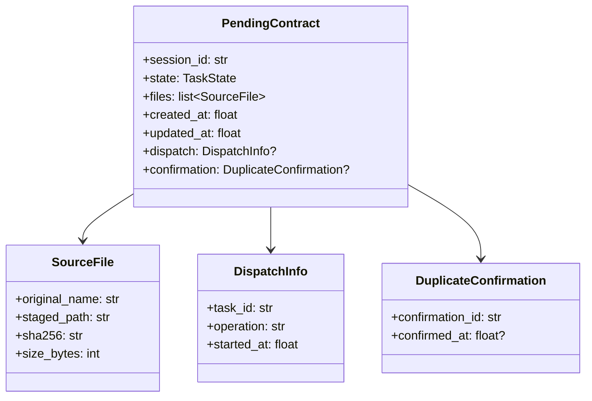

# Phase 2 重构目标

本文件将 Phase 1 UML 转换为可执行的代码拆分计划。Phase 1 不修改运行时代码和组件版本。

## 重构顺序


## 1. OpenContracts Operator 与 MCP

### 目标

OpenContracts Operator 直接调用 MCP Tools 获取合同列表、文档正文、搜索结果和处理状态，并将远端数据转换为稳定业务判断。

### 目标服务模型



`DocumentIdentityResolver` 的判断规则需要固定输入、固定输出和单元测试，避免由自然语言临时决定。

## 2. OpenContracts Gateway

### 目标目录

```text
plugins/astrbot_plugin_opencontracts_gateway/
├── main.py
├── config/
│   ├── __init__.py
│   └── settings.py
├── domain/
│   ├── __init__.py
│   ├── upload_command.py
│   └── upload_result.py
├── clients/
│   ├── __init__.py
│   └── import_client.py
├── services/
│   ├── __init__.py
│   ├── confirmation_service.py
│   ├── file_validation_service.py
│   └── upload_service.py
├── storage/
│   ├── __init__.py
│   └── receipt_store.py
├── _conf_schema.json
├── metadata.yaml
└── README.md
```

### 依赖方向



### `main.py` 目标

- 读取 AstrBot config；
- 创建依赖；
- 注册 `opencontracts_gateway_status`；
- 注册 `opencontracts_upload_document`；
- 将领域结果序列化为 Tool JSON。

## 3. Contract File Router

### 目标目录

```text
plugins/astrbot_plugin_contract_file_router/
├── main.py
├── domain/
│   ├── __init__.py
│   ├── actions.py
│   ├── pending_contract.py
│   └── task_state.py
├── handlers/
│   ├── __init__.py
│   ├── file_event_handler.py
│   └── text_event_handler.py
├── services/
│   ├── __init__.py
│   ├── conversation_service.py
│   ├── session_service.py
│   ├── staging_service.py
│   └── task_context_factory.py
├── storage/
│   ├── __init__.py
│   ├── cancelled_task_store.py
│   └── pending_store.py
├── ui/
│   ├── __init__.py
│   └── prompts.py
├── _conf_schema.json
├── metadata.yaml
└── README.md
```

### 状态模型



JSON Store 负责 DTO 与持久化字典之间的转换，事件处理器不直接拼接状态字段。

## 4. WeCom Final Result Guard

### 目标目录

```text
plugins/astrbot_plugin_wecom_final_result_guard/
├── main.py
├── classification/
│   ├── __init__.py
│   └── upload_status_classifier.py
├── mapping/
│   ├── __init__.py
│   └── customer_message_mapper.py
├── storage/
│   ├── __init__.py
│   └── cancelled_task_store.py
├── text/
│   ├── __init__.py
│   └── utf8_truncator.py
├── _conf_schema.json
├── metadata.yaml
└── README.md
```

正式状态标记是分类器的主要输入；兼容旧文本的规则单独维护并记录移除条件。

## 5. Handoff Policy

该插件保持小型。建议提取两个纯函数模块：

```text
routing.py          # agent/tool/branch resolution
canonical_task.py   # canonical JSON construction
```

委派协议使用能力描述：

```text
read_channel = opencontracts_mcp
write_channel = opencontracts_import_gateway
```

## 6. Persona 与 Skill

代码接口稳定后进行内容更新：

- Master Persona 保留客户交互、核验要求和协作范围；
- OpenContracts Persona 保留合同库操作范围和结果质量；
- `contract-opencontracts` 记录 MCP 读取与 Gateway 上传顺序；
- `contract-result-verification` 只定义统一状态及完成条件；
- Router 动态上下文只提供数据和动作，不复制整段 Skill。

这些文件行为变化时分别推进 Persona 和 Skill 版本。

## 7. 兼容策略

Phase 2 可分两个 PR：

### PR 1：读取迁移

- 增加 MCP 身份解析流程；
- 更新 Operator Skill、Persona 和工具分配文档；
- Gateway 保留旧 Tool 名称作为兼容层；
- 增加新合同、重复合同和未知状态测试。

### PR 2：文件拆分

- 保持 Tool 名称、配置键和状态标记稳定；
- 按目标目录移动实现；
- 加入单元测试；
- 删除已无调用的 REST lookup 实现和配置。

## 8. 完成标准

- OpenContracts 读取日志来自 MCP Tool 调用；
- Gateway 状态只报告写入配置；
- Router 和 Gateway `main.py` 各自主要承担适配与协调；
- 每个状态转换有测试；
- 每个插件 README UML 与代码模块一致；
- `scripts/build_release.py` 能输出可安装 ZIP 和校验清单。
