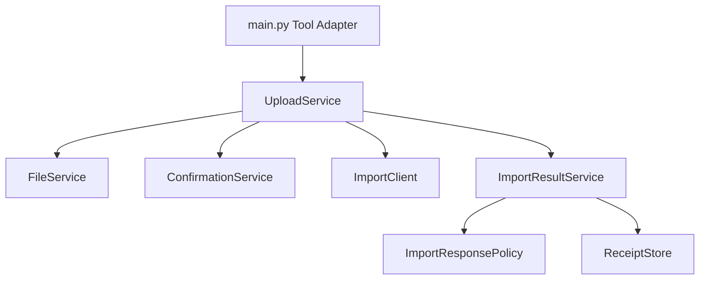
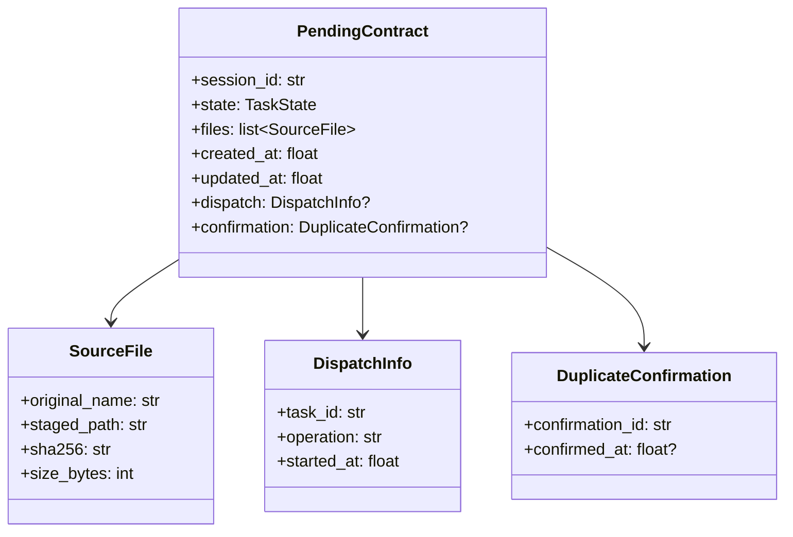

# Phase 2 重构目标与进度

## 顺序


## Phase 2-A：已完成

### OpenContracts MCP

OpenContracts 官方 `docs/mcp/`、MCP 服务实现和运行时工具发现是能力清单的事实来源。Corpus-scoped MCP 当前提供：

```text
get_corpus_info
list_documents
get_document_text
list_annotations
list_relationships
search_corpus
list_threads
get_thread_messages
create_thread_message
```

`create_thread_message` 需要认证用户上下文。Skill 根据上传、问答、风险分析、关系、标注和讨论线程等任务选择对应工具。

### OpenContracts 写入

Upload Gateway 使用 WorkerKey 和官方 `/api/imports/documents/` 端点完成合同文件导入。

### Gateway 目录

```text
plugins/astrbot_plugin_opencontracts_gateway/
├── main.py
├── config/
│   ├── __init__.py
│   └── settings.py
├── domain/
│   ├── __init__.py
│   ├── models.py
│   └── results.py
├── clients/
│   ├── __init__.py
│   └── import_client.py
├── services/
│   ├── __init__.py
│   ├── confirmation_service.py
│   ├── file_service.py
│   ├── import_response_policy.py
│   ├── import_result_service.py
│   └── upload_service.py
├── storage/
│   ├── __init__.py
│   └── receipt_store.py
├── _conf_schema.json
├── metadata.yaml
└── README.md
```

### 依赖方向



## Phase 2-B：Contract File Router

### 目标目录

```text
plugins/astrbot_plugin_contract_file_router/
├── main.py
├── domain/
│   ├── actions.py
│   ├── pending_contract.py
│   └── task_state.py
├── handlers/
│   ├── file_event_handler.py
│   └── text_event_handler.py
├── services/
│   ├── conversation_service.py
│   ├── session_service.py
│   ├── staging_service.py
│   └── task_context_factory.py
├── storage/
│   ├── cancelled_task_store.py
│   └── pending_store.py
└── ui/
    └── prompts.py
```

### 状态模型



JSON Store 负责 DTO 与持久化字典之间的转换；事件处理器通过服务修改状态。Task Context Factory 直接使用当前 MCP 与 Gateway 工具名称。

## Phase 2-C：WeCom Final Result Guard

```text
plugins/astrbot_plugin_wecom_final_result_guard/
├── main.py
├── classification/
│   └── upload_status_classifier.py
├── mapping/
│   └── customer_message_mapper.py
├── storage/
│   └── cancelled_task_store.py
└── text/
    └── utf8_truncator.py
```

正式状态标记是分类器的主要输入。兼容现有文本的规则单独维护。

## Phase 2-D：Handoff Policy

该插件保持小型，计划提取：

```text
routing.py
canonical_task.py
```

规范化上下文使用：

```text
document_read_channel = opencontracts_mcp
document_write_channel = worker_key_document_import
receipt_role = upload_audit
```

## MVP 完成标准

- OpenContracts 合同库操作来自 MCP Tool 调用；
- Gateway 状态只报告 WorkerKey 文件导入配置；
- Gateway 运行模块保持职责明确；
- Router 与 Result Guard 的事件适配层和业务服务分离；
- 插件 README UML 与代码模块一致；
- `python3 -m compileall -q plugins scripts` 通过；
- 发布脚本输出可安装 ZIP 和 SHA-256 清单；
- ZIP 能在 AstrBot WebUI 中加载并完成最小上传流程。
