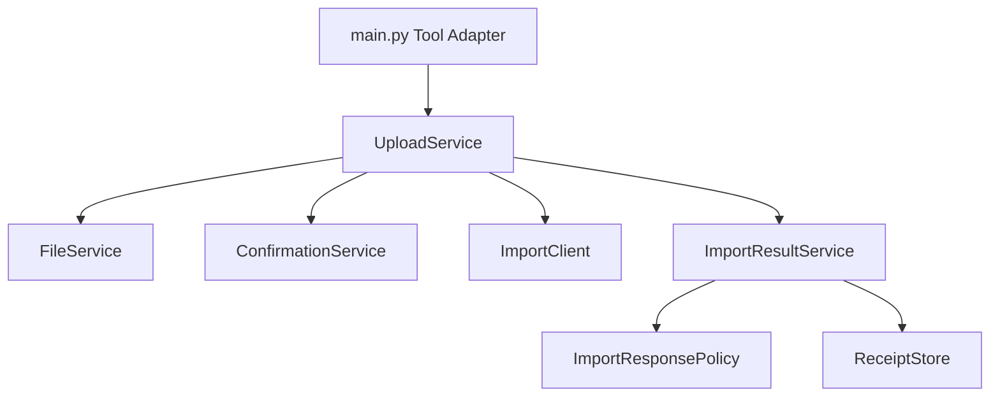

# Phase 2 重构目标与进度

## 顺序


## Phase 2-A：已完成

### OpenContracts MCP

OpenContracts 官方 `docs/mcp/`、MCP 服务实现和运行时工具发现是能力清单的事实来源。Corpus-scoped MCP 当前提供：

```text
get_corpus_info
list_documents
get_document_text
list_annotations
list_relationships
search_corpus
list_threads
get_thread_messages
create_thread_message
```

`create_thread_message` 需要认证用户上下文。Skill 根据上传、问答、风险分析、关系、标注和讨论线程等任务选择对应工具。

### 合同身份

主人格从合同正文提取：

```text
contract_date = YYYY-MM-DD
contract_title = 合同正文中的正式标题
```

Gateway 统一生成：

```text
document_title = YYYY-MM-DD 合同标题
normalized_filename = YYYY-MM-DD_合同标题.原扩展名
```

Operator 使用规范化标题进行 MCP 候选搜索和完全一致比较。身份缺失时停止上传。

### OpenContracts 写入

Upload Gateway 使用 WorkerKey 和官方 `/api/imports/documents/` 端点完成合同文件导入。写入目标由 WorkerKey 绑定；Gateway 不要求配置 Corpus ID。

### Gateway 目录

```text
plugins/astrbot_plugin_opencontracts_gateway/
├── main.py
├── config/settings.py
├── domain/models.py
├── domain/results.py
├── clients/import_client.py
├── services/confirmation_service.py
├── services/file_service.py
├── services/import_response_policy.py
├── services/import_result_service.py
├── services/upload_service.py
├── storage/receipt_store.py
├── _conf_schema.json
├── metadata.yaml
└── README.md
```

### 依赖方向



### 提交状态

以下情况进入人工核查并禁止自动重试：

```text
unexpected_unconfirmed_update
transport_commit_unknown
upstream_commit_unknown
unexpected_success_response
```

Receipt 使用 append-only 审计记录。

## Phase 2-B：Contract File Router

### 目标目录

```text
plugins/astrbot_plugin_contract_file_router/
├── main.py
├── domain/
│   ├── actions.py
│   ├── pending_contract.py
│   └── task_state.py
├── handlers/
│   ├── file_event_handler.py
│   └── text_event_handler.py
├── services/
│   ├── conversation_service.py
│   ├── session_service.py
│   ├── staging_service.py
│   └── task_context_factory.py
├── storage/
│   ├── cancelled_task_store.py
│   └── pending_store.py
└── ui/prompts.py
```

Task Context Factory 直接使用当前 MCP 与 Gateway 工具名称，移除 `opencontracts_check_duplicate` 遗留字段。状态模型应增加对人工核查任务的明确处理策略。

## Phase 2-C：WeCom Final Result Guard

```text
plugins/astrbot_plugin_wecom_final_result_guard/
├── main.py
├── classification/upload_status_classifier.py
├── mapping/customer_message_mapper.py
├── storage/cancelled_task_store.py
└── text/utf8_truncator.py
```

正式状态标记是分类器的主要输入。`MANUAL_REVIEW` 优先于 `PROCESSING` 和 `FAILED`；兼容文本规则单独维护。

## Phase 2-D：Handoff Policy

该插件保持小型，计划提取：

```text
routing.py
canonical_task.py
```

规范化上下文使用：

```text
document_read_channel = opencontracts_mcp
document_write_channel = worker_key_bound_document_import
receipt_role = append_only_upload_audit
```

Handoff 必须合并 Router 原有安全约束，并保留主人格传入的结构化合同身份。

## MVP 完成标准

- OpenContracts 合同库操作来自 MCP Tool 调用；
- Gateway 只报告 WorkerKey 文件导入配置，不要求 Corpus ID；
- 合同远端身份按日期和标题规范化；
- 提交状态未知进入人工核查且禁止自动重试；
- Receipt 为 append-only 审计；
- Gateway 运行模块保持职责明确；
- 插件 README UML 与代码模块一致；
- `python3 -m compileall -q plugins scripts` 通过；
- `python scripts/build_release.py --clean` 输出可安装 ZIP 和 SHA-256 清单；
- ZIP 能在 AstrBot WebUI 中加载并完成最小上传流程。
