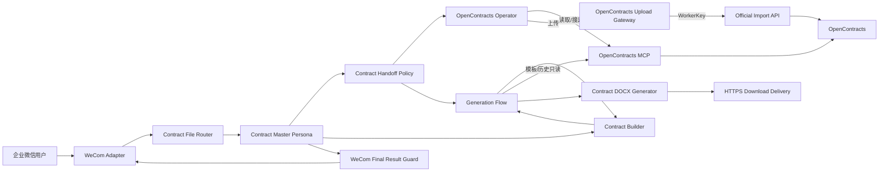

# System UML

当前正式 ContractBot 架构，不包含 Docassemble Gateway。



## 正式路径

```text
读取：Master → Operator → OpenContracts MCP
上传：Master → Operator → OpenContracts Gateway → WorkerKey Import API → MCP 核验
生成：Master → Builder → Generation Flow → DOCX Generator → Download Delivery → Draft finalize
结果：Master → WeCom Final Result Guard → WeCom
```

Skills 只保留 `contract-direct-analysis` 和 `contract-conversation-control`；Operator 与 Builder 不绑定 Skill。
