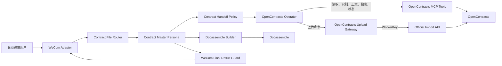

# System UML

本图是 ContractBot 的架构入口。详细说明见 `docs/architecture/`。



## 集成路径

```text
读取与检索：OpenContracts Operator -> OpenContracts MCP -> OpenContracts
上传与版本写入：OpenContracts Operator -> Upload Gateway -> Official Import API -> OpenContracts
用户结果：Master Persona -> WeCom Final Result Guard -> WeCom Adapter
```

Gateway 的读取相关 REST 实现属于当前 0.5.1 基线与目标架构之间的待重构差异。Phase 2 按上述路径迁移读取和重复判断。
