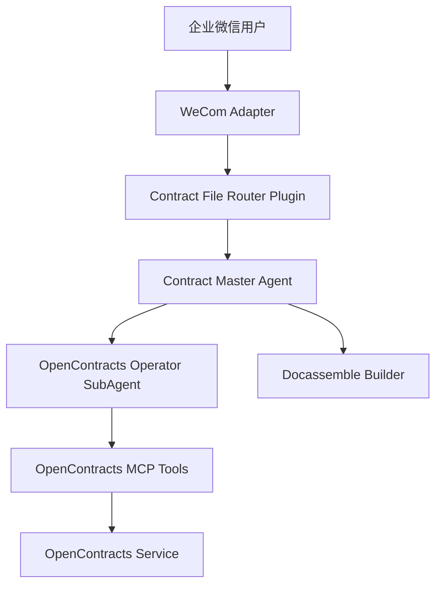

# System UML


```mermaid
flowchart TD
    User[企业微信用户]
    WeCom[WeCom Adapter]
    Router[Contract File Router Plugin]
    Master[Contract Master Agent]
    OC[OpenContracts Operator SubAgent]
    MCP[OpenContracts MCP Tools]
    OpenContracts[OpenContracts Service]
    Docassemble[Docassemble Builder]

    User --> WeCom
    WeCom --> Router
    Router --> Master
    Master --> OC
    OC --> MCP
    MCP --> OpenContracts
    Master --> Docassemble
```

## 约束

禁止：

```text
Agent -> REST API -> OpenContracts
```

允许：

```text
Agent -> MCP Tool -> OpenContracts
```
