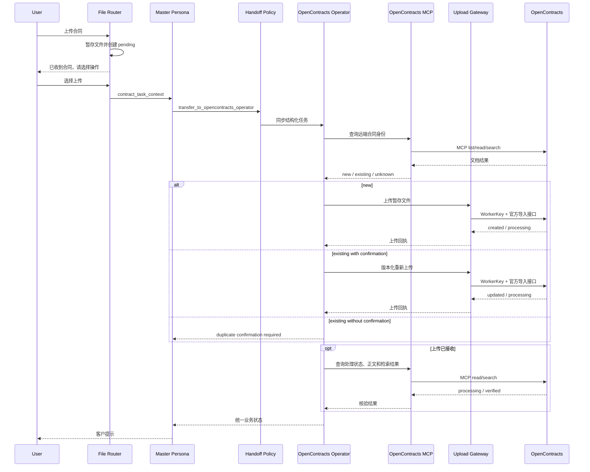

# Upload Flow UML



## 关键数据

```text
Router -> Operator:
  original_name
  staged_path
  sha256
  duplicate_confirmation

Operator -> MCP:
  corpus identity
  document identity query
  document text/search query

Operator -> Gateway:
  staged_path
  expected_sha256
  source_filename
  duplicate_confirmation_id
```
