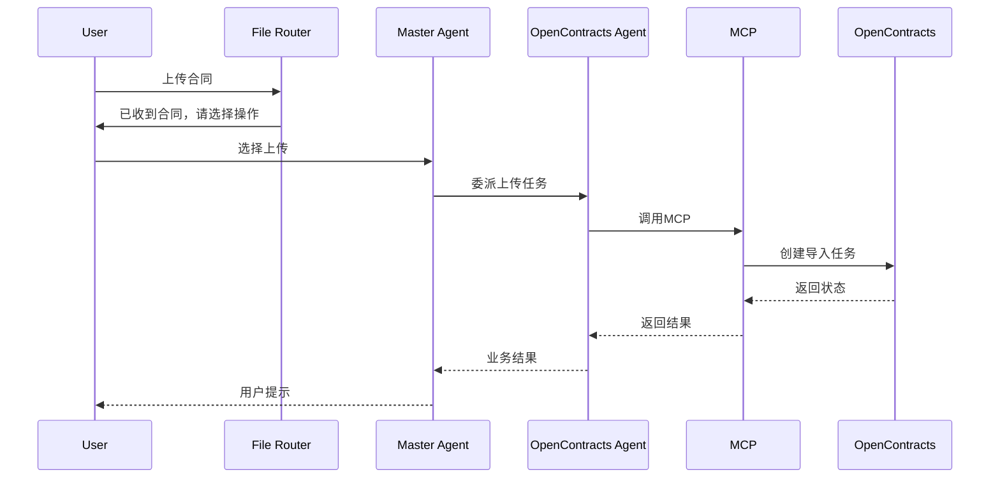

# Upload Flow UML

```mermaid
sequenceDiagram
    participant U as User
    participant R as File Router
    participant A as Master Agent
    participant O as OpenContracts Agent
    participant M as MCP
    participant C as OpenContracts

    U->>R: 上传合同
    R->>U: 已收到合同，请选择操作
    U->>A: 选择上传
    A->>O: 委派上传任务
    O->>M: 调用MCP
    M->>C: 创建导入任务
    C-->>M: 返回状态
    M-->>O: 返回结果
    O-->>A: 业务结果
    A-->>U: 用户提示
```
