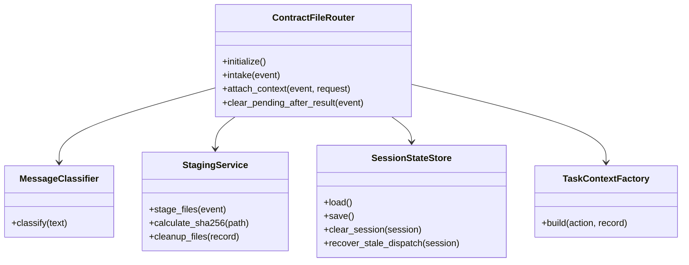
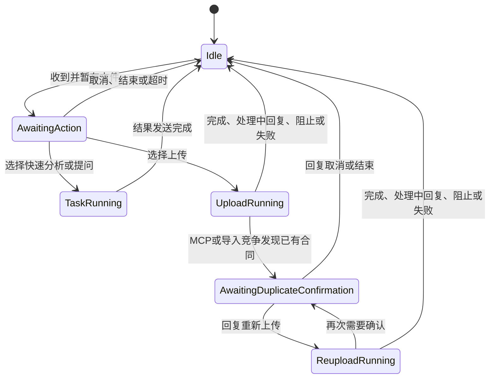
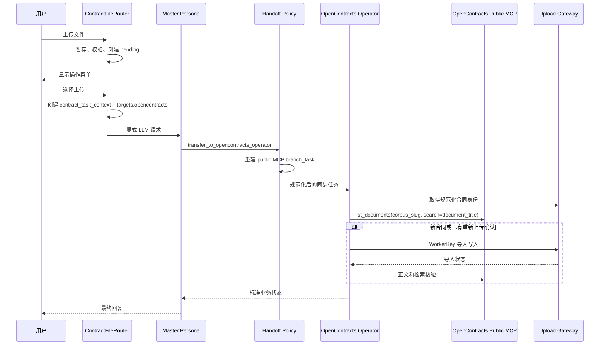

# 合同文件接收与路由 0.5.0

本插件是合同流程的入口适配器，负责把企业微信文件事件转换为可恢复的合同任务，并在当前消息事件中启动主人格请求。

## 职责

- 接收 AstrBot 文件组件并复制到插件暂存目录。
- 计算文件 SHA-256、大小和会话文件指纹。
- 维护等待操作、运行中、重复确认和结束后的会话状态。
- 生成 `contract_task_context`，将用户选择转换为明确的业务操作。
- 通过 `opencontracts_target` 配置公开 MCP 使用的目标 Corpus slug。
- 在企业微信当前事件中创建 LLM 请求。
- 在任务完成、取消或过期后清理暂存文件。
- 与最终结果保护插件共享取消任务和重复确认状态。

OpenContracts 的合同发现、正文读取和检索由 OpenContracts Operator 使用公开 MCP 完成；Router 提供文件、用户意图、目标 Corpus slug、确认状态和任务契约。

## 组件 UML



当前 `main.py` 仍将这些职责放在同一个类中。Phase 2-A 由 Handoff Policy 将上传分支重建为公开 MCP 读取与 WorkerKey 写入能力；Router 的模块拆分和旧 `branch_task` 清理安排在 Phase 2-B。

## 会话状态 UML



`BLOCKED` 和 `FAILED` 后当前任务结束并删除暂存文件。管理员修复后，客户需要重新上传合同；当前不维护失败后重试状态。

## 上传协作时序



## 任务上下文契约

Router 生成的 `contract_task_context` 包含：

```text
task_id
operation
source_files[]
source_files[].original_name
source_files[].staged_path
source_files[].sha256
targets.opencontracts
duplicate_confirmation
recommended_subagents
branch_tasks
expected_outputs
```

`targets.opencontracts` 来自插件配置 `opencontracts_target`，默认值为 `contracts`。Handoff 将其转换为 Operator 的 `mcp_contract.corpus_slug` 和 `branch_task.corpus_slug`。

OpenContracts Operator 实际接收的上传能力由 Handoff 0.4.5 重建为：

```text
list_documents
opencontracts_gateway_status
opencontracts_upload_document
get_document_text
search_corpus
```

Router 0.5.0 中残留的旧 `opencontracts_check_duplicate` 分支声明不会传入 Operator。Phase 2-B 拆分 Router 时将从源头删除该旧声明。

`original_name` 只用于保留原扩展名和审计信息；MCP 查重使用 Gateway 返回的规范化 `identity.document_title`。

## 后续拆分目标

```text
astrbot_plugin_contract_file_router/
├── main.py
├── domain/
│   ├── actions.py
│   └── task_state.py
├── handlers/
│   ├── file_event_handler.py
│   └── text_event_handler.py
├── services/
│   ├── staging_service.py
│   ├── task_context_factory.py
│   └── session_service.py
└── storage/
    ├── pending_store.py
    └── cancelled_task_store.py
```

`main.py` 最终只保留 AstrBot 生命周期、事件过滤器和服务协调。
