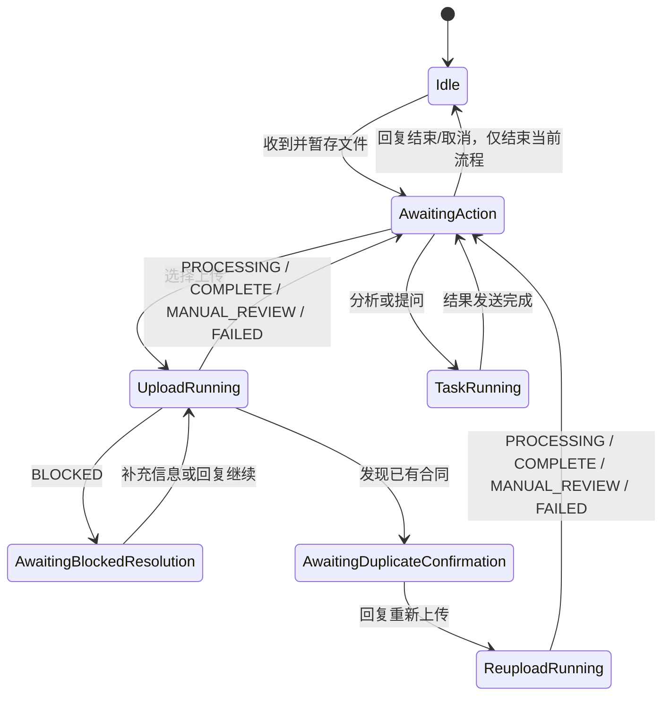

# 合同文件接收与路由 0.5.9

本插件把企业微信文件事件转换为可恢复的合同任务，在当前消息事件中启动主人格请求，并管理当前合同文件上下文。

## AstrBot 入口

`main.py:Main` 是唯一 AstrBot `Star` 入口；`runtime.py` 只提供普通 Python 状态机与文件逻辑。`Main` 注册 `intake`、`attach_context` 和 `clear_pending_after_result` 三个事件入口。

## 职责

- 使用 AstrBot `File.get_file()` 取得文件并复制到插件暂存目录；
- 计算文件 SHA-256、大小和会话文件指纹；
- 维护等待操作、运行中、阻断恢复、重复确认和结束状态；
- 从 Router 自己的 `staged_path` 本地解析 PDF/DOCX/TXT/MD 正文，并以 `_no_save` transient context 注入当前 LLM 请求；
- 生成不携带固定 Corpus 的 `contract_task_context`，目标 Corpus 由 Handoff Policy 统一绑定；
- 从原始文件名确定性提取唯一有效日期，写入 `identity_hints.contract_date`；
- 与 Result Guard 共享取消、重复确认和 BLOCKED 保留状态；
- 对同一 UMO 的 Router intake/context/cleanup 使用轻量 `asyncio.Lock` 串行状态迁移。

## 文件生命周期

0.5.9 起，**任务结束不等于文件删除**。

- 分析、自由问答、上传等任务完成后，当前文件继续保留并回到 `awaiting_action`，用户可以继续追问或执行其他文件操作；
- 用户回复“结束”或“取消”时，只结束当前流程并解除 current/pending 状态，不物理删除暂存文件；
- 用户上传下一份文件且当前没有运行中任务时，新文件直接成为当前文件，上一份文件继续保留在暂存目录；
- 只有用户明确回复“删除文件”“删除当前文件”“删除这份合同文件”等删除指令时，才物理删除当前文件；
- 不再通过普通 pending TTL 或 staging TTL 自动物理删除合同文件；长期未使用文件的清理由独立月度维护任务后续实现。

这意味着用户无需在每次分析后重新上传同一合同；当前合同会一直保持可继续处理状态，直到用户明确结束当前流程或上传下一份文件。

## 暂存合同正文

正常交互：

```text
发送合同文件
→ Router 暂存并返回菜单
→ 用户回复 1 / 2 / 直接提问
→ Router 从 staged_path 本地解析合同正文
→ 正文快照以 _no_save transient context 进入当前 LLM 请求
→ 任务完成后继续保留当前文件
```

当前直接支持：

```text
.pdf
.docx
.txt
.md / .markdown
```

`.doc` 由 Contract DOC Preconverter 转换后进入 Router。单次直接注入最多保留前 `120000` 个字符；超过时会在上下文中明确标记截断。

自由提问任务还会把用户当前问题与暂存合同正文一起注入，避免显式 Router 请求覆盖原始问题文本。合同正文只在当前请求中使用，不写入长期 conversation history。

## 文件名日期提示

Router 只在原始文件名中存在唯一有效日期时提供日期提示：

```text
YYYY-M-D
YYYY.M.D
YYYY_M_D
YYYY年M月D日
YYYYMMDD
```

正文明确日期优先；正文日期字段为空时，Master 可以采用唯一文件名日期提示，不重复询问。文件名出现多个不同日期时不提供提示。

## 会话状态



`BLOCKED` 和 duplicate confirmation 仍按原有可恢复状态处理。运行中的任务收到“结束”时会登记取消，避免旧任务结果继续影响当前会话；已经开始的远端写入不能假装回滚。

## 与 Result Guard 的事件契约

Result Guard 设置：

```text
contract_preserve_pending_reason = duplicate_confirmation_required
contract_preserve_pending_reason = blocked
contract_blocked_reason = missing_date | missing_title | missing_identity | system
```

Router 在 `after_message_sent` 阶段消费这些标记。普通任务完成后不再清除文件，而是恢复为 `awaiting_action`；BLOCKED 与 duplicate confirmation 继续进入对应恢复状态。

## 任务上下文

```text
task_id
operation
source_files[]
source_files[].original_name
source_files[].staged_path
source_files[].sha256
identity_hints
resume.blocked_reason
resume.user_input
targets.opencontracts
duplicate_confirmation
branch_tasks
expected_outputs
```

Router 创建上下文时把 `targets.opencontracts` 和分支 `corpus_slug` 留空；`astrbot_plugin_contract_handoff_policy.default_opencontracts_corpus_slug` 是合同库 Corpus 的唯一配置 owner。

## 运行结构

```text
astrbot_plugin_contract_file_router/
├── main.py           # Main Star、会话锁、文件保留策略、request-only 正文快照注入
├── document_text.py  # staged PDF/DOCX/TXT/MD 本地解析
└── runtime.py        # 暂存、状态机、任务上下文与事件处理实现
```
