# 合同文件接收与路由 0.5.7

本插件把企业微信文件事件转换为可恢复的合同任务，在当前消息事件中启动主人格请求，并管理暂存文件生命周期。

## AstrBot 入口

`main.py` 必须实际定义继承 `Star` 的插件类，并在同一模块注册事件处理器。Router 0.5.7 在 `main.py` 中定义 `Main`，把 `intake`、`attach_context` 和 `clear_pending_after_result` 三个带装饰器的入口注册到 `main` 模块；具体状态机与文件逻辑继续委托给 `runtime.py`。入口加载时会移除导入运行实现产生的临时 Star 与 Handler 注册，避免处理器留在 `runtime` 模块而无法绑定。

## 职责

- 使用 AstrBot `File.get_file()` 取得文件并复制到插件暂存目录；
- 计算文件 SHA-256、大小和会话文件指纹；
- 维护等待操作、运行中、阻断恢复、重复确认和结束状态；
- 对用户已经选择的上传、快速分析或合同问答任务，从 Router 自己的 `staged_path` 本地解析 PDF/DOCX/TXT/MD 正文，并直接注入同一次 LLM 请求，不新增文件读取工具调用或额外 AI 回合；
- 注入的合同正文使用 AstrBot `_no_save` transient context，只参与当前请求，不写入长期 conversation history；
- PDF 与 DOCX 的正文解析都在线程中执行，避免本地文件转换阻塞 AstrBot asyncio event loop；
- 生成不携带固定 Corpus 的 `contract_task_context`，目标 Corpus 由 Handoff Policy 统一绑定；
- 生成当前事件内的显式 LLM 请求；
- 从原始文件名确定性提取唯一有效日期，写入 `identity_hints.contract_date`；
- 与 Result Guard 共享取消、重复确认和 BLOCKED 保留状态；
- 在流程完成、失败、取消或客户明确结束后清理暂存文件；
- 对同一 UMO 的 Router intake/context/cleanup 使用一个轻量 `asyncio.Lock` 串行状态迁移；锁不覆盖后续 LLM、Subagent 或 MCP 执行。

## 暂存合同正文

用户正常交互是两阶段的：

```text
发送合同文件
→ Router 暂存并返回菜单
→ 用户回复 1 / 2 / 直接提问
→ Router 从 staged_path 本地解析合同正文
→ 正文快照以 _no_save transient context 进入当前 LLM 请求
→ Agent 保存 conversation history 时跳过这份正文快照
```

这条路径不依赖 AstrBot Computer Use，也不要求 Main 使用 Shell、Python 或通用 FileRead。当前直接支持：

```text
.pdf
.docx
.txt
.md / .markdown
```

`.doc` 继续由 Contract DOC Preconverter 转换后进入 Router。单次直接注入最多保留前 `120000` 个字符；超过时会在上下文中明确标记截断，但不会为了继续读取而增加一轮 AI tool call。

自由提问任务还会把用户当前问题与暂存合同正文一起注入，避免显式 Router 请求覆盖原始问题文本。合同正文只在当前请求中使用；后续用户消息不会因为 history 持久化而重复携带上一份完整合同正文。

## 文件名日期提示

Router 只在原始文件名中存在唯一有效日期时提供日期提示：

```text
YYYY-M-D
YYYY.M.D
YYYY_M_D
YYYY年M月D日
YYYYMMDD
```

例如：

```text
示例项目劳务合同_2025.1.7.pdf
```

任务上下文将包含：

```json
{
  "identity_hints": {
    "contract_date": "2025-01-07",
    "source": "original_filename"
  }
}
```

正文明确日期优先。正文日期字段为空时，Master 直接采用该提示，不向客户追问。文件名出现多个不同日期时不提供提示。

## 会话状态

```mermaid
stateDiagram-v2
    [*] --> Idle
    Idle --> AwaitingAction: 收到并暂存文件
    AwaitingAction --> UploadRunning: 选择上传
    AwaitingAction --> TaskRunning: 分析或提问
    UploadRunning --> AwaitingBlockedResolution: BLOCKED
    AwaitingBlockedResolution --> UploadRunning: 补充信息或回复继续
    AwaitingBlockedResolution --> Idle: 结束或取消
    UploadRunning --> AwaitingDuplicateConfirmation: 发现已有合同
    AwaitingDuplicateConfirmation --> ReuploadRunning: 回复重新上传
    AwaitingDuplicateConfirmation --> Idle: 取消或结束
    UploadRunning --> Idle: PROCESSING / COMPLETE / MANUAL_REVIEW / FAILED
    ReuploadRunning --> Idle: PROCESSING / COMPLETE / MANUAL_REVIEW / FAILED
    TaskRunning --> Idle: 结果发送完成
```



`BLOCKED` 是可恢复状态：

- Router 进入 `awaiting_blocked_resolution`；
- 保留 pending、暂存路径和文件哈希；
- 普通 pending TTL 和孤立文件清理不会删除仍被 pending 引用的文件；
- 客户补充日期、标题或管理员修复后回复“继续”，Router 复用同一文件重新生成任务上下文；
- 客户回复“结束”或“取消”时删除文件并结束；
- 后续达到 `PROCESSING`、`COMPLETE`、`MANUAL_REVIEW` 或 `FAILED` 时流程结束并清理普通暂存状态。

同一会话的 Router 状态处理在进入 LLM 之前串行完成，因此快速连续发送“1”“结束”或重复选择时，不会在 ACK、conversation 创建或 staged file 解析的 await 窗口交叉修改 pending 状态。

运行中的上传收到“结束”时，Router 会移除该 task 的 pending 状态并登记取消。OpenContracts Gateway 0.6.2 在真正发起 WorkerKey HTTP POST 之前再次读取同一个 Router state，只有当前 `dispatch_task_id + source SHA-256` 仍匹配才提交。因此“结束”发生在写入开始前时不会继续产生上传副作用；如果 HTTP 提交已经开始，则只能按已有传输结果处理，不能假装回滚远端写入。

## 与 Result Guard 的事件契约

Result Guard 设置：

```text
contract_preserve_pending_reason = duplicate_confirmation_required
contract_preserve_pending_reason = blocked
contract_blocked_reason = missing_date | missing_title | missing_identity | system
```

Router 在 `after_message_sent` 阶段消费这些标记，决定保存还是清理当前任务。已取消的运行中 task 结果仍由 Result Guard 抑制，避免用户在收到“流程已结束”后又看到旧任务结果。

## 任务上下文

```text
task_id
operation
source_files[]
source_files[].original_name
source_files[].staged_path
source_files[].sha256
identity_hints
resume.blocked_reason
resume.user_input
targets.opencontracts
duplicate_confirmation
branch_tasks
expected_outputs
```

Router 创建上下文时把 `targets.opencontracts` 和分支 `corpus_slug` 留空；`astrbot_plugin_contract_handoff_policy.default_opencontracts_corpus_slug` 是合同库 Corpus 的唯一配置 owner，并在 handoff 时写入最终目标值。

公开 MCP 上传工具契约：

```text
opencontracts_gateway_status
list_documents
opencontracts_upload_document
get_document_text
search_corpus
```

Router 不声明 `opencontracts_check_duplicate` 或 `get_corpus_info`。MCP 查重使用 Gateway 返回的 `identity.document_title`。

## 运行结构

```text
astrbot_plugin_contract_file_router/
├── main.py           # Main Star、会话锁、request-only 正文快照注入
├── document_text.py  # staged PDF/DOCX/TXT/MD 本地解析
└── runtime.py        # 暂存、状态机、任务上下文与事件处理实现
```
