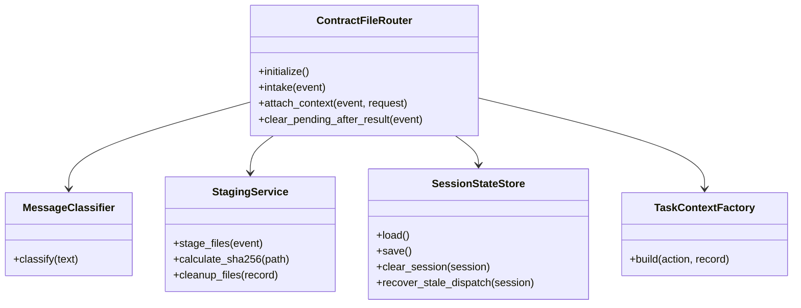
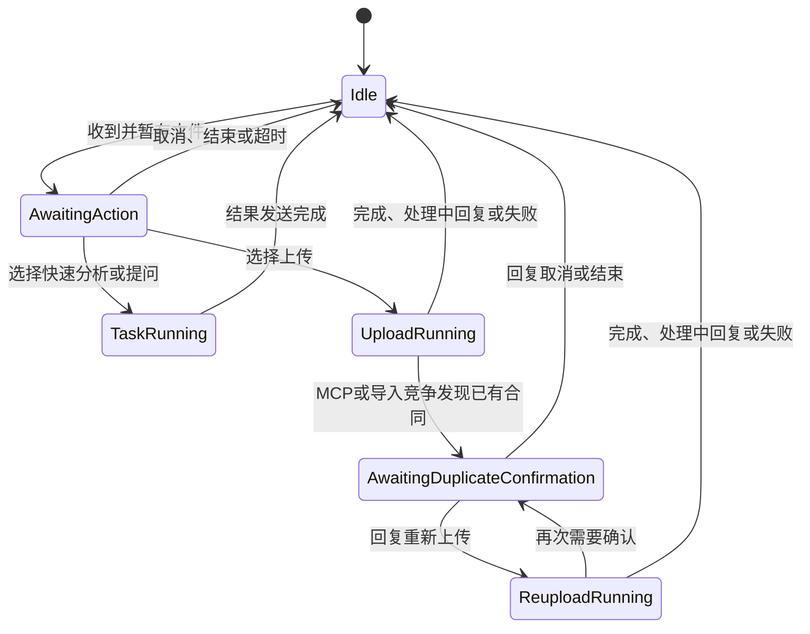
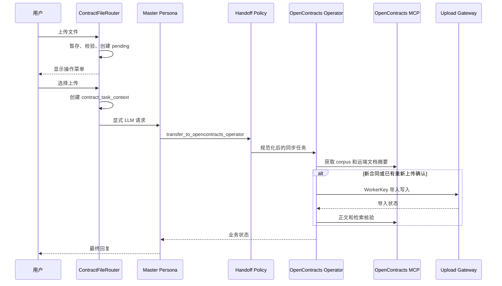

# 合同文件接收与路由 0.5.0

本插件是合同流程的入口适配器，负责把企业微信文件事件转换为可恢复的合同任务，并在当前消息事件中启动主人格请求。

## 职责

- 接收 AstrBot 文件组件并复制到插件暂存目录。
- 计算文件 SHA-256、大小和会话文件指纹。
- 维护等待操作、运行中、重复确认和结束后的会话状态。
- 生成 `contract_task_context`，将用户选择转换为明确的业务操作。
- 在企业微信当前事件中创建 LLM 请求。
- 在任务完成、取消或过期后清理暂存文件。
- 与最终结果保护插件共享取消任务和重复确认状态。

OpenContracts 的合同发现、正文读取和检索由 OpenContracts Operator 使用 MCP 完成；Router 提供文件、用户意图、确认状态和任务契约。

## 组件 UML



当前 `main.py` 仍将这些职责放在同一个类中。Phase 2-A 由 Handoff Policy 将上传分支规范化为 MCP 读取与 WorkerKey 写入能力；Router 的模块拆分和任务上下文清理安排在 Phase 2-B。

## 会话状态 UML



## 上传协作时序



## 任务上下文契约

Router 生成的 `contract_task_context` 包含：

```text
task_id
operation
source_files[]
source_files[].original_name
source_files[].staged_path
source_files[].sha256
duplicate_confirmation
recommended_subagents
branch_tasks
expected_outputs
```

上传分支声明的能力包括：

```text
get_corpus_info
list_documents
opencontracts_gateway_status
opencontracts_upload_document
get_document_text
search_corpus
```

`original_name` 是 MCP 文档搜索和导入文件名的输入；`staged_path` 由上传网关读取本地暂存文件。

## 后续拆分目标

```text
astrbot_plugin_contract_file_router/
├── main.py
├── domain/
│   ├── actions.py
│   └── task_state.py
├── handlers/
│   ├── file_event_handler.py
│   └── text_event_handler.py
├── services/
│   ├── staging_service.py
│   ├── task_context_factory.py
│   └── session_service.py
└── storage/
    ├── pending_store.py
    └── cancelled_task_store.py
```

`main.py` 最终只保留 AstrBot 生命周期、事件过滤器和服务协调。
