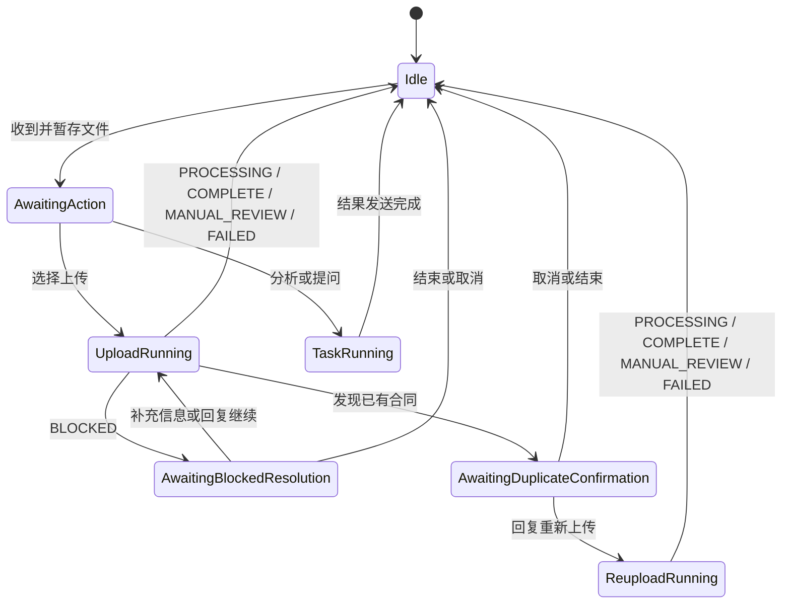

# 合同文件接收与路由 0.5.4

本插件把企业微信文件事件转换为可恢复的合同任务，在当前消息事件中启动主人格请求，并管理暂存文件生命周期。

## AstrBot 入口

`main.py` 必须实际定义继承 `Star` 的插件类，并在同一模块注册事件处理器。Router 0.5.4 在 `main.py` 中定义 `Main`，把 `intake`、`attach_context` 和 `clear_pending_after_result` 三个带装饰器的入口注册到 `main` 模块；具体状态机与文件逻辑继续委托给 `runtime.py`。入口加载时会移除导入运行实现产生的临时 Star 与 Handler 注册，避免处理器留在 `runtime` 模块而无法绑定。

## 职责

- 使用 AstrBot `File.get_file()` 取得文件并复制到插件暂存目录；
- 计算文件 SHA-256、大小和会话文件指纹；
- 维护等待操作、运行中、阻断恢复、重复确认和结束状态；
- 通过 `opencontracts_target` 提供公开 MCP 使用的目标 Corpus slug；
- 生成 `contract_task_context` 和当前事件内的显式 LLM 请求；
- 从原始文件名确定性提取唯一有效日期，写入 `identity_hints.contract_date`；
- 与 Result Guard 共享取消、重复确认和 BLOCKED 保留状态；
- 在流程完成、失败、取消或客户明确结束后清理暂存文件。

## 文件名日期提示

Router 只在原始文件名中存在唯一有效日期时提供日期提示：

```text
YYYY-M-D
YYYY.M.D
YYYY_M_D
YYYY年M月D日
YYYYMMDD
```

例如：

```text
新田光伏发电项目劳务合同_2025.1.7.pdf
```

任务上下文将包含：

```json
{
  "identity_hints": {
    "contract_date": "2025-01-07",
    "source": "original_filename"
  }
}
```

正文明确日期优先。正文日期字段为空时，Master 直接采用该提示，不向客户追问。文件名出现多个不同日期时不提供提示。

## 会话状态



`BLOCKED` 是可恢复状态：

- Router 进入 `awaiting_blocked_resolution`；
- 保留 pending、暂存路径和文件哈希；
- 普通 pending TTL 和孤立文件清理不会删除仍被 pending 引用的文件；
- 客户补充日期、标题或管理员修复后回复“继续”，Router 复用同一文件重新生成任务上下文；
- 客户回复“结束”或“取消”时删除文件并结束；
- 后续达到 `PROCESSING`、`COMPLETE`、`MANUAL_REVIEW` 或 `FAILED` 时流程结束并清理普通暂存状态。

## 与 Result Guard 的事件契约

Result Guard 设置：

```text
contract_preserve_pending_reason = duplicate_confirmation_required
contract_preserve_pending_reason = blocked
contract_blocked_reason = missing_date | missing_title | missing_identity | system
```

Router 在 `after_message_sent` 阶段消费这些标记，决定保存还是清理当前任务。

## 任务上下文

```text
task_id
operation
source_files[]
source_files[].original_name
source_files[].staged_path
source_files[].sha256
identity_hints
resume.blocked_reason
resume.user_input
targets.opencontracts
duplicate_confirmation
branch_tasks
expected_outputs
```

公开 MCP 上传工具契约：

```text
opencontracts_gateway_status
list_documents
opencontracts_upload_document
get_document_text
search_corpus
```

Router 不声明 `opencontracts_check_duplicate` 或 `get_corpus_info`。MCP 查重使用 Gateway 返回的 `identity.document_title`。

## 运行结构

```text
astrbot_plugin_contract_file_router/
├── main.py       # 定义 Main Star 和三个装饰器入口
└── runtime.py    # 暂存、状态机、任务上下文与事件处理实现
```
